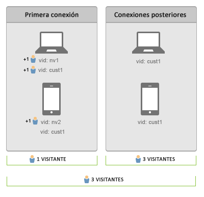

# Conectar usuarios entre dispositivos

>[!IMPORTANT]
>
>Ya no se recomienda este método de identificación de visitantes entre dispositivos. Consulte la documentación [de cooperación entre dispositivos de](https://marketing.adobe.com/resources/help/en_US/mcdc/)Adobe Experience Cloud.

La identificación de visitantes entre dispositivos ayuda a conectar los visitantes a varios dispositivos. La identificación de visitantes entre dispositivos utiliza la variable de ID de visitante, s.visitorID, para asociar un visitante a varios dispositivos.

Cuando se proporciona una variable de [!UICONTROL ID de visitante] con una visita, el sistema comprueba si existen otros perfiles del visitantes que tengan una [!UICONTROL ID de visitante] coincidente. Si existe uno, a partir de ese momento se utilizará el perfil del visitante que ya está almacenado en el sistema, mientras que el perfil anterior dejará de usarse.

Generalmente, la [!UICONTROL ID de visitante] se configura tras la autenticación o después de que un visitante realice alguna otra acción que permita identificarlo de manera única independientemente del dispositivo que se emplee. Recomendamos crear un hash del nombre de usuario o una ID interna que no contenga información que pueda identificar al visitante.

En el [ejemplo anterior](/help/implement/js-implementation/xdevice-visid/xdevice-connecting.md), una vez que el cliente inicia sesión en cada dispositivo, todos esos dispositivos se asocian al mismo perfil de usuario. Aunque posteriormente el visitante cierre la sesión en un dispositivo, la identificación seguirá funcionando, ya que las [!UICONTROL ID de visitante] se almacenan en una cookie ubicada en cada uno de los dispositivos que ya están asociados al mismo perfil del visitante. Recomendamos rellenar la variable [!UICONTROL s.visitorID] siempre que sea posible por si se elimina la cookie con la [!UICONTROL ID de visitante].

## Recuentos de visitas y visitantes únicos {#section_70330AB6724C4E419A4BD0BDD54641AC}

Consideremos la siguiente secuencia de conexión para dos dispositivos:

**Durante la primera conexión de datos**

* La anulación de la duplicación de visitantes no es retroactiva.

Tras realizar la autenticación en el ordenador portátil, Adobe Analytics tratará igual a las visitas con cualquiera de las ID de visitante (`nv1` o `cust1`). Sin embargo, la anulación de duplicación de los visitantes no es retroactiva, por lo que se cuentan 2 visitantes únicos.

En la primera conexión de datos en el dispositivo móvil, no se reconoce al cliente, por lo que se cuenta un visitante único nuevo. Una vez que el usuario esté autenticado (`cust1`) en el dispositivo móvil, Adobe Analytics vuelve a asignar `cust1` a la ID de visitante proporcionada en el sitio principal, por lo que el número de visitas únicas no se incrementa.

Cada dispositivo o explorador nuevo autenticado se considerará 1 visitante único.

**En las posteriores conexiones de datos**

En las posteriores conexiones de datos a dispositivos autenticados los visitantes únicos no aumentarán.
