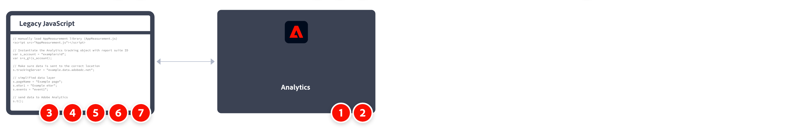

# Implementar Adobe Analytics con AppMeasurement para JavaScript

Históricamente, AppMeasurement para JavaScript ha sido un método común para implementar Adobe Analytics. Sin embargo, con la creciente popularidad de los sistemas de Tag Management, se recomienda utilizar [etiquetas en Adobe Experience Platform](../launch/overview.md).

Una información general de alto nivel de las tareas de implementación:



<table>

<tr>
<th style="width:5%"></th><th style="width:75%"><b>Tarea</b></th><th style="width:20%"><b>Más información</b></th>
</tr>

<tr>
<td>1</td><td>Asegúrese de haber <b>definido un grupo de informes</b></td><td><a href="../../admin/tools/manage-rs/report-suites-admin.md">Administrador del grupo de informes</a></td>
</tr>

<tr>
<td>2</td><td><b>Descargue el código JavaScript necesario para AppMeasurement</b> desde el Administrador de códigos. Descomprima el archivo.</td><td><a href="../../admin/tools/code-manager-admin.md">Administrador de códigos</a></td>
</tr>

<tr>
<td>3</td><td><b>Agregue <code>AppMeasurement.js</code> al archivo de plantilla del sitio web</b>. El código contiene las bibliotecas necesarias para enviar datos a Adobe.

```html
<head>
  <script src="AppMeasurement.js"></script>
  …
</head>
```

</td><td></td>
</tr>

<tr>
<td>4</td><td><b>Defina las variables de configuración dentro de <code>AppMeasurement.js</code></b>. Cuando se crea una instancia del objeto de Analytics, estas variables garantizan que la configuración de recopilación de datos sea correcta.

```JavaScript
// Instantiate the Analytics tracking object with report suite ID
var s_account = "examplersid";
var s=s_gi(s_account);
 
// Make sure data is sent to the correct tracking server
s.trackingServer = "example.data.adobedc.net";
```

</td><td><a href="../vars/config-vars/configuration-variables.md">Variables de configuración</a></td>
</tr>

<tr>
<td>5</td><td><b>Defina variables de nivel de página dentro del código de página del sitio</b>. Estas variables determinan la dimensión y las métricas específicas que se envían a Adobe.

```js
s.pageName = "Example page";
s.eVar1 = "Example eVar";
s.events = "event1";
```

</td><td><a href="../vars/page-vars/page-variables.md">Variables de página</a></td>
</tr>

<tr>
<td>6</td><td><b>Envíe los datos a Adobe mediante el método <code>t()</code></b>, cuando se definan todas las variables de página.

```js
s.t();
```

</td><td><a href="../vars/functions/t-method.md">método t()</a></td>
</tr>

<tr>
<td>7</td><td><b>Ampliación y validación de la implementación</b> antes de llevarlo a producción.</b></td><td></td>
</tr>

</table>

## Recursos adicionales

- [Información general sobre variables, funciones, métodos y complementos](../vars/overview.md)
