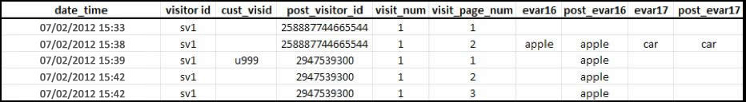
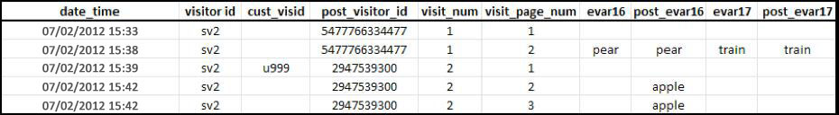

# Atribución y persistencia

> [!IMPORTANT] Ya no se recomienda este método de identificación de visitantes entre dispositivos. Consulte Análisis [entre dispositivos](/help/components/cda/cda-home.md) en la guía del usuario Componentes.

Cuando los perfiles de los visitantes se combinan después de asociarse a la misma variable de ID de visitante, la atribución no cambia en el conjunto de datos históricos.

* When the variable `s.visitorID` is set and sent on a hit, Adobe checks for any other visitor profiles that have a matching visitor ID.
* Si existe un perfil, a partir de ese momento se utilizará el perfil del visitante que ya está almacenado en el sistema, mientras que el perfil anterior dejará de usarse.
* Si no se encuentra ningún ID de visitante coincidente, se crea un nuevo perfil.

Cuando un cliente no autenticado llega a su sitio, Adobe Analytics asigna a ese cliente un perfil del visitante. Al crearse el perfil nuevo, finaliza una visita y se inicia otra visita.

## Ejemplo 1

El ejemplo siguiente representa cómo se envían los datos a Adobe Analytics cuando un cliente se autentica por primera vez en el primer dispositivo:

* `eVar16` tiene una caducidad de 1 día, y `evar17` caduca en la visita.
* La columna `post_visitor_id` representa el perfil que mantiene Adobe Analytics. Las columnas de anuncios suelen verse en las fuentes de datos. Consulte Fuentes [de datos](/help/export/analytics-data-feed/data-feed-overview.md) en la Guía del usuario de exportación.
* Las columnas `post_evar16` y `post_evar17` muestran la persistencia de las eVars.
* `cust_visid` representa un valor configurado en `s.visitorID`.
* Cada fila es una &quot;visita&quot;, una sola solicitud enviada a los servidores de recopilación de datos de Adobe Analytics.

On the first data connection containing a previously unrecognized `s.visitorID` value (`u999` above), a new profile is created. Los valores persistentes del perfil anterior se transfieren al nuevo perfil.

* Las eVars configuradas para caducar en la visita no se copian en el perfil autenticado. Observe que el valor `car` anterior no se mantiene.
* Las eVars configuradas para caducar con otras medidas se copiarán en el perfil autenticado. Observe que el valor `apple` se mantiene.
* Para las eVars que se mantienen, no se registra ninguna métrica Instancia. Esto significa que, al usar la identificación de visitantes entre dispositivos, pueden aparecer informes donde la métrica Visitas únicas de un valor eVar sea más grande que la métrica Instancia.

> [!NOTE] Si un usuario es nuevo en su sitio (nunca antes lo ha visitado en este dispositivo) y se autentica en los 3 minutos siguientes a su llegada, no se conservará ningún valor en el perfil autenticado.

## Ejemplo 2

El ejemplo siguiente representa cómo se envían los datos a Adobe Analytics cuando un cliente se autentica en un nuevo dispositivo, después de haberse autenticado previamente en otro dispositivo.

Cuando el cliente se autentica, coincide con el perfil &#39;autenticado&#39; anterior - `2947539300`. El perfil usado al principio de esta visita (`5477766334477`) ya no se usa y no se mantienen datos del archivo.

* Los datos de segmentación geográfica se registran en función de la primera visita y no cambian para una única visita, independientemente del dispositivo que se use. Esto significa que, en las posteriores conexiones de datos en un dispositivo nuevo, los datos de segmentación geográfica no se suelen incluir.
* Las columnas de tecnología, como explorador, sistema operativo y profundidad de color, se registran en la primera visita. Al igual que los valores de segmentación geográfica, no se copian en el perfil vinculado.
* Los canales de mercadotecnia sobrescriben otros canales en una conexión de datos posterior que contiene una primera autenticación para ese dispositivo.
