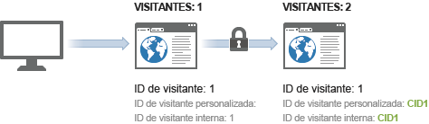
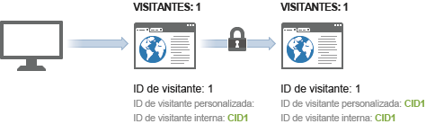

# Ejemplo de identificación de visitantes entre dispositivos

>[!IMPORTANT]
>
>Ya no se recomienda este método de identificación de visitantes entre dispositivos. Consulte [Cross-Device Analytics](/help/components/cda/overview.md) en la guía del usuario Componentes.

El siguiente ejemplo ilustra el funcionamiento de la identificación de visitantes entre dispositivos mediante una muestra de llamadas al servidor enviadas en una interacción común de clientes.

| Llamada al servidor | Acción | Cookie de ID de visitante | Variable de ID de visitante | ID de visitante efectiva | Número de página de visita | Número de visita |
|--- |--- |--- |--- |--- |--- |--- |
| 1 | Un visitante hace clic en un vínculo de un correo electrónico de marketing y visita su sitio desde el equipo de casa. Este visitante ha visitado su sitio 7 veces más en el pasado. | 3 | - | 1 | 1 | 8 |
| 2-8 | Visita otras 7 páginas del sitio. | 1 | - | 3 | 2-8 | 8 |
| 9 | Se autentica en el equipo de casa. | 1 | CID1 | CID1 | 9  (Esta es la primera visita de CID1, de modo que se continúa en el perfil del visitante desde el ID de visitante 1.) | 8 |
| 10 | Visita 1 página adicional. | 3 | CID1 | CID1 | 10 | 8 |
| 11 | Abre el sitio desde el ordenador portátil de la oficina. El visitante no ha visitado el sitio antes de utilizar este servicio. | 2 | - | 2 | 3 | 1 |
| 12 | Se autentica en el ordenador portátil. | 2 | CID1 | CID1 | 1 | 9 |
| 13 | Ve 1 página adicional. | 2 | CID1 | CID1 | 2 | 9 |

## Recuento de visitas

Analytics contabiliza una visita individual cada vez que se realiza una visita con un número de página de visita igual a 1.

Con la tabla anterior, se contabilizó una nueva visita individual 4 veces: en las visitas 1, 9, 11 y 12.

## Recuento de visitantes

Analytics contabiliza cada ID de visitante efectiva única como un visitante único.

Con la tabla anterior, se contabilizó un visitante nuevo tres veces: en las visitas 1, 9 y 10.

Cuando utiliza la identificación de visitantes entre dispositivos, puede aumentar el número de visitantes únicos que ve. El visitante se puede contabilizar dos veces en la misma visita: una en la visita inicial y otra después de que el usuario se autentique.

Después de la asociación inicial, los recuentos de visitas vuelven a la normalidad porque el visitante está asociado mediante la cookie del explorador. Si más adelante el visitante ve el sitio y después se autentica, el recuento de visitantes no aumenta porque la ID de visitante efectiva no cambia después de la autenticación.

Asegúrese de que es lo más coherente posible al identificar visitantes únicos. Por ejemplo, utilice siempre la variable `visitorID` cuando el usuario esté autenticado.
