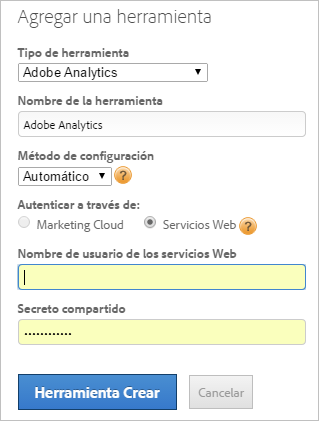

# Agregar la herramienta Adobe Analytics

Implemente Adobe Analytics mediante el uso de Dynamic Tag Management. Para ello, debe crear la herramienta Adobe Analytics y configurar el código de página de forma automática o manual. Para la mayoría de los usuarios, se recomienda seguir el método automático.

>[!NOTE] Para mejorar el seguimiento de visitantes, recomendamos que habilite el [Servicio de identidad](https://marketing.adobe.com/resources/help/es_ES/mcvid/).

## Agregar una herramienta Adobe Analytics {#section_D5066B21581B4F7F811AD0027BF44EA5}

1. Haga clic  **[!UICONTROL  *`Web Property Name`*]** > **[!UICONTROL Overview]** > **[!UICONTROL Add a Tool]** > **[!UICONTROL Adobe Analytics]** .

   

1. Rellene los campos:

<table id="table_1CFB53FE72E74CCB8CAA5D4E3873D286"> 
 <thead> 
  <tr> 
   <th colname="col1" class="entry"> Elemento </th> 
   <th colname="col2" class="entry"> Descripción </th> 
  </tr> 
 </thead>
 <tbody> 
  <tr> 
   <td colname="col1"> 
Tipo de herramienta 
 </td> 
   <td colname="col2">Tipo de herramienta, como Adobe Analytics. </td> 
  </tr> 
  <tr> 
   <td colname="col1"> 
Nombre de la herramienta 
 </td> 
   <td colname="col2">Un nombre descriptivo para esta herramienta. Este nombre se muestra en la ficha Información general en Herramientas instaladas. </td> 
  </tr> 
  <tr> 
   <td colname="col1" morerows="1"> 
Método de configuración 
 </td> 
   <td colname="col2"> 
 <b>Automático</b> (recomendado): utiliza Dynamic Tag Management para gestionar la configuración. Este método permite la sincronización automática de los grupos de informes de Adobe Analytics mediante el inicio de sesión en Experience Cloud o el ID de servicios web, a la vez que gestiona el código de AppMeasurement. 
 
Una vez que las cuentas están conectadas, Dynamic Tag Management extrae los nombres e ID de los grupos de informes de Adobe Analytics en la interfaz de configuración de la herramienta, lo que permite aumentar la velocidad de implementación de la herramienta con menos posibilidades de que se produzcan errores de usuarios. 
 
 
Nota: Debe elegir la opción Automático si es cliente de Adobe Analytics Premium. 
 
 
Rellene los campos específicos de la configuración automática: 
 
    <ul id="ul_8D9797B01E444B9C85B862A9F96B447C"> 
     <li id="li_0AC84C1F37B24C658F2178E50ECCC4B0"> 
 <b>Experience Cloud</b>: (predeterminado) utiliza el inicio de sesión único de Experience Cloud. Especifique el ID y la contraseña de Experience Cloud. 
 </li> 
     <li id="li_6C80468835D04CC09F4AEC46D1300310"> 
<b>Servicios web</b>: especifique su nombre de usuario y secreto compartido de los servicios web. 
 
Las credenciales de secreto compartido se encuentran en Administración &gt; Configuración de la empresa &gt; <a href="https://docs.adobe.com/content/help/es-ES/analytics/admin/company-settings/web-services-admin.html">Servicios web</a>. 
 
Los desarrolladores pueden consultar <a href="https://marketing.adobe.com/developer/en_US/get-started/enterprise-api/c-get-web-service-access-to-the-enterprise-api">Acceso a servicios web para la API empresarial</a> para obtener ayuda sobre la obtención de credenciales de los servicios web. 
 </li> 
    </ul> </td> 
  </tr> 
  <tr> 
   <td colname="col2"> 
 <b>Manual</b>: administra de forma manual el código de AppMeasurement. Puede descargar el código de AppMeasurement de Analytics desde Herramientas de administración &gt; Administrador de códigos.  
 
Haga clic en <a href="https://marketing.adobe.com/resources/help/en_US/sc/implement/appmeasure_mjs.html">JavaScript (nuevo)</a> para obtener información sobre cómo descargar el código localmente para copiarlo y pegarlo en el campo Editar código en <a href="/help/implement/other/dtm/c-aa-tool/library-management.md">Administración de bibliotecas</a>. 
 
Rellene los campos específicos de una configuración manual: 
 
    <ul id="ul_CFB6CE78AEB743EF8B47BAAC42E2DB0A"> 
     <li id="li_5B7046CD95AB416F8C113B381A264D91"> 
<b>ID de la cuenta de producción:</b> (obligatorio) su cuenta de producción para la recopilación de datos. En Analytics, este es su ID para el grupo de informes. Dynamic Tag Management instala automáticamente la cuenta correcta en el entorno de producción y ensayo. 
 </li> 
     <li id="li_14E840FD79A0451BABEDD15DC0584768"> 
<b>ID de la cuenta de ensayo:</b> (obligatorio) se utiliza en el entorno de desarrollo o prueba. En Analytics, este es su ID para el grupo de informes. Una cuenta de ensayo mantiene los datos de prueba separados de la producción. 
 </li> 
     <li id="li_69E6C6A41F5240E1ABE8ABE0B9D151FC"> 
<b>Servidor de seguimiento:</b> especifique la información de su servidor de seguimiento 
 
Las variables Servidor de seguimiento y Servidor de seguimiento SSL se utilizan en la implementación de cookies personales para especificar el dominio en el cual se escribe la cookie y la solicitud de imagen. Para obtener más información, consulte el artículo <a href="https://helpx.adobe.com/es/analytics/kb/determining-data-center.html">Rellenar correctamente las variables trackingServer y trackingServerSecure</a>. 
 </li> 
     <li id="li_1A7271C68205428F8CA5548A96CACBEC"> 
<b>Servidor de seguimiento SSL:</b> especifique la información de su servidor de seguimiento SSL. 
 </li> 
    </ul> </td> 
  </tr> 
 </tbody> 
</table>

1. Click **[!UICONTROL Create Tool]** to create the tool and display it for editing.

   Las herramientas se muestran en la [!UICONTROL Overview] ficha, en [!UICONTROL Installed Tools].

1. (Condicional) Configure la herramienta según sea necesario siguiendo las instrucciones de los vínculos siguientes ( [!UICONTROL General], [!UICONTROL Library Management], [!UICONTROL Global Variables], [!UICONTROL Pageviews & Content], [!UICONTROL Link Tracking], [!UICONTROL Referrers & Campaigns], [!UICONTROL Cookies]y [!UICONTROL Customize Page Code]).

Consulte [Preguntas más frecuentes sobre la herramienta Adobe Analytics](/help/implement/faq.md) para obtener más información al respecto.

## Editar una herramienta Adobe Analytics existente {#section_148B16AF429B4949B06238D90635B726}

Puede editar una herramienta Adobe Analytics existente para modificar sus ajustes de configuración.

1. Click the   icon next to an installed tool from the [!UICONTROL Overview] tab.
1. Edite los campos como desee.

   En la tabla siguiente se incluyen solo los elementos que no están disponibles al crear una herramienta Analytics, según lo descrito anteriormente. Sin embargo, puede cambiar cualquier elemento de la página, como se describe en ambas tablas.

<table id="table_2B60CD109CFF4839AB7F91D61125EDFF"> 
 <thead> 
  <tr> 
   <th colname="col1" class="entry"> Elemento </th> 
   <th colname="col2" class="entry"> Descripción </th> 
  </tr> 
 </thead>
 <tbody> 
  <tr> 
   <td colname="col1"> 
Habilitar configuración automática 
 </td> 
   <td colname="col2"> 
Nota: Al habilitar esta configuración, se cambia una implementación configurada manualmente al método de configuración automática descrito en Método de configuración. 
 
Esta opción permite a Dynamic Tag Management recuperar automáticamente la configuración de la cuenta de Adobe Analytics. 
 
Se utiliza el último código de AppMeasurement disponible y se muestran las notificaciones de actualización para su selección a medida que las nuevas versiones están disponibles. También puede revertir a versiones anteriores de AppMeasurement según sea necesario, por ejemplo por motivos de compatibilidad. Se muestran hasta cinco versiones anteriores. 
 </td> 
  </tr> 
  <tr> 
   <td colname="col1"> 
Actualizar credenciales 
 </td> 
   <td colname="col2"> 
Actualice la API, por ejemplo, para actualizar los grupos de informes asociados a un usuario. 
 </td> 
  </tr> 
 </tbody> 
</table>

1. (Condicional) Configure la herramienta según sea necesario siguiendo las instrucciones de los vínculos siguientes ( [!UICONTROL General], [!UICONTROL Library Management], [!UICONTROL Global Variables], [!UICONTROL Pageviews & Content], [!UICONTROL Link Tracking], [!UICONTROL Referrers & Campaigns], [!UICONTROL Cookies]y [!UICONTROL Customize Page Code]).
1. Haga clic en **[!UICONTROL Save Changes]**.
