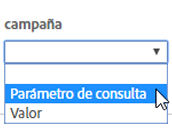

# Referentes y campañas

Descripciones de los campos de [!UICONTROL Dynamic Tag Management] para opciones de referentes y campañas al implementar [!UICONTROL Dynamic Tag Management] en Adobe [!DNL Analytics].

**[!UICONTROL *`Property`*]** > **[!UICONTROL  Editar herramienta ]** > **[!UICONTROL  Referentes y campañas ]**

<table id="table_09AE3BFF0F12442F9C19CD96451F93E4">
 <thead>
  <tr>
   <th colname="col1" class="entry"> Elemento </th>
   <th colname="col2" class="entry"> Descripción </th>
  </tr>
 </thead>
 <tbody>
  <tr>
   <td colname="col1"> Anulación de referente </td>
   <td colname="col2"> 
Anula el valor configurado en la variable La variable s.referrer, que suele completar el referente configurado en el explorador. 
 
Consulte <a href="../../../vars/page-vars/referrer.md">referente</a>. 
 </td>
  </tr>
  <tr>
   <td colname="col1"> Campaign </td>
   <td colname="col2"> 
Una variable que identifica las campañas de marketing utilizadas para atraer visitantes a un sitio. El valor de campaña generalmente se toma de un parámetro de cadena de consultas. 
 
Consulte <a href="../../../vars/page-vars/campaign.md">campaña</a>. 
 </td>
  </tr>
 </tbody>
</table>

Utilice la interfaz de la DTM para elegir si desea utilizar un valor o una cadena de consulta (que se puede extraer de un elemento de datos):

Puede introducir la cadena de consulta directamente en la interfaz o hacer referencia a un elemento de datos independiente si dispone de otro medio para rastrear una campaña.
