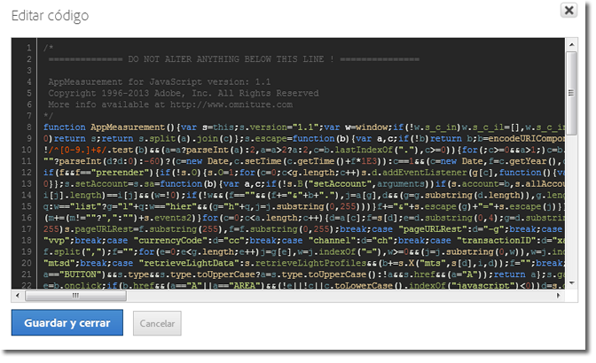

# Inserción del código principal de AppMeasurement

Introduzca el código AppMeasurement si implementa de forma manual Dynamic Tag Management en Adobe Analytics.

1. En la página de herramientas de [!DNL Adobe Analytics], expanda la sección **[!UICONTROL General]** y, a continuación, haga clic en **[!UICONTROL Abrir editor]**.
1. Descomprima el archivo [!DNL AppMeasurement_JavaScript*.zip] que descargó en [implementar Adobe Analytics](/help/implement/other/dtm/t-analytics-deploy.md).

   Si opta por una biblioteca personalizada, al abrir la ventana ya incluirá la versión de código más reciente. No es necesario descargar el zip desde Admin Console.
1. Abra [!DNL AppMeasurement.js] en un editor de texto.
1. Copie y pegue el contenido en la ventana **[!UICONTROL Editar código]**.

   

1. Adobe recomienda añadir el siguiente código sobre *`Do Not Alter Anything Below This Line`*:

   ```
   var s_account="INSERT-RSID-HERE"
   var s=s_gi(s_account)
   ```

   >[!IMPORTANT]
   >
   >Si agrega este código, es recomendable seleccionar también la casilla de verificación **[!UICONTROL Definir grupos de informes con el siguiente código personalizado]** en la configuración general de la biblioteca.

1. Haga clic en **[!UICONTROL Guardar y cerrar]**.

   Si está utilizando el módulo de medio, el módulo integrado o complementos de integración, también puede copiarlos en la sección de código. El código gestionado en Dynamic Tag Management puede configurarse exactamente igual que el archivo JavaScript en una implementación típica.

