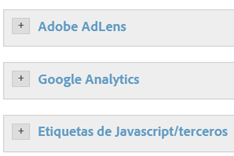
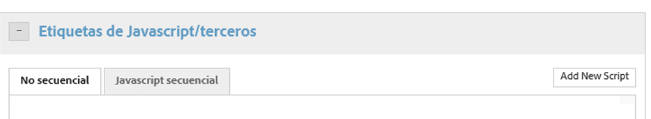
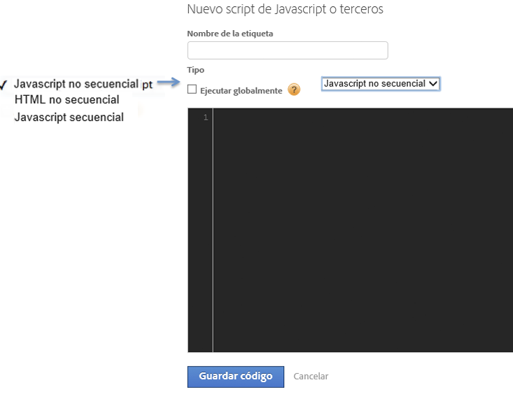
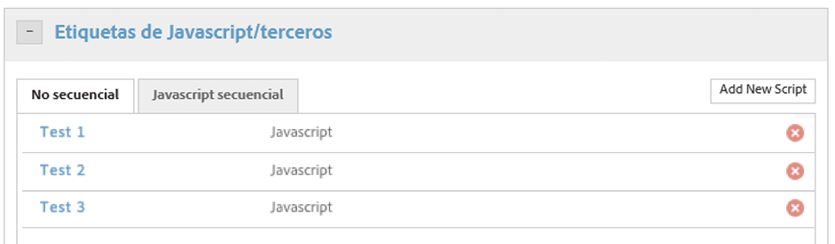

# Configurar acciones para que la condición active

Configurar las acciones que desea que la condición active.

Una vez configurada la condición, debe configurar las acciones que desea que la condición active. Estas acciones pueden incluir eventos de [!DNL Analytics], etiquetas de terceros y secuencias de comandos personalizadas. Este ejemplo describe cómo configurar secuencias de comandos y etiquetas de terceros.

Más allá de herramientas integradas como [!DNL Adobe Analytics] y Google Analytics, Dynamic Tag Management puede activar cualquier tipo de JavaScript o introducir HTML en su sitio, en páginas seleccionadas o en determinados escenarios.

Cada regla puede activar tantas secuencias de comandos o introducciones de HTML como desee.

>[!NOTE]
>
>Dado que la DTM le permite insertar código personalizado en su página, debe procurar no crear vulnerabilidades de scripts de sitios cruzados (XSS) (consulte la [guía de OWASP](https://www.owasp.org/index.php/Cross-site_Scripting_(XSS)) para obtener más información). Debe prestar especial atención cuando utilice elementos de datos en un script. Tenga en cuenta que los valores de elementos de datos no siempre provienen de una fuente de confianza.

**Configurar acciones para que la condición active**

1. Haga clic en **[!UICONTROL Etiquetas de JavaScript/terceros]** para agregar una nueva secuencia de scripts a la regla.

   

1. Haga clic en **[!UICONTROL Agregar nuevo script]**.

   

1. Asigne un nombre a la secuencia de comandos.
1. Especifique cómo quiere que se active la secuencia de comandos, y pegue el contenido deseado en el área de texto. 

1. Haga clic en **[!UICONTROL Guardar código]**, y la secuencia de scripts se agregará a la cola de la regla. 

