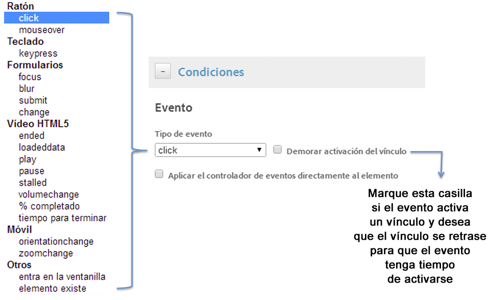
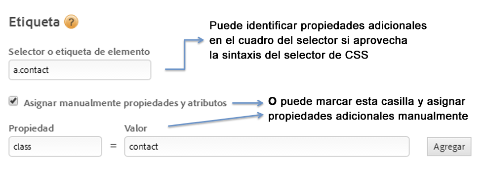
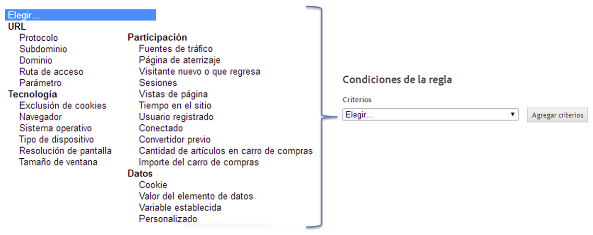

# Crear condiciones para reglas basadas en eventos

Las condiciones determinan cuándo se activa una regla basada en eventos.

1. Seleccione el tipo de interacción que desea rastrear, como clics con el ratón o envíos de formularios.

   

   Para obtener más información, consulte [Tipos de evento](https://docs.adobe.com/content/help/es-ES/dtm/using/resources/rules/t-rules-event-conditions.html) en Documentación del producto de Adobe Tag Management.

1. Habilite las opciones siguientes según sea necesario:

   | Elemento | Descripción |
   |--- |--- |
   | Retraso de activación de vínculo | Habilita si el evento activa un vínculo y si desea que el vínculo se retrase hasta que el evento se active. |
   | Aplicar el controlador de eventos directamente al elemento | Aplica el controlador de eventos a un elemento específico objetivo. Esta configuración está unida al concepto de propagación y capas de un explorador. |

   Por ejemplo, cuando se hace clic en una imagen dentro de una etiqueta delimitadora como ``, puede que se espere que el clic esté asociado con la etiqueta delimitadora, ya que la etiqueta está en el flujo de propagación. Sin embargo, si inspecciona el clic en las herramientas del desarrollador, es posible que el clic solo afecte a la etiqueta ``. Para asegurar que el evento se administra correctamente, asocie el clic con la etiqueta `` y no dependa del explorador para propagar el clic a un elemento principal. Un evento como un clic puede propagarse potencialmente a `<body>`. Es importante comprender a dónde está vinculado realmente el evento, y establecerlo específicamente como objetivo para asegurarse de que la regla se activa correctamente.

   *Propagación* significa que el evento primero se captura, se administra por el elemento más interior y, a continuación, se propaga a los elementos externos.

1. Indique el nombre de la etiqueta que quiere rastrear, así como las propiedades adicionales de la etiqueta que desea hacer coincidir.

   

   Consulte [Uso del selector CSS](https://docs.adobe.com/content/help/es-ES/dtm/using/resources/rules/t-rules-event-conditions.html#concept_DDF500DCB8214658AEDECDE69ED1D4AF) en Documentación del producto de Dynamic Tag Management para obtener información sobre cómo se busca la etiqueta de elemento correcta.

1. Seleccione y configure cualquier tipo de condición o criterio adicional que desee relacionar con la regla.

   

1. Indique su preferencia con respecto a la propagación del evento.

   La propagación de eventos es una manera de difusión de eventos en HTML DOM.

   | Si usted... | Marque esta opción |
   |--- |--- |
   | Desea interacciones relacionadas en elementos secundarios del selector de regla que identificó para activar la regla. | Permitir propagación de eventos en elementos secundarios. |
   | Desea evitar la propagación si el elemento secundario ya activa su propio evento. | No permitir si el elemento secundario ya activa un evento. |
   | No desea que los eventos del selector de regla que identificó vayan más allá del propio elemento en la jerarquía de eventos. | No permitir que los eventos se propaguen hacia los principales. |
