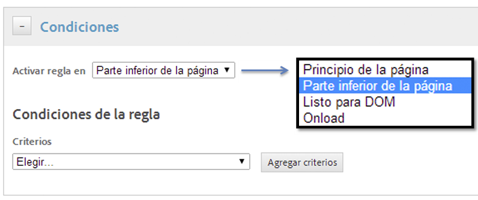
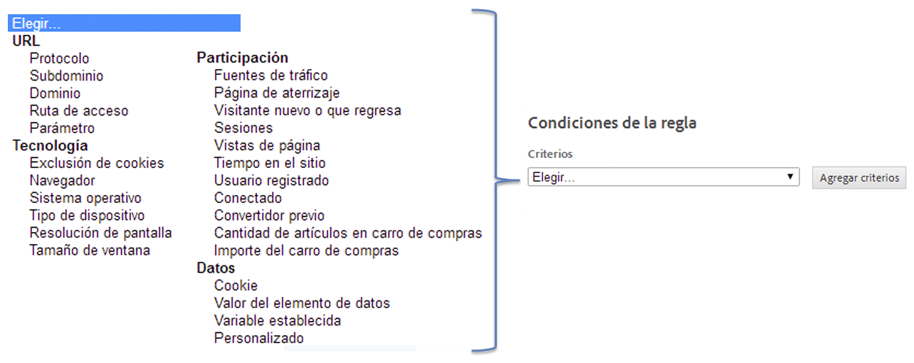

# Creación de condiciones para reglas de carga de página

Cree reglas que determinen en qué páginas debe activarse una regla.

1. Especifique en qué lugar de la página desea que se active la regla.

   La elección del momento en el que la regla se activa en la página es más importante cuando existen dependencias en el contenido de la página en la regla.

   

1. Especifique la condición que provoca que la regla se active.

   Por ejemplo, puede seleccionar **[!UICONTROL Ruta de acceso]** para identificar páginas específicas para las cuales desea que la regla se active.

   

