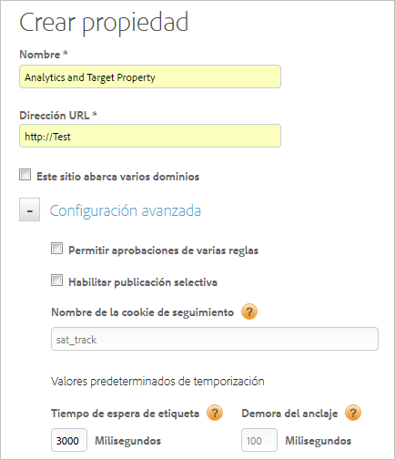

# Crear una propiedad web

Una propiedad web puede ser cualquier agrupación de uno o más dominios y subdominios incluida en un código incrustado y con una biblioteca de reglas.

>[!NOTE]
>
>Solo los usuarios con derechos de administrador pueden crear una propiedad. Para obtener más información sobre las funciones, consulte [Crear y administrar grupos en la DTM](https://docs.adobe.com/content/help/es-ES/dtm/using/admin/groups.html) en la documentación del producto de Dynamic Tag Management.

Puede administrar y rastrear estos recursos con DTM. Por ejemplo, supongamos que tiene varios sitios web basados en una plantilla y quiere rastrear los mismos recursos en todos. Puede aplicar una propiedad web a varios dominios.

Para obtener información general sobre propiedades web y prácticas recomendadas, consulte [Propiedades web](https://docs.adobe.com/content/help/es-ES/dtm/using/admin/web-property.html) en la documentación del producto de Dynamic Tag Management.

1. Vaya a la página de su empresa y haga clic en **[!UICONTROL Agregar propiedad]**.

   

1. Rellene los campos:

   <table id="table_376D72251C4D4C4CA878D10C18D2532C"> 
    <thead> 
    <tr> 
    <th colname="col1" class="entry"> Elemento </th> 
    <th colname="col2" class="entry"> Descripción </th> 
    </tr> 
    </thead>
    <tbody> 
    <tr> 
    <td colname="col1">  Nombre </td> 
    <td colname="col2"> 
El nombre de su propiedad. 
 </td> 
    </tr> 
    <tr> 
    <td colname="col1">  URL </td> 
    <td colname="col2"> 
URL base de la propiedad. 
 </td> 
    </tr> 
    <tr> 
    <td colname="col1">  Este sitio expande varios dominios  </td> 
    <td colname="col2"> 
Puede agregar y eliminar dominios si desea que los datos del visitante se mantengan entre los dominios. Si se selecciona esta opción, los datos de la visita persisten entre subdominios. 
 
Este ajuste le permite especificar cómo desea rastrear el tráfico entre sus subdominios o dominios asociados. Los vínculos a subdominios se tratan como vínculos de salida. Las visitas a subdominios se rastrean separadamente. 
 </td> 
    </tr> 
    </tbody> 
    </table>

1. (Opcional) Configure la [!UICONTROL Configuración avanzada].

   <table id="table_6E687FBE6ACC4301BCCD837F4DCBB9C9"> 
    <thead> 
    <tr> 
    <th colname="col1" class="entry"> Elemento </th> 
    <th colname="col2" class="entry"> Descripción </th> 
    </tr> 
    </thead>
    <tbody> 
    <tr> 
    <td colname="col1">  Permitir aprobaciones de reglas múltiples </td> 
    <td colname="col2"> 
Permite que se aprueben múltiples reglas para esta propiedad al mismo tiempo. La aprobación predeterminada permite aprobar una única regla. 
 </td> 
    </tr> 
    <tr> 
    <td colname="col1">  Habilitar publicación selectiva </td> 
    <td colname="col2"> 
Especifica si se permite a los usuarios seleccionar qué reglas de aprobación se publican. Se trata de la opción predeterminada. 
 </td> 
    </tr> 
    <tr> 
    <td colname="col1">  Nombre de cookie de seguimiento </td> 
    <td colname="col2"> 
Anula el nombre de la cookie de seguimiento predeterminado. Puede personalizar el nombre que utiliza Dynamic Tag Management para rastrear el estado de exclusión para recibir otras cookies. 
 </td> 
    </tr> 
    <tr> 
    <td colname="col1">  Tiempo de espera de etiqueta </td> 
    <td colname="col2"> 
Especifica cuánto tiempo espera Dynamic Tag Management a que una etiqueta se active antes de cancelar su solicitud. 
 
 Debido al modo en que funciona Dynamic Tag Management, no se preocupe si el valor es muy grande. DTM cuenta con métodos eficaces de asegurar que las etiquetas lentas no afecten a la experiencia de usuario. 
 </td> 
    </tr> 
    <tr> 
    <td colname="col1">  Retraso de anclaje </td> 
    <td colname="col2"> 
Especifica cuánto tiempo espera Dynamic Tag Management a que las etiquetas se activen cuando se pulsa un vínculo, antes de pasar a la siguiente página. El valor predeterminado es 100 milisegundos. 
 
Un tiempo de espera superior mejora la precisión de seguimiento. Adobe recomienda un tiempo de espera de 500 milisegundos o menos, ya que el usuario no lo percibirá. 
 
Dynamic Tag Management esperará el tiempo especificado, pero se reducirá el tiempo de espera si la señalización se activa antes de lo previsto (esto significa que el usuario no siempre tendrá que esperar durante todo el tiempo de espera). 
 </td> 
    </tr> 
    </tbody> 
    </table>

1. Haga clic en **[!UICONTROL Crear propiedad]**.
