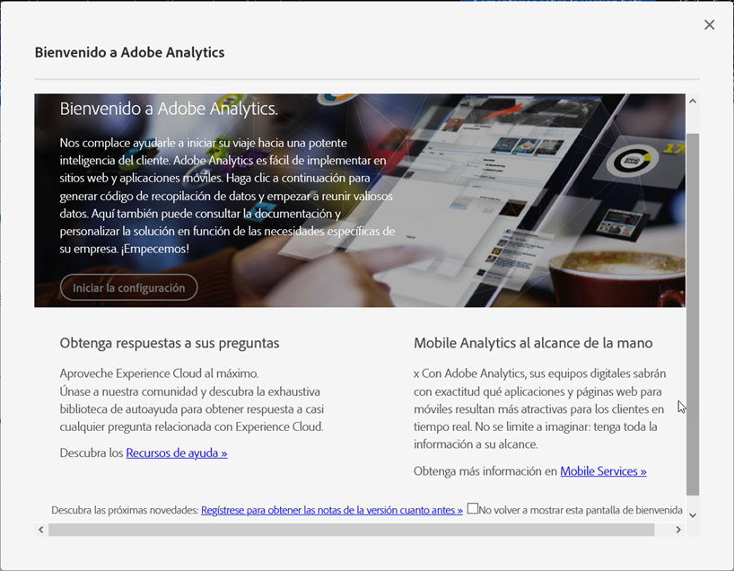

# Modo de implementación

<!-- https://activation.adobedtm.com/index.php?redirected=1 -->

La ventana modal &#39;Bienvenido a Adobe Analytics&#39; proporciona un flujo de trabajo simplificado para crear un grupo de informes. Adobe recomienda utilizar este flujo de trabajo siempre que se necesiten más grupos de informes en su organización.

## Requisitos previos

Su ID de Adobe debe tener acceso a Adobe Analytics y a Adobe Experience Platform Launch. Si no tiene acceso a Launch, puede colocarse en un bucle de autenticación en el que se le pedirá que compruebe sus credenciales indefinidamente. Póngase en contacto con un administrador del sistema de su organización para obtener acceso a Launch.

## Acceso al modal

Acceda al modal para crear un grupo de informes siguiendo los pasos siguientes.

1. Inicie sesión en [experiencecloud.adobe.com](https://experiencecloud.adobe.com) con sus credenciales de Adobe ID.
2. Click the 9-grid icon at the top, then click [!UICONTROL Adobe Analytics].
3. Si aún no ha creado un grupo de informes, se muestra automáticamente el modal. Si existe un grupo de informes para esta empresa de inicio de sesión, haga clic en el icono Ayuda en la parte superior derecha y, a continuación, haga clic en [!UICONTROL Bienvenido a Adobe Analytics].

> [!NOTE] La opción [!UICONTROL Bienvenido a Adobe Analytics] solo aparece si inicia sesión a través de Adobe Experience Cloud. Si inicia sesión a través de dominios heredados, el modal no está disponible.

## Crear un grupo de informes

Haga clic en el botón [!UICONTROL Iniciar configuración] para iniciar el flujo de trabajo de creación de grupos de informes.

### Tipo de propiedad

El tipo de propiedad ayuda a Adobe a determinar algunos ajustes del servidor en función de dónde se va a implementar Analytics.

* **Sitio web**: Si quiere implementar Adobe Analytics solo para un sitio web.
* **Aplicación** móvil nativa: Si quiere implementar Adobe Analytics solo para una aplicación móvil.
* **Ambos**: Si este grupo de informes contiene datos para un sitio web y una aplicación móvil.

### Sectores

Especifique el modelo de negocio principal. Esta configuración ayuda a Adobe a preconfigurar algunos nombres y configuraciones de variables en función de su modelo comercial principal.

### Capa de datos

Una capa  de datos es un objeto JavaScript que organiza todas las variables utilizadas en la implementación en una sola ubicación útil. See [Data layers](data-layer.md) for more information.

### Repositorio de datos

Asigne un nombre práctico al grupo de informes. La ID del grupo de informes (RSID) se genera automáticamente según el nombre práctico y la empresa de inicio de sesión.

### Zona horaria

Compruebe que Adobe ha detectado la zona horaria correcta para el grupo de informes.

### Vistas de página estimadas por día

Calcule el tráfico que recibe su sitio web o aplicación por día. Esta información permite a Adobe asignar la cantidad correcta de recursos de procesamiento a su grupo de informes.

### Moneda base

Determine en qué moneda almacena los valores monetarios el grupo de informes.

> [!IMPORTANT] Asegúrese de indicar la moneda correcta, especialmente si tiene requisitos de informes en relación con los ingresos. Es difícil cambiar la moneda base después de que comience la recopilación de datos.

## Recursos de implementación

Una vez creado el grupo de informes, tiene una de las dos opciones para continuar con la implementación:

* **Vaya al lanzamiento** de Adobe Experience Platform: Vincula a [launch.adobe.com](https://launch.adobe.com) para configurar la implementación y descargar el código de implementación. Consulte [Implementación con Launch](../launch/overview.md) Adobe recomienda utilizar Launch en la mayoría de los casos.
* **Descargar código** de implementación: Proporciona un vínculo directo para descargar archivos JavaScript para una implementación manual de JavaScript. Consulte [AppMeasurement para JavaScript](../js/overview.md).
