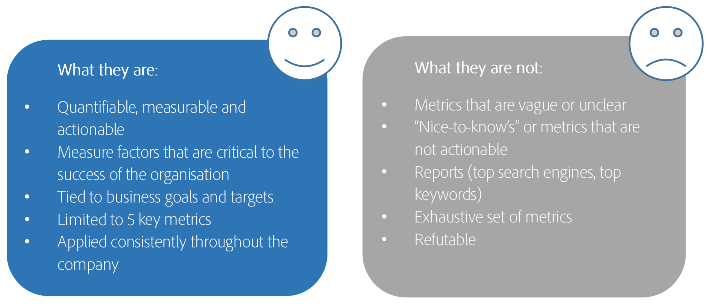

# Definición de los 5 KPI principales

No puede medir todo, y su implementación de Adobe Analytics será la mejor si prioriza la medición de lo más importante para la empresa. Trabaje con los líderes de su empresa para definir los indicadores clave de rendimiento (KPI) que tienen un mayor impacto en su negocio. A continuación, concentre sus esfuerzos en las métricas y variables que admiten estos KPI.

## 1. Comprenda sus objetivos empresariales

Comience por comprender los objetivos empresariales, de modo que pueda elegir los 5 KPI más importantes para la empresa. Estos KPI pueden ser métricas como, por ejemplo, ingresos, o métricas calculadas, como ingresos por visita, y las métricas también pueden tener variables. NO copie KPI aleatorios de otras empresas o estándares del sector; probablemente no se ajusten a SUS objetivos comerciales.

## 2. Formule una pregunta crucial

Pregúntese a usted mismo: si su CEO estuviera atrapado en una isla y usted pudiera decirle solo 5 cosas acerca de la salud de la empresa, ¿cuáles serían esas cosas? Si usted le dijera que el tiempo promedio empleado en una página era 1:30, eso no ayudaría en absoluto. Sin embargo, si le dijera que los ingresos promedios por visita fue de 2 dólares y que tenía 2 millones de visitas, eso le daría una verdadera indicación del éxito de la empresa.

## 3. Recuerde cuáles son los KPI y cuáles no

## 4. Defina los KPI

Complete su propio gráfico, similar a este:

| Objetivo empresarial | Métricas y dimensiones |
| --- | --- |
| Aumentar las ventas a través de canales digitales | Ingresos por visita |
| Aumentar la imagen de marca | Visitantes |
| Dirigir relaciones de cliente más profundas y duraderas | Inicios de sesión, clics |
| Conversión de sitio | Clics en CTA/Vistas de página totales |
| Participación del sitio | Vistas de página por visitante único, Tiempo en el sitio de visitante promedio |

## 5. Revise los KPI regularmente

Actualice los KPI al menos cada 6 meses. Recuerde que las necesidades de la empresa cambian con frecuencia.
