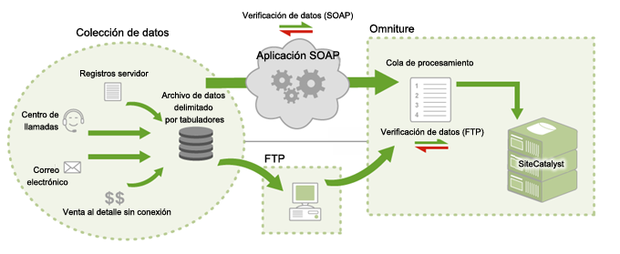

# Funcionamiento de las fuentes de datos

Información sobre los métodos de Adobe para proporcionar acceso a fuentes de datos.

>[!NOTE]
>
>Después de enviar los datos a través de fuentes de datos, no se pueden distinguir de otros datos de informes recopilados por otros métodos (señalizaciones JavaScript, ActionSource, API de inserción de datos, etc.). Los datos no se pueden eliminar después de importarlos.

Hay dos métodos disponibles para enviar datos:

* [FTP](/help/import/c-data-sources/datasrc-how-data-sources-works.md#section_0E70022648F94061AF5B4AD6C7145243)
* [API](/help/import/c-data-sources/datasrc-how-data-sources-works.md#section_65DACC9CE00C437BBFDD02D19C25A4BD)

## FTP {#section_0E70022648F94061AF5B4AD6C7145243}

Los informes de marketing permiten crear y administrar fuentes de datos para cargar mediante FTP; en este caso, para importar los archivos de datos en el sistema de fuentes de datos se utiliza el protocolo de transferencia de archivos FTP. Después de crear las fuentes de datos, Adobe le indica una dirección FTP que puede usar para cargar los archivos creados. Después de la carga de los archivos, el sistema de fuentes de datos los encontrará y procesará automáticamente. Una vez procesados, los datos estarán disponibles para los informes de marketing.

## API  {#section_65DACC9CE00C437BBFDD02D19C25A4BD}

Adobe ofrece una API específica que permite vincular mediante programación cualquier aplicación con el sistema de fuentes de datos. Esto elimina la necesidad de usar un servidor FTP intermedio, y las transferencias de datos pasan a realizarse por HTTP, SOAP y REST.

Consulte la [documentación de API de fuentes de datos](https://github.com/AdobeDocs/analytics-1.4-apis/tree/master/docs/data-sources-api).
