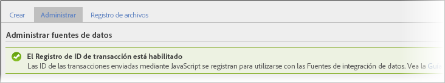

# Integración de transacciones y clientes

Las fuentes de datos ofrecen otros dos modos de integrar eventos sin conexión en sus datos en línea.

* [Activar el registro de ID de transacción](/help/import/c-data-sources/datasrc-integrating-offline-data.md#section_30D6D47AEC0F4A36B87EBFE4C858F20C)
* [Integración de transacciones](/help/import/c-data-sources/datasrc-integrating-offline-data.md#section_B3F281CEFF9B47E9A07F9851D61D415D)
* [Integración de clientes](/help/import/c-data-sources/datasrc-integrating-offline-data.md#section_9F4AAD710D2543BDA834090A98115FBF)

Estas integraciones asocian los datos correspondientes a actividades sin conexión con determinadas transacciones en línea o con un visitante conectado.

## Activar el registro de ID de transacción {#section_30D6D47AEC0F4A36B87EBFE4C858F20C}

El ID de transacción se puede activar y desactivar desde la interfaz de usuario, sin necesidad de recurrir al servicio de atención al cliente:

Vaya a **[!UICONTROL Administración]** > **[!UICONTROL Grupos de informes]** > Seleccionar grupo de informes > **[!UICONTROL Editar configuración]** > **[!UICONTROL General]** > **[!UICONTROL Configuración general de cuenta]**.

<!-- 

When contacting Customer Care, be prepared to provide the following information: 
 
<ul id="ul_C425C7A074484650AFCCF0425E8E3F47"> 
 <li id="li_7640C0C4DF0C49749A3C37E5461DC22F">Report Suite ID of the data source for which you need transaction ID recording enabled. 
In Data Sources, the report suite ID is the first part of the login appended by a random number that identifies the specific data source that was set up. For example, <code> RSID-drmossdev5 Login-drmossdev5_0001343430</code>. 
 </li> 
 <li id="li_4FB0E3EC7BE94A2DBEE9063365A71C9C">The Transaction ID expiration window (described in <a href="/help/import/c-data-sources/datasrc-tid-visitor-profile.md"  > Transaction ID and Visitor Profiles</a>). By default this is 90 days, but it can be extended to up to 2 years. </li> 
</ul>

 -->

Para comprobar si el registro de ID de transacción está activado, vaya a **[!UICONTROL Analytics]** > **[!UICONTROL Administrador]** > **[!UICONTROL Fuentes de datos]**.

La pestaña [!UICONTROL Administrar] muestra el estado del registro de ID de transacción.

## Integración de clientes {#section_9F4AAD710D2543BDA834090A98115FBF}

Los ID de cliente se usan para indicar la actividad que realiza un cliente estando desconectado y vincularla con su actividad en línea. Estos ID se deben usar cuando:

* Se coloca un ID de cliente en la variable *`visitorID`*.
* No hay ningún punto indicado en el que la actividad del cliente pase a realizarse sin conexión, como puede ser la solicitud o la compra de un cliente potencial.

Para configurar este tipo de fuente de datos, consulte [ID de visitante](/help/import/c-data-sources/c-datasrc-types/datasrc-visitorid.md)

## Integración de transacciones {#section_B3F281CEFF9B47E9A07F9851D61D415D}

Para registrar el estado de un visitante en determinado momento se usan ID de transacción. Estas ID se deben usar para aquellos momentos en que es habitual que la transacción siga con el cliente desconectado, por ejemplo:

* Cuando los datos de un cliente potencial se envían a un vendedor para que se comunique con el cliente.
* Cuando el cliente compra a través de Internet un producto que tal vez devuelva más tarde en una tienda.
* Cuando el cliente compra un producto y más tarde llama para pedir asistencia técnica.

Cuando el cliente se desconecta, a menudo se convierte en un cliente anónimo.

Los eventos de ID de transacción no se incluyen en las métricas de participación de visitas (las que se muestran en los informes de marketing). Esto se debe a que los datos del ID de transacción no están asociados a una visita (porque el evento sin conexión no suele formar parte del evento sin conexión), sino al visitante.

Consulte [ID de transacción](/help/import/c-data-sources/c-datasrc-types/datasrc-transactionid.md).
