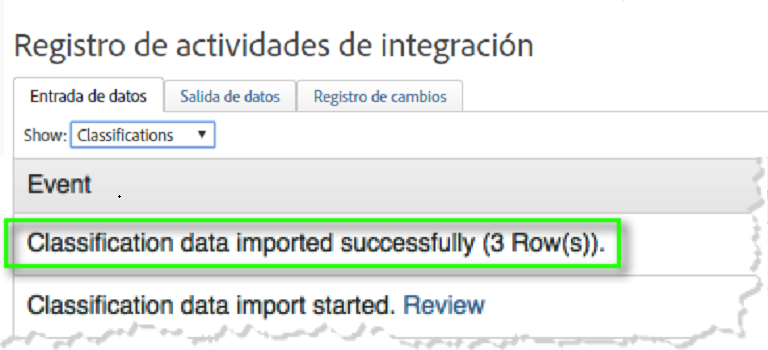
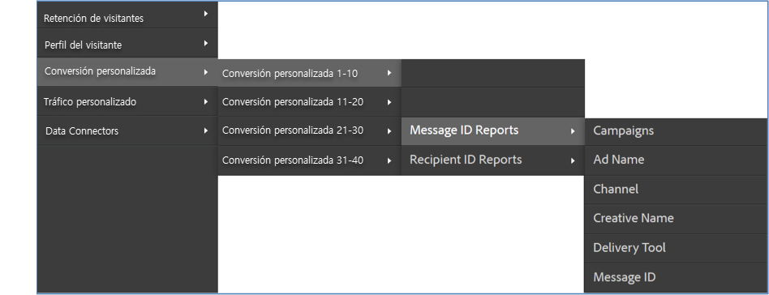

# Implementación de la integración {#deploying-the-integration}

Implementar esta integración es un proceso sencillo que requiere las siguientes acciones:

## Completar el asistente de integración de Adobe {#completing-the-adobe-integration-wizard}

Pasos para completar el asistente de integración en la interfaz de Data Connectors.

1. Vaya al área de Data Connectors (anteriormente Genesis) dentro de Adobe Experience Cloud.
1. Inicie el asistente de integración de ContactLab.
1. Elija el grupo de informes deseado y proporcione un nombre para la integración.
1. Configure las opciones siguientes:

   | Elemento | Descripción |
   |---|---|
   | Correo electrónico Dirección | La dirección de correo electrónico del contacto principal |
   | Descripción | (Opcional) Descripción de esta configuración de integración |

1. Configure las siguientes opciones de **[!UICONTROL Asignaciones de variables]**:

   | Elemento | Descripción |
   |---|---|
   | ID del vínculo | Seleccione una eVar para recopilar los ID de vínculo en tiempo real. |
   | ID de mensaje | Seleccione una eVar para recopilar los ID de mensaje en tiempo real. |
   | Recipient ID (ID de destinatario) | Seleccione una eVar para recopilar los ID de destinatario en tiempo real. |
   | Devoluciones | Seleccione un evento numérico para recibir devoluciones diarias de ContactLab. |
   | Enviados | Seleccione un evento numérico para recibir envíos diarios desde ContactLab. |
   | Clics | Seleccione un evento numérico para recibir todos los clics diarios de ContactLab. |
   | Aperturas | Seleccione un evento numérico para recibir las aperturas totales diarias desde ContactLab. |
   | Cancelación de suscripción | Seleccione un evento numérico para recibir cancelaciones de suscripciones diarias desde ContactLab. |

1. Habilite el acceso a los datos y configure la recopilación de datos.
   1. Cambie los nombres de las clasificaciones si fuera necesario.
   1. **[!UICONTROL Los segmentos asociados]** son segmentos de remarketing estándar que se incluyen en la integración.
   1. En **[!UICONTROL Sus segmentos]**, seleccione los segmentos personalizados que desee incluir en esta integración. Puede crear segmentos personalizados adicionales en el panel de administración.
   1. En **[!UICONTROL Solicitudes de acceso]**, marque la casilla para permitir que la información del producto se exporte a ContactLab en segmentos de remarketing diarios.
   1. Cambie el nombre de las métricas calculadas según sea necesario.
   1. Configure si va a recopilar los ID actualizando manualmente el código de recopilación de Analytics o utilizando la solución automatizada. Si selecciona **[!UICONTROL Solución automatizada]**, debe incluir los parámetros que se utilizan en los vínculos de correo electrónico para pasar los ID.
1. Revise todas las opciones de configuración y haga clic en **[!UICONTROL Activar ahora]**.

## Verificar la integración {#verifying-the-integration}

Vea la configuración de la integración de ContactLab en Adobe Experience Cloud.

1. Vea el registro de actividades de integración.
   1. En Adobe Experience Cloud, vaya a **[!UICONTROL Asistencia]** > **[!UICONTROL Registro de actividades de integración]**.

      

   1. Busque entradas como **[!UICONTROL Datos de clasificación importados correctamente]**, **[!UICONTROL Datos de métricas importados correctamente]** y **[!UICONTROL Datos de métricas exportados correctamente]**. Estas entradas deberían aparecer en el plazo de 1 día desde que se realizó la implementación.
1. Vea los datos de los informes en Adobe Analytics.
   1. Vaya a **[!UICONTROL Conversión personalizada]** > **[!UICONTROL Conversión personalizada 1-10]** > **[!UICONTROL Informes de ID de mensaje]**.

      

   1. Busque los informes de ContactLab. Estos datos deberían aparecer entre 24 y 48 horas después de la implementación.
