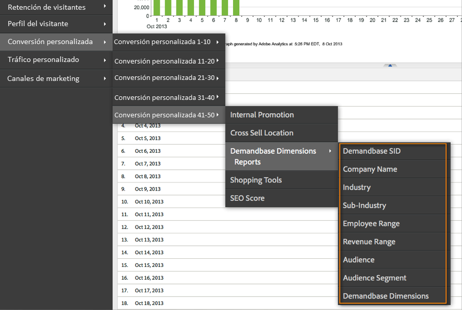
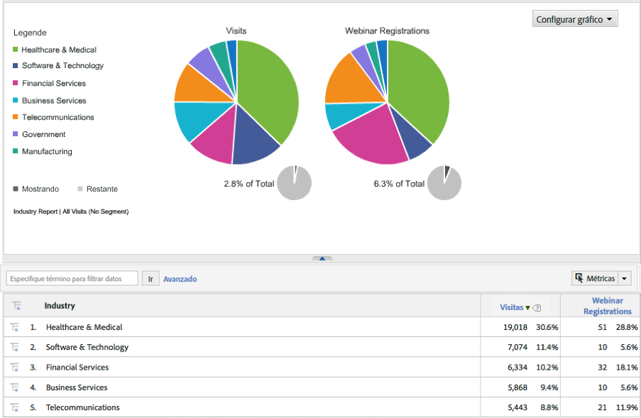

# Implementación de la integración {#deploying-the-integration}

Implementar esta integración es un proceso sencillo que requiere las siguientes acciones.

## Finalización del asistente de integración de Adobe {#completing-the-adobe-integration-wizard}

Para activar la integración, debe completar el asistente de configuración en la interfaz de Data Connectors.

1. Vaya al área de Data Connectors (anteriormente Genesis) dentro de Adobe Experience Cloud.
1. Inicie el asistente de integración de Demandbase 2.0.
1. Elija el grupo de informes deseado y proporcione un nombre para la integración.
1. Configure las opciones siguientes:

<table id="table_8D60DC7C48C144DC9934749E7F9F65FF"> 
 <thead> 
  <tr> 
   <th colname="col1" class="entry"> Elemento </th> 
   <th colname="col2" class="entry"> Descripción </th> 
  </tr>
 </thead>
 <tbody> 
  <tr> 
   <td colname="col1"> Correo electrónico Dirección </td> 
   <td colname="col2"> La dirección de correo electrónico del contacto principal. </td> 
  </tr> 
  <tr> 
   <td colname="col1"> Descripción </td> 
   <td colname="col2"> (Opcional) Descripción de esta configuración de integración. </td> 
  </tr> 
  <tr> 
   <td colname="col1"> Clave de API de Demandbase </td> 
   <td colname="col2"> Puede obtenerla de su representante de Demandbase. </td> 
  </tr> 
  <tr> 
   <td colname="col1"> Dimensión de Demandbase personalizada #N </td> 
   <td colname="col2"> Son los ID de las 8 dimensiones opcionales. Para obtener más información, consulte Dimensiones personalizadas de Demandbase. </td> 
  </tr> 
  <tr> 
   <td colname="col1"> Enviar a Adobe Target </td> 
   <td colname="col2">Si se establece en “true”, las dimensiones de Demandbase también se envían a Adobe Target mediante un archivo mbox oculto. <p>Nota: Se debe implementar un archivo mbox.js configurado en la página web para que se recopilen las dimensiones. </p> </td> 
  </tr> 
 </tbody> 
</table>

1. Configure las siguientes opciones de Asignaciones de variables:

   | Elemento | Descripción |
   |---|---|
   | Dimensiones de Demandbase | Elija una variable eVar disponible en el grupo de informes. |
   | Dimensiones personalizadas de Demandbase (opcional). | Elija una variable eVar disponible en el grupo de informes. |

1. Configure los nombres de la dimensión personalizada (si corresponde).

   1. Si eligió incluir dimensiones personalizadas en el paso 4 y asignó la eVar opcional en el paso 5, debe proporcionar nombres descriptivos para cada dimensión. Por ejemplo, si elige introducir “stock_ticker” como dimensión personalizada 1, debe cambiar la casilla que contiene “Dimension 1” a “Stock Ticker”.
   1. **NO** modifique los nombres de las 8 dimensiones estándar (es decir, SID de Demandbase, Nombre de la empresa, Sector, etc.).

1. Marque la casilla para que el Panel de integración de Demandbase se cree automáticamente (recomendado).
1. Revise todas las opciones de configuración y haga clic en **[!UICONTROL Activar ahora]**.

## Implementación del código de integración {#deploying-the-integration-code}

Después de completar el asistente de integración, debe implementar el código de integración en el código de implementación de Adobe Analytics (s_code).

>[!NOTE]
>
>Si ha utilizado Adobe TagManager o Dynamic Tag Management para implementar Adobe Analytics, puede añadir fácilmente el código de integración con una de estas herramientas.

1. Vaya a la pestaña **[!UICONTROL Asistencia]** y descargue y guarde el recurso `integration code v2_0_1` desde el área Recursos de la integración.

1. Si procede, realice las modificaciones necesarias en el código. Para obtener más información, consulte Modificación del código de integración (en esta página).
1. Incluya el módulo Integrate si no está presente en el código de implementación de Adobe Analytics.
1. Implemente el código mediante uno de los siguientes métodos:

   * Utilice Adobe TagManager o Dynamic Tag Management para agregar el código.
   * O bien, envíe el código al recurso de organización responsable de actualizar el código de implementación de Adobe Analytics.

>[!IMPORTANT]
>
>Asegúrese de probar la implementación para esta integración en un entorno de desarrollo o ensayo antes de implementarla en un entorno de producción.

## Modificación del código de integración {#modifying-the-integration-code}

En la mayoría de los casos, no es necesario realizar ninguna modificación en el código de integración que proporciona el asistente de Data Connectors.

Sin embargo, si necesita realizar ajustes, a continuación se describen algunos de estos para el código.

<table id="table_5405A73CEFD44466B3C39559F4A037C9"> 
 <thead> 
  <tr> 
   <th colname="col1" class="entry"> Configuración del código </th> 
   <th colname="col2" class="entry"> Descripción </th> 
  </tr>
 </thead>
 <tbody> 
  <tr> 
   <td colname="col1"> s.maxDelay </td> 
   <td colname="col2">El número máximo de milisegundos que la solicitud de imagen de Adobe Analytics espera a los datos de Demandbase antes de activarse en el servidor de recopilación de Analytics. <p>Nota: Esta configuración se aplica a todas las integraciones que se estén ejecutando a través del módulo Integrate. </p> </td> 
  </tr> 
  <tr> 
   <td colname="col1"> _db._key </td> 
   <td colname="col2"> La clave de API de Demandbase. </td> 
  </tr> 
  <tr> 
   <td colname="col1"> _db._apiURL </td> 
   <td colname="col2"> Plantilla de URL para la API de Demandbase. </td> 
  </tr> 
  <tr> 
   <td colname="col1"> _db._delim </td> 
   <td colname="col2"> El delimitador utilizado para separar los elementos de dimensión Demandbase cuando se envían a Adobe Analytics. Si se cambia esta configuración, es posible que las reglas de clasificación predeterminadas no funcionen correctamente. </td> 
  </tr> 
  <tr> 
   <td colname="col1"> _db._setTnt </td> 
   <td colname="col2">Si se establece en “true”, el código de integración intenta usar un archivo mbox oculto para enviar las dimensiones de Demandbase a Adobe Target como parámetros de perfil. <p>Nota: Esto requiere que el código mbox.js exista en la página. </p> </td> 
  </tr> 
  <tr> 
   <td colname="col1"> _db._tntVarPrefix </td> 
   <td colname="col2"> Esta cadena se antepone a cada nombre de dimensión de Demandbase antes de enviarla a Adobe Target. Por ejemplo, si esta configuración tiene el valor “db_”, la dimensión “sector” se envía a Adobe Target como “db_sector”. </td> 
  </tr> 
  <tr> 
   <td colname="col1"> _db._dimensionsArray </td> 
   <td colname="col2"> Dimensiones estándar de Demandbase que se envían a Adobe Analytics. Se recomienda no modificar esta configuración. La propiedad “max_size” es el número de caracteres permitidos para la dimensión antes de que se produzca el truncamiento. </td> 
  </tr> 
  <tr> 
   <td colname="col1"> _db._dimensionsArrayCustom </td> 
   <td colname="col2"> Dimensiones de Demandbase personalizadas que se envían a Adobe Analytics. La propiedad “max_size” es el número de caracteres permitidos para la dimensión antes de que se produzca el truncamiento. </td> 
  </tr> 
  <tr> 
   <td colname="col1"> _db._cName </td> 
   <td colname="col2"> Nombre de la cookie de sesión que se utiliza para mantener el estado de la comunicación de la API de Demandbase. </td> 
  </tr> 
  <tr> 
   <td colname="col1"> _db._contextName </td> 
   <td colname="col2"> Nombre de la variable contextData que se utiliza para enviar las dimensiones estándar a Adobe Analytics. Se recomienda no modificar esta configuración. </td> 
  </tr> 
  <tr> 
   <td colname="col1"> _db._contextNameCustom </td> 
   <td colname="col2"> Nombre de la variable contextData que se utiliza para enviar las dimensiones personalizadas a Adobe Analytics. Se recomienda no modificar esta configuración. </td> 
  </tr> 
 </tbody> 
</table>

## Inclusión del módulo Integrate {#including-the-integrate-module}

El código de integración requiere que el módulo Integrate exista dentro de la implementación de Adobe Analytics.

Si todavía no tiene el módulo Integrate como parte de la implementación, complete los siguientes pasos según el tipo de implementación que tenga.

### Para AppMeasurement 1.0+ {#section-f28d090bf2404cabaae34cd9c66fc575}

1. Descomprima el archivo zip de AppMeasurement que descargó de **[!UICONTROL Analytics]** > **[!UICONTROL Administración]** > **[!UICONTROL Administrador de códigos]**.

1. Abra el archivo llamado [!DNL AppMeasurement_Module_Integrate.js].
1. Copie y pegue el contenido de este archivo en el archivo principal [!DNL AppMeasurement.js].

   >[!NOTE]
   >
   >Péguelo justo antes del comentario DO NOT ALTER ANYTHING BELOW THIS LINE (no alterar nada debajo de esta línea) dentro del archivo.

### Para código heredado (código H) {#section-bba8ad8c715e4f97883e7de3269f681a}

1. Descargue el módulo Integrate desde el área “Recursos” de la interfaz de usuario de Data Connectors (en la pestaña Asistencia técnica).

   

1. Copie y pegue el contenido de ese archivo en el archivo [!DNL s_code].

   >[!NOTE]
   >
   >Péguelo justo antes del comentario DO NOT ALTER ANYTHING BELOW THIS LINE (no alterar nada debajo de esta línea) dentro del archivo.

## Verificación de la integración {#verifying-the-integration}

Compruebe que la integración está capturando datos correctamente mediante la comprobación del seguimiento activo y los informes.

### Seguimiento activo {#section-9c20e8ff6b404ae09387ee07d675c9e2}

Utilice la herramienta de depuración DigitalPulse para comprobar que los datos de dimensión de Demandbase se envían a Adobe Analytics. Después de eliminar las cookies, vuelva a cargar una página del sitio web en la que se haya implementado el código de integración. Suponiendo que la IP actual se asigna a una organización reconocida por Demandbase, debería ver resultados similares a los siguientes.

**Reports &amp; Analytics (anteriormente SiteCatalyst) incluye las dos variables de datos de contexto de Demandbase:**


**Mbox de Target incluye los parámetros de perfil de Demandbase:**
solo puede verlo si tiene Target implementado en la página y tiene esta integración configurada para Adobe Target; consulte el paso 4 del asistente de integración de Adobe.


### Creación de informes {#section-1792fe75dc3249d0ad063dfd87a89162}

Revise los informes de Demandbase en Adobe Analytics mediante el panel creado automáticamente con el asistente de integración de Adobe (paso 7).

También puede navegar hasta los informes de Demandbase dentro de la estructura de menú de Adobe Analytics; consulte las capturas de pantalla a continuación.

>[!NOTE]
>
>Estos datos deberían aparecer entre 24 y 48 horas después de la implementación.





### Preguntas frecuentes {#section-d926b160a2ef4f07b43ea1bc67ac2a0a}

**¿Qué significa “[n/a]”?**

Demandbase Data Connectors indica cuándo un atributo está “No disponible” al establecer este valor predeterminado. Hay dos escenarios comunes en los que se establece el valor predeterminado:

* Demandbase detecta que el visitante proviene de una dirección IP que no pertenece a una empresa.
* Se utiliza un atributo de observación de cuenta (que comienza con “watch_list”), pero la empresa no está en la lista de observación de cuentas.

**¿Por qué aparece “`[n/a]`” con más frecuencia para determinados atributos?**

Demandbase clasifica todas las direcciones IP y proporciona los atributos audience y audience_segment incluso cuando el visitante no procede de una IP de la empresa. Cuando la audiencia devuelve valores como “Residencial”, “Inalámbrico” y “Hospitalidad”, es probable que el resto de atributos no estén disponibles.

A veces, la audiencia de un visitante es “SMB”, pero otros atributos muestran “`[n/a]`”. Esto significa que Demandbase puede clasificar al visitante como una pequeña empresa, pero el perfil completo de la empresa no está disponible. Esto suele ocurrir en las empresas más pequeñas, cuando más de una pequeña empresa utiliza el mismo proveedor de servicios o bloque de direcciones IP.

### Consideraciones del desarrollador {#section-d33fff55bc4b4db99f82dee418ef1bc2}

Si necesita ajustar el valor predeterminado en la implementación, actualice la línea:

```
_db._nonOrgMatchLabel = "[n/a]";
```
