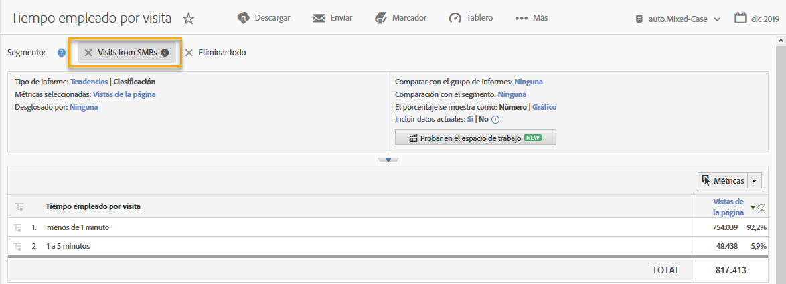

# Uso de la integración {#using-the-integration}

Una vez implementada la integración, puede empezar a utilizar las capacidades adicionales que proporciona.

>[!NOTE] Puede tardar entre 24 y 48 horas en empezar a ver algunos de los datos de Demandbase en los informes de Adobe Analytics.

A continuación, se indican algunas acciones que puede realizar para aprovechar esta integración desde Adobe Analytics:

## Visualización de métricas de tráfico y conversión por la dimensión de Demandbase {#viewing-traffic-and-conversion-metrics-by-demandbase-dimension}

Esta integración proporciona nuevas dimensiones que están disponibles como informes de Adobe Analytics.

El informe siguiente es un ejemplo de análisis de visitas y una métrica de conversión (Registros de seminario web) que se desglosaron por tipo de audiencia y por sector.

## Segmentación por dimensiones de Demandbase {#segmenting-by-demandbase-dimensions}

Una característica principal de esta integración es la capacidad de crear segmentos de Adobe Analytics basados en las dimensiones de Demandbase.

Por ejemplo, puede crear un segmento que incluya solo las visitas de organizaciones SMB. Puede llamar a estas visitas desde PYME. Su definición sería:

La audiencia es igual a SMB.

Para obtener más información sobre cómo crear segmentos, consulte la [Guía de segmentación de Analytics](https://docs.adobe.com/content/help/es-ES/analytics/components/segmentation/seg-home.html).

Este segmento se puede aplicar a prácticamente cualquier informe; un ejemplo es el informe de tiempo empleado por visita que se ve aquí: 
