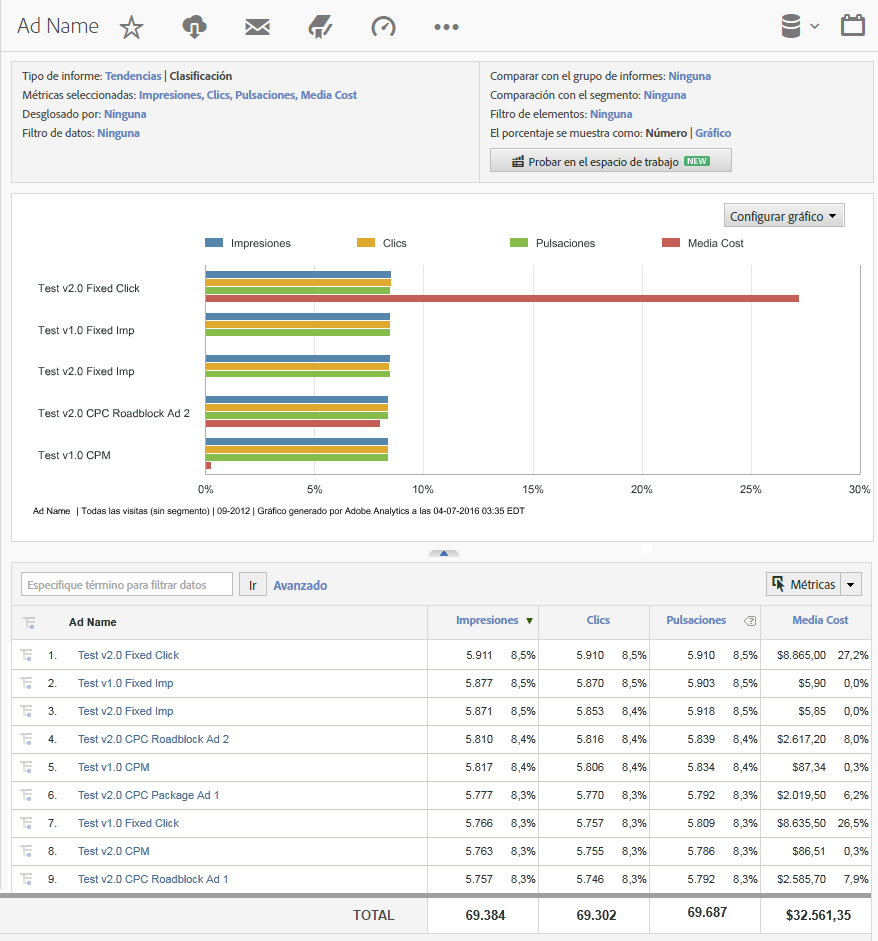

# Informes de Analytics que usan datos de DFA {#analytics-reports-using-dfa-data}

Una vez que los servidores de recopilación de Adobe® y DFA se pueden comunicar, puede generar informes en Reports &amp; Analytics que incluyen datos de DFA.

Los informes DFA preempaquetados incluyen lo siguiente:

**Canal**: muestra datos comparando anuncios de tipo titular con otras opciones de publicidad en línea, como Búsqueda paga y Correo electrónico.

**Herramienta de entrega**: muestra datos comparando DoubleClick for Advertisers con otros servicios de publicidad en línea.

**Nombre del sitio**: muestra datos comparando sitios web donde aparecieron anuncios de tipo titular de DFA.

**Nombre de la página**: muestra datos comparando páginas web individuales donde aparecieron anuncios de tipo titular de DFA.

**Nombre del anuncio**: muestra datos comparando anuncios de tipo titular de DFA específicas.

**Campañas**: muestra datos comparando diferentes campañas de publicidad de DFA.

Para generar un informe DFA:

1. Inicie sesión en Adobe Experience Cloud.
1. Vaya a **[!UICONTROL Analytics]** > **[!UICONTROL Reports &amp; Analytics]**. Asegúrese de haber seleccionado el grupo de informes donde instaló la integración de DFA.

1. En la navegación del lado izquierdo, seleccione la variable de Conversión que captura los datos de clics de DFA. A continuación, seleccione el informe DFA que desee.
1. Haga clic en **[!UICONTROL Agregar métricas]**. Se abre el cuadro de diálogo Selector de métricas.
1. Compruebe las métricas de Impresiones y Clics en la lista **[!UICONTROL Métricas disponibles]** y haga clic en **[!UICONTROL Aplicar]**.

   El informe generado muestra datos de Impresiones, Clics e Ingresos de modo que pueda ver cómo los servicios DFA se traducen en ingresos de saldo final.
Por ejemplo, un informe de Nombre de anuncio DFA muestra los datos de impresiones, clics e ingresos que se atribuyen directamente a anuncios de tipo titular específicas en la campaña de publicidad DFA actual:

   

Este informe tiene las siguientes funciones importantes:

* El encabezado del informe, etiquetado DFA_Ad Name Report, muestra el período de tiempo del informe (febrero de 2009), e indica que se trata de un informe de clasificación mediante un formato de Barra horizontal.
* El gráfico mismo muestra tres métricas (Impresiones, Clics e Ingresos) para cada anuncio DFA en el informe.
* El gráfico muestra datos para cada métrica como un porcentaje del total de métricas, en lugar de usar los números reales para cada métrica. Puede cambiar esto en el cuadro de diálogo **[!UICONTROL Configurar informe]**.
* Debajo del gráfico, el informe DFA_Ad Name muestra una lista con los detalles del informe para cada uno de los anuncios DFA, y muestra tanto datos numéricos como porcentuales para el rendimiento del anuncio.
* Seleccione un nombre de anuncio DFA para abrir un menú de opciones y obtener más información sobre ese anuncio DFA específico.
* Cada columna de métrica incluye una clave de color que corresponde al color asignado de la métrica en el gráfico.
* El informe está ordenado según la métrica de ingresos con el anuncio de ingresos más alta en la parte superior. Puede cambiar el ordenamiento del informe si hace clic en una etiqueta (métrica) de columna diferente.
