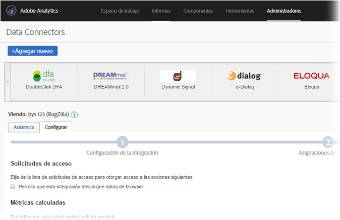
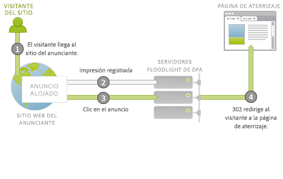
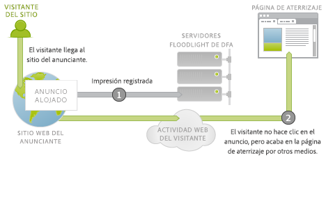
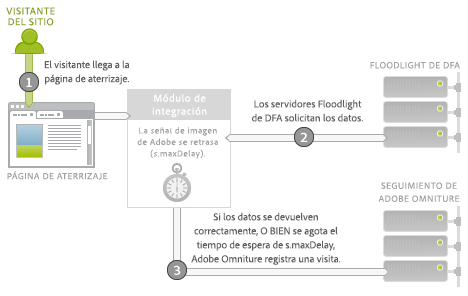
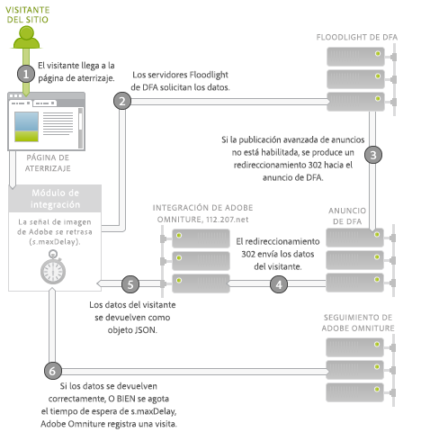

# Data Connectors de DFA para Adobe Analytics {#dfa-data-connector-for-adobe-analytics}

>[!IMPORTANT]
>
>La vida útil de la tecnología de Adobe Data Connector finalizará de mediados a finales de 2021. [Más información...](/help/import/data-connectors/data-connectors-eol.md)

En un mercado en línea actual que se caracteriza por ser cada vez más complejo y competitivo, los anunciantes y las agencias en línea deben mejorar continuamente sus conocimientos acerca del entorno de marketing en línea y su retorno en gastos de publicidad. Aunque los anunciantes, las agencias, y los publicistas poseen herramientas individuales para ayudarles a lograr estos objetivos, agregar datos manualmente desde sistemas de datos y procesos diferentes puede dañar gravemente la eficacia de las campañas de marketing en línea, dando como resultado un rendimiento de la campaña menos que óptimo, discrepancias de datos y confusión.

La integración de DoubleClick para anunciantes (DFA) soluciona este problema al usar Data Connectors™ de Adobe® para permitir que DoubleClick DFA pase datos automáticamente a Reports &amp; Analytics.

**[!UICONTROL Analytics]** > **[!UICONTROL Administrador]** > **[!UICONTROL Data Connectors]**

## Ventajas principales {#key-benefits}

Entre las ventajas principales de la integración de Data Connectors - DFA se incluyen las siguientes:

* **Aumento de conversión**: obtenga información direccional para optimizar la ubicación de campaña de publicidad y conversión in situ en función de las preferencias y del comportamiento del visitante tras hacer clic.
* **Ubicación compartida para datos**: combine datos de visualizaciones y clics de DoubleClick DFA con Reports &amp; Analytics para mejorar la colaboración entre organizaciones y la capacidad de tomar decisiones objetivas.
* **Análisis de valor agregado**: la integración automatizada entre DFA e Reports &amp; Analytics de Adobe permite que los anunciantes y las agencias destinen menos tiempo a realizar un procesamiento intensivo de datos y más tiempo a analizar informes y tomar medidas.
* **Un conocimiento más profundo del cliente**: obtenga un conocimiento más profundo sobre el lugar de donde provienen los visitantes y qué están haciendo en su sitio.
* **Duración de métricas de éxito**: mida la efectividad de sus campañas de adquisición en todo el ciclo de vida del visitante.
* **Informes integrados**: sincronice datos automáticamente entre DFA e Reports &amp; Analytics para procesos e informes comerciales y racionalizados.
* **Duración del análisis de visitante**: mida la eficacia de la campaña mediante varios eventos de éxito definidos por el usuario y valor de duración.
* **Métricas de coste**: optimice la rentabilidad de su inversión comparando figuras de coste DFA e ingresos de esos costes en un solo sistema.

## Información general sobre la integración del servicio de publicidad {#ad-serving-integration-overview}

Existen varias maneras en que esta integración obtiene datos sobre el visitante que llega por anuncio. La primera manera es haciendo clic en un anuncio y llegar en una página de aterrizaje etiquetada, también denominada proporción de clics:

El visitante llega en un sitio del publicador, que aloja el anuncio. Este anuncio tiene un identificador único, denominado ID de anuncio. Los anuncios comprenden una ubicación más un creativo, que describen dónde se encuentra el anuncio en el sitio del publicador y qué contenido se mostró al visitante. Cuando el visitante obtiene este anuncio, ubicación o creativo desde los servidores de contenido DFA, rastrea una impresión en los Servidores de Floodlight DFA para este visitante (1).

Si el visitante hace clic en el anuncio (2), se realiza una consulta al Servidor de Floodlight que cuenta un clic, 302 redirecciona (3) al visitante a la página de aterrizaje. Se denomina una proporción de clics cuando el visitante ha llegado en la página de aterrizaje. Esta página contiene código de seguimiento de Adobe que realiza una consulta de datos desde el Servidor de Floodlight DFA.

No se denomina una proporción de clics cuando el visitante no llega realmente a la página de aterrizaje después de que el Servidor de Floodlight haya rastreado un clic. Puede que algunos anuncios e implementaciones realmente no hagan que el explorador del visitante obedezca el redireccionamiento 302. Para obtener más información sobre este tema, consulte [Reconciliación de discrepancias de métricas](../dfa-data-connector-analytics/dfa-reconciling-metric-discrepancies.md).

La siguiente métrica capturada por esta integración ocurre cuando el visitante recibe la impresión de anuncio, no hace clic, pero en algún momento próximo inminente llega a la página de aterrizaje por otro medio.

Este escenario se denomina visualización. La diferencia en este escenario con el escenario de proporción de clics es que el visitante no hace clic en el anuncio, sino que continúa con otras actividades antes de llegar a la página de aterrizaje (2). En el caso más simple, el visitante escribe la dirección URL de la página de aterrizaje en el explorador. En otros casos, el visitante continúa explorando pero luego usa un motor de búsqueda, que lleva al visitante a la página de aterrizaje. En cualquier caso, el usuario llega a la página de aterrizaje.

## Integración de Adobe: recopilación de datos en tiempo real {#adobe-integration-real-time-data-collection}

La siguiente figura muestra cómo funciona la recopilación de datos.

La parte de recopilación de datos de la integración de Adobe comienza cuando el visitante llega a la página de aterrizaje (1). El código de recopilación de datos de Adobe que se ejecuta en la página de aterrizaje no conoce el historial que el visitante ha tenido con los anuncios publicados. El equipo de DFA de Google ha coordinado un servicio que se ejecuta en el Servidor de Floodlight DFA para permitir que el código de Adobe realice una consulta a la información de anuncio sobre el visitante que se encuentra en el sitio (2). Para obtener estos datos, demora temporalmente la señalización de imagen de Adobe y solicita los datos del Servidor de Floodlight.

Cuando llegan los datos, o si tardan demasiado tiempo, activa la visita a los servidores de seguimiento de Adobe (3).

El módulo Integrate es un módulo principal y especial de JavaScript de Adobe que hace que se demore la señalización de imagen de Adobe, esperando la solicitud de un tercero durante un período de tiempo específico (`s.maxDelay`). `s.maxDelay` define cuánto tiempo el módulo Integrate esperará datos del Servidor de Floodlight DFA antes de activar la etiqueta de imagen en el explorador del visitante. Este comportamiento es importante para que los datos básicos del visitante se sigan recopilando, incluso cuando los Servidores de Floodlight DFA no están en funcionamiento o bien tienen una carga intensiva. Si los datos de Floodlight llegan antes de que `s.maxDelay` hayan caducado, los datos de seguimiento de Adobe aún se activarán de forma inmediata, y contendrán los datos de DFA adicionales.

Cuando se agota el tiempo de espera, el código de la página puede especificar un Evento de Reports &amp; Analytics de Adobe para utilizarse como Evento de tiempo de espera. Este evento resulta útil a la hora de diagnosticar problemas con la integración, o a la hora de ajustar `s.maxDelay`. En casos donde existen tiempos de espera excesivos, incremente `s.maxDelay`. `s.maxDelay` puede establecerse, de todas formas, demasiado alto, en cuyos casos el visitante podría de dejar el sitio antes de que caduque el temporizador de `s.maxDelay`.

Algunas veces el Servidor de Floodlight responde con errores acerca del visitante. Esto generalmente sucede cuando el Servidor de Floodlight no conoce nada sobre el visitante, ya que el visitante aún no ha visto anuncios o no tiene una cookie de visitante DFA. El código de la página puede especificar una variable (eVar) de Conversión personalizada que recopilará estos errores, y puede ayudar en la resolución de problemas de implementación o destacar problemas con la transacción de Google. Los errores más comunes son Sin historial, Sin cookie, Error de consulta y No optó, tal como se describe en la siguiente tabla:

| Error | Nombre | Descripción |
|---|---|---|
| nh | Sin historial | El visitante no ha visto ni hecho clic en anuncios. |
| nc | Sin cookie | El visitante no tiene un código de visitante DFA. |
| qe | Error de consulta | Hubo un error al consultar los datos del Servidor de Floodlight. |
| oo | No optó | El visitante no optó por el rastreo de clics o la impresión de Google. |

## Integración de Adobe: importación de datos por la noche {#adobe-integration-nightly-data-import}

La parte de recopilación de datos de la integración recopila datos de clics y visualizaciones acerca de los visitantes del sitio. Para obtener métricas de clics, impresiones y costes de DFA, existe un proceso por la noche que está coordinado por Google y Adobe para importar estos datos adicionales en el grupo de informes integrados. Estas métricas se importan a través de Fuentes de datos, lo que significa que están disponibles en conjunto solamente, y no se encuentran en el nivel de visita.

## Diferencias de versiones {#version-differences}

Actualmente existen tres versiones de integración de DFA: 1.0, 1.5, y 2.0.

La siguiente tabla resume las funciones en cada versión de la integración.

| Función | Versión 1.0 | Versión 1.5 | Versión 2.0 |
|---|---|---|---|
| Métricas por la noche de clics e impresiones de DFA | Sí | Sí | Sí |
| Rastreo de clics y visualizaciones | Sí | Sí | Sí |
| La integración recibe datos en un nivel de Anunciante | No | Sí | Sí |
| La integración recibe datos en un nivel de Configuración de Floodlight | No | No | Sí |
| Métricas de coste | No | No | Sí |
| Métricas de creativo | No | No | Sí |
| Cadenas de consulta más allá de 2k bytes | No | Sí | Sí |
| Usa el módulo Integrate para una recopilación de datos óptima de terceros | No | Sí | Sí |
| Rastreo de tiempos de espera y errores | No | Sí | Sí |
| Sin necesidad de ID del cliente negociado | No | No | Sí |

### Acerca de la versión 1.5 {#section-b5a3e967cfa141ea8f740612336181be}

La versión 1.5 de la integración introduce el módulo Integrate al JavaScript de la página de aterrizaje. El módulo Integrate permite solicitudes de tamaño fijo al servidor de publicidad de DFA (ad.doubleclick.net) que supera los límites de solicitudes de 2K de la integración previa. También introduce un tiempo de espera que se puede configurar, *`s.maxDelay`*, para seguir recopilando datos de visitantes de Adobe cuando ocurren interrupciones de red. Los errores y el tiempo de espera también se pueden recopilar en variables de Analytics.

La siguiente ilustración muestra interacciones de red en la página de aterrizaje en la versión 1.5.

En la versión 1.5, el módulo Integrate (2) solicita datos del Servidor de Floodlight (3). El Servidor de Floodlight redireccionará al servidor de publicidad de DFA, que devolverá datos sobre el visitante de la misma manera que la versión 1.0. Redireccionará 302 (4) a un servicio de traductor especial en integrate.112.2o7.net, que convertirá la estructura de la respuesta en un objeto JSON. El módulo Integrate consume este objeto JSON y pasa la información al Seguimiento de Adobe (5).

Al pasar de la Versión 1.0 de la integración a 1.5 hay un cambio de JavaScript. Para obtener este JavaScript, inicie sesión en su cuenta de Adobe Online Marketing Suite, elija el producto Genesis, haga clic en Editar en la integración DFA y continúe con el asistente. Siempre y cuando se haya asignado previamente un ID de sitio de cliente, una vez que haya guardado la integración recibirá inmediatamente el nuevo código JavaScript por correo electrónico. Una vez que tenga este código, la nueva versión del s_code principal será necesaria con el módulo Integrate. Este código se puede solicitar al Administrador de cuentas o al Asesor de implementación.

Una función importante del nuevo código JavaScript es que no se necesita ningún cambio de implementación entre la versión 1.5 y la versión 2.0.

### Acerca de la versión 2.0 {#section-afd56de0c56c4489bb5ddc5798d6709a}

La última versión de la integración DFA incorpora datos para una Configuración de Floodlight completa en la integración. Antes de la versión 2.0, las integraciones individuales estaban ligadas a un solo Anunciante de DFA. Con este cambio las métricas de Clics, Impresiones y Costes para la Configuración de Floodlight completa se incluirán en el grupo de informes integrado. También es posible rastrear visualizaciones entre sitios, cuando los dos sitios se encuentren en la misma Configuración de Floodlight.

Las métricas de Coste de medios también están disponibles desde la versión 2.0 de la integración. Para habilitar métricas de coste de medios para una integración, debe elegir un evento de Reports &amp; Analytics para Coste de medios en el asistente de Genesis, así como también especificar en qué moneda se encuentran las figuras de métricas en la interfaz de DFA.

Se espera que los tiempos de espera disminuyan con la integración 2.0, puesto que se han eliminado los redireccionamientos 302. La eliminación de estos saltos debería disminuir los tiempos de espera e incrementar la cantidad de datos DFA que puede integrar.

Si una Configuración de Floodlight es una configuración compartida en DFA, la actualización de la versión 1. 5 a 2.0 hace que los datos de conversión para todos los anunciantes compartidos dentro de la Configuración de Floodlight se incluyan en el grupo de informes.

### Actualización a la versión 2.0 {#section-f0bf90b9a7a1434ab1540b6c0999f4c7}

La siguiente tabla describe los propietarios para migración a versiones más nuevas de la integración:

| Migración | Propietario | Tareas |
|---|---|---|
| Versión 1.0 a 1.5 | Cliente | Implementar JavaScript versión 1.5 con el módulo Integrate |
| Versión 1.5 a 2.0 | Cliente | El cliente comienza una conversación con Google sobre períodos de tiempo para la actualización. Después de la aprobación, Google habilita el Servicio de publicidad avanzado. |
