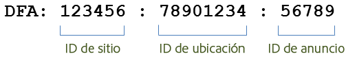
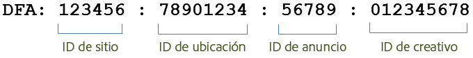

# Funciones de integración {#integration-features}

Una vez activada, la integración Data Connectors DFA proporciona las siguientes métricas para sus informes de Adobe Analytics:

* Visualizaciones
* Clics de DFA
* Impresiones
* (Opcional) Datos de costes de DFA
* (Opcional) Errores de consultas de DFA, Tiempos de espera

>[!NOTE]
>
>Esta integración no proporciona soporte para rastreadores de clics (anteriormente comandos de clics). Los rastreadores de clics se usan para registrar la cantidad de clics en vínculos de texto, vínculos en mensajes de correo electrónico o en otros elementos que no son modificables en un sitio web.

La integración de DFA de Data Connectors crea automáticamente códigos de seguimiento de DFA a partir de los datos devueltos por DFA. Estos códigos de seguimiento se crean para identificar de forma exclusiva un anuncio junto con su Ubicación y Creativo asociados. A continuación, se menciona la estructura del código de seguimiento, de acuerdo con la versión de la integración. La versión 1.5 tiene este formato:

La versión 2.0 tiene este formato:

Estos ID cumplen la función de clave compartida entre Genesis y DFA para asociar las clasificaciones y métricas correctas.

| ID del sitio | El sitio de terceros en el que se alojó el anuncio. La clasificación del Nombre del sitio proporciona un nombre descriptivo de este ID del sitio. |
|---|---|
| ID de anuncio | Un ID para el mensaje comercial que se entrega a un usuario. La clasificación del Nombre del anuncio contiene el nombre del anuncio tal como lo define su organización en el sistema de DFA. Por ejemplo: `Hybrid Coup Textlink - Build`. |
| ID de colocación | Una representación en la cuenta de DFA de un sitio web, parte de un sitio web o grupo de sitios web donde ha comprado espacio de publicidad. |
| ID del creativo | La imagen, Flash SWF u otro recurso pensado para ser mostrado al visitante. La clasificación Nombre del creativo contiene el nombre que ha proporcionado a este creativo en la interfaz DFA. |

Las otras dos clasificaciones, Herramienta de entrega (DoubleClick para Anunciantes) y Canal (anuncio tipo titular) tienen los mismos valores para cualquier campaña de DFA y ayudan a distinguir datos importados de DFA.

## Anulación de duplicación de SearchCenter {#section-f809b3bb5e5142aa8ff89bcd5f0d0e49}

La integración de DFA ahora reconoce Adobe SearchCenter. Al habilitar la anulación de duplicación de SearchCenter mediante el asistente de Data Connectors, los visitantes guiados por la búsqueda no hacen que se extraigan datos del servidor de Floodlight de DFA y no se completan los *`s.campaign`* con DFA, permitiendo así que SearchCenter los rellene. Además, DFA y SearchCenter ahora rellenan valores de anulación de duplicación en las variables para cada producto.

La siguiente lista describe la lógica que se habilita cuando está habilitada la anulación de duplicación de SearchCenter:

Si **[!UICONTROL DFA]** > **[!UICONTROL Anulación de duplicación de SearchCenter]** está seleccionada en el asistente:

* En el caso de hacer clic en DFA, la integración rellena la cadena “Hacer clic en DFA” con la eVar de SCM configurada.
* En el caso de una visualización de DFA, la integración rellena la cadena “Visualización de DFA” con la eVar de SCM configurada.

Si **[!UICONTROL SearchCenter]** > **[!UICONTROL Anulación de duplicación de DFA]** está seleccionada en el asistente:

* En el caso de una visualización de DFA, la integración rellena la cadena “Visualización de DFA” con la eVar de SCM configurada.

>[!NOTE]
>
>Si SearchCenter > Anulación de duplicación de DFA está habilitada y el parámetro de cadena de consulta de SearchCenter está establecido, la visita no se considera para procesamiento de DFA. Esto significa que el parámetro de cadena de consulta de SearchCenter debería ser diferente al parámetro de clics en DFA, y ningún anuncio de visualización debería establecer el parámetro de cadena de consulta de SearchCenter.
