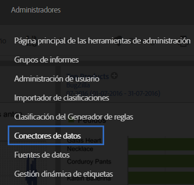
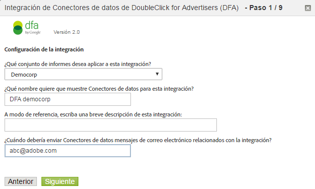

# Integración de DFA{#dfa-integration}

Configurar la integración de DFA implica las siguientes tareas:

## Configurar la integración de DFA{#configure-the-dfa-integration}

Complete los pasos de la integración de Data Connectors DFA.

Las páginas de configuración proporcionan información general sobre la integración, junto con vínculos útiles para obtener más información. Existen tarifas de Adobe como DoubleClick asociadas con esta integración. Póngase en contacto con los Representantes de ventas correspondientes para ambas organizaciones y asegúrese de comprender la estructura de tarifas.

1. Log in to the [!DNL Adobe Analytics].
1. Click **[!UICONTROL Admin]** &gt; **[!UICONTROL Data Connectors]**.

   

1. Locate **[!UICONTROL DoubleClick DFA]**, then click **[!UICONTROL Add New]**.

   

   En cada página del Asistente para integración, proporcione la información requerida y haga clic en **[!UICONTROL Siguiente]**. La siguiente tabla explica la información necesaria para completar la integración mediante el asistente.

<table id="table_8F6F7F304C36431DA5FD6E5D54F60FC0"> 
 <thead> 
  <tr> 
   <th colname="col1" class="entry"> Número de página del asistente </th> 
   <th colname="col2" class="entry"> Campo </th> 
   <th colname="col3" class="entry"> Descripción </th> 
  </tr> 
 </thead>
 <tbody> 
  <tr> 
   <td colname="col1"> 1 </td> 
   <td colname="col2"> Nombre de la integración </td> 
   <td colname="col3"> Nombre de integración que Genesis muestra en la Lista de integración activa del grupo de informes. </td> 
  </tr> 
  <tr> 
   <td colname="col1"> 1 </td> 
   <td colname="col2"> Integración de dirección de correo electrónico </td> 
   <td colname="col3"> La dirección de correo electrónico que recibe todas las notificaciones relacionadas con esta integración. </td> 
  </tr> 
  <tr> 
   <td colname="col1"> 2 </td> 
   <td colname="col2"> Nombre de usuario </td> 
   <td colname="col3"> El nombre de usuario de la API DFA para usar con esta integración. Para habilitar un usuario para el inicio de sesión de API, consulte el atributo API en la interfaz DFA. Después de habilitar el inicio de sesión de API, aparece un campo de contraseña para proporcionar una contraseña para el usuario. Esta contraseña se introduce junto con el nombre de usuario en el asistente para la autenticación. </td> 
  </tr> 
  <tr> 
   <td colname="col1"> 2 </td> 
   <td colname="col2"> Contraseña </td> 
   <td colname="col3"> La contraseña de la API DFA. </td> 
  </tr> 
  <tr> 
   <td colname="col1"> 2 </td> 
   <td colname="col2"> ID del anunciante </td> 
   <td colname="col3"> <p>El ID del anunciante de DFA o el ID de configuración de Floodlight principal. Los Data Connectors usan este ID para identificar el anunciante DFA para rastrear (versión 1.5 de la integración). Este ID de anunciante no se utiliza en la versión 2.0 de la integración; se buscará y usará el ID de configuración de Floodlight principal. Consulte las instrucciones en pantalla. </p> </td> 
  </tr> 
  <tr> 
   <td colname="col1"> 3 </td> 
   <td colname="col2"> Variable de anuncio DFA </td> 
   <td colname="col3"> La eVar de Analytics que recibe datos de atributo, impresiones y clics de campaña DFA. Generalmente, es la eVar de código de seguimiento ( <span class="varname"> s.campaign </span>), but you can choose any available eVar. Data Connectors también agrega las siguientes clasificaciones relacionadas con DFA a la eVar seleccionada: <p><b>Campañas</b>: una recopilación de anuncios publicados en varios sitios que transmiten mensajes en común. </p> <p><b>Nombre del sitio</b>: el sitio en el que se publicó el anuncio. </p> <p><b>Nombre del anuncio</b>: el nombre del anuncio, según se define en la cuenta DFA. </p> <p><b>Nombre de la ubicación del sitio</b>: el sitio y la página web donde se publicó el anuncio. </p> <p><b>Herramienta de entrega</b>: DoubleClick para Anunciantes. </p> <p><b>Canal</b>: anuncio de tipo titular. </p> <p><b>Estructura de costes</b>: CPM, CPC o Fijo en función de la estructura de costes del anuncio. </p> <p><b>Nombre creativo</b>: el nombre del creativo asociado con un ID de anuncio/ubicación/creativo. </p> <p><b>DFA &gt; Anulación de duplicación de SearchCenter</b>: especifica que el DFA debería colocar valores en variables de Searchcenter cuando se generan pulsaciones o visualizaciones de DFA. </a>. </p> </td> 
  </tr> 
  <tr> 
   <td colname="col1"> 4 </td> 
   <td colname="col2"> Impresiones </td> 
   <td colname="col3"> El evento personalizado que recibe datos de métricas de Impresiones de DFA. Las impresiones indican la cantidad de veces que se publicó el anuncio. </td> 
  </tr> 
  <tr> 
   <td colname="col1"> 4 </td> 
   <td colname="col2"> Clics </td> 
   <td colname="col3"> Seleccione el evento personalizado que recibe datos de métricas de clics de DFA. Los clics indican la cantidad de veces que los visitantes hicieron clic en la publicidad según la medición de la redirección de DFA. La métrica de clics se correlaciona con la métrica de pulsaciones de Analytics. <p>Nota: Los clics de DFA y las pulsaciones de Analytics podrían no coincidir exactamente debido a diferencias en la forma en que se recopilan los datos.  </a>. </p> </td> 
  </tr> 
  <tr> 
   <td colname="col1"> 5 </td> 
   <td colname="col2"> Variable de visualización </td> 
   <td colname="col3"> <p>La eVar de Analytics que recibe datos de visualización de DFA. La variable de visualización le ayuda a ver cómo las visualizaciones afectan a las tasas de conversión en su sitio. </p> <p>Data Connectors agrega las mismas clasificaciones relacionadas con DFA a esta eVar tal como a la variable de anuncio DFA (consulte más arriba). </p> </td> 
  </tr> 
  <tr> 
   <td colname="col1"> 5 </td> 
   <td colname="col2"> Tiempo desde la última vista (variable de bloque de tiempo de visualización) </td> 
   <td colname="col3"> La eVar de Analytics que recibe datos de Tiempo desde la última vista DFA. El Tiempo desde la última vista indica la cantidad de tiempo que ha transcurrido desde la última visualización de visualización de anuncio. </td> 
  </tr> 
  <tr> 
   <td colname="col1"> 5 </td> 
   <td colname="col2"> Visualizaciones </td> 
   <td colname="col3"> El evento personalizado que recibe datos de métricas de visualizaciones de DFA. Utilice el evento de visualizaciones con la variable de visualizaciones para ver qué campañas no influyeron en una pulsación directa, pero sí en conducir el tráfico al sitio en algún momento posterior. <p>Data Connectors cambia el nombre del evento personalizado seleccionado a "Visualizaciones". </p> </td> 
  </tr> 
  <tr> 
   <td colname="col1"> 6 </td> 
   <td colname="col2"> Error en consulta DFA  </td> 
   <td colname="col3"> (Opcional) La eVar de Analytics que recibe códigos de mensajes de error de consultas DFA que se han notificado. Algunos códigos posibles de mensajes DFA son: 
    <ul id="ul_85FC7FB19F7F4ADF83ABCA6DDB44CE19"> 
     <li id="li_0A3181DED5A149588A0D3F1584E2FE8B"><b>nc</b>: sin cookie DoubleClick. </li> 
     <li id="li_D397AA73AD5E4086A18B87F271E4EC14"><b>oo</b>: el usuario no ha optado. </li> 
     <li id="li_5AC1D0C8049340B4AD857D88E275CBD6"><b>nh</b>: sin historial de campaña. </li> 
     <li id="li_73A8C5E905C54E2BB531A1FCDBC6AA1A"><b>qe</b>: error de consulta (tiempo de espera, servidor caído, etc.). </li> 
    </ul> </td> 
  </tr> 
  <tr> 
   <td colname="col1"> 6 </td> 
   <td colname="col2"> Evento de tiempo de espera </td> 
   <td colname="col3"> <p>El Evento de contador de Analytics que se incrementa cada vez que caduca el temporizador <span class="varname"> s.maxDelay </span> timer expires, and no response was received from the DFA servers. Use this event to configure the <span class="varname"> s.maxDelay </span> variable Tuning s.maxDelay </a>.) </p> </td> 
  </tr> 
 </tbody> 
</table>

## Actualizaciones de sitios web para la Integración de DFA{#web-site-updates-for-the-dfa-integration}

Una vez que Genesis ha configurado el grupo de informes de Analytics para la integración de DFA, se debe hacer lo siguiente para configurar el sitio web y el entorno de DFA para admitir la integración:

### Verifique el espacio de cookie en el dominio{#verify-cookie-space-on-the-domain}

La integración de Data Connectors para DFA requiere que establezca una cookie en el dominio de la página.

Aunque es poco habitual, algunos dominios han alcanzado la capacidad máxima de cookies para algunos exploradores web. Para evitar afectar la experiencia de navegación de un visitante en el sitio Web, consulte con el equipo de desarrollo, operaciones de red o grupo de ingeniería para verificar que la adición de otra cookie al dominio de las páginas utilizadas para la integración de DFA no afectará la experiencia del usuario. También deberá seleccionar un nombre para la cookie.

### Actualizar el parámetro de cadena de consulta de DFA{#update-your-dfa-query-string-parameter}

Si ya ha estado rastreando campañas de publicidad con Adobe Analytics antes de la integración de DFA, es posible que todas las campañas (correo electrónico, búsqueda o titular) usen el mismo parámetro de cadena de consulta para identificar el ID de campaña de referencia en la página de aterrizaje.

Para comprender cuándo se deben solicitar datos de visualizaciones y pulsaciones desde datos de DFA para sus campañas de publicidad de DFA, Data Connectors necesita identificar cuándo un visitante ha hecho clic en un anuncio de titular de campaña de DFA. Para que esto sea posible, debe agregar un parámetro de cadena de consulta diferenciado a la dirección URL de la página de aterrizaje de la campaña de publicidad de DFA para que Data Connectors pueda distinguir entre las páginas de campaña de publicidad de DFA y otras páginas de campaña de publicidad que pueda tener en el sitio Web. El `dfa_overrideParam` complemento JavaScript utilizado para DFA.

>[!CAUTION]
>
>Aunque la variable de campaña puede utilizarse para otras campañas, no la utilice para campañas DFA. Si establece la variable de Campaña en una página de aterrizaje de campaña de DFA, Adobe no puede unir las impresiones y los clics con pulsaciones de campaña de DFA. Una vez por visita, los servidores de recopilación de Adobe comprueban en servidores DFA si hay una pulsación o visualización previa. Debido a esto, incluya el código del complemento DFA solo en páginas de aterrizaje comunes para evitar redirecciones innecesarias que pueden ralentizar los tiempos de carga de la página, especialmente para los usuarios con conexiones a Internet más lentas.

## Actualizar el código de la recopilación de datos de su sitio web{#update-your-web-site-s-data-collection-code}

La integración de Genesis para DFA aprovecha el ID de configuración de Floodlight DFA (dfa_SPOTID), que mejora la coherencia de informes entre el sistema de recopilación de datos de Adobe y DFA.

> [!NOTE] El término Spotlight se cambió a Floodlight en una reciente versión de DFA de Google. El parámetro JavaScript `dfa_SPOTID` recibió su nombre por la terminología de Spotlight pero se usa para ambas versiones.

Para habilitar la integración de DFA en su sitio web, debe actualizar su código de recopilación de datos JavaScript. Para ello, agregue lo siguiente:

* Módulo Integrate para DFA
* Adición al código de la recopilación

### Módulo Integrate para DFA {#section-fa00e42a732a4e27a4ab3dfcfeae1a5b}

The DFA integration leverages the Adobe Experience Cloud Integrate Module, which adds functionality to your core JavaScript data collection code ( `s_code.js`). El módulo Integrate se incluye como parte del archivo .zip cuando se descarga el código de AppMeasurement para Javascript desde el Administrador de códigos. Póngase en contacto con su consultor de Adobe solo si necesita ayuda adicional para encontrarla.

Insert the Integrate Module code in the `Modules` section of your website's `s_code.js` file.

### Adición al código de la recopilación {#section-8f98c727f1ba414fb8b4f02d696b8791}

Según las selecciones al activar la integración de DFA en el Asistente para integración, Data Connectors generan y le envían un correo electrónico con una adición personalizada a su código de recopilación de datos JavaScript. Inserte este código en la sección principal del archivo `s_code.js` (no en la función `doPlugins` u otra función).

El código de muestra aparece a continuación con fines ilustrativos únicamente; use el código que recibió por correo electrónico después de completar el Asistente para integración de Data Connectors.

El código de recopilación está formado por los siguientes componentes:

* Ajustes de Integrate de DFA
* Complementos requeridos por la integración

**Ajustes de Integrate de DFA**

```
/************************** DFA VARIABLES **************************/ 
var dfaConfig = { 
   CSID:              "1234567", 
   SPOTID:            "29876543", 
   tEvar:             "eVar17", 
   errorEvar:         "eVar59", 
   timeoutEvent:      "event76", 
   requestURL:         "http://fls.doubleclick.net/ 
json?spot=[SPOTID]&src=[CSID]&var=[VAR]&host=integrate.112.2o7.net%2 
Fdfa_echo%3Fvar%3D[VAR]%26AQE%3D1%26A2S%3D1&ord=[RAND]", 
 
   maxDelay:          "1500", 
   visitCookie:       "s_dfa", 
   clickThroughParam: "CID", 
   searchCenterParam: "s_kwcid", 
   newRsidsProp:      undefined 
}; 
/************************ END DFA Variables ************************/ 
```

El bloque Ajustes de Integrate de DFA establece variables requeridas por la integración de DFA. Los valores para cada una de estas variables provienen de las siguientes fuentes:

**CSID**: ID del cliente. Generado por DFA una vez que usted completa el Asistente para integración. Data Connectors rellena previamente esta variable con el ID CS de DFA, y también le envía este valor en el correo electrónico de configuración una vez que completa el Asistente para integración. Esta variable no se requiere si el Servicio de publicidad avanzado está habilitado en su cuenta.

**SPOTID**: configuración de Floodlight (antes denominado ID de Spotlight). Data Connectors rellena previamente esta variable con el ID de configuración de Floodlight DFA según la información de cuenta DFA especificada en el Asistente para integración.

**tEvar**: variable de transferencia. Data Connectors rellena previamente esta variable con el nombre de la variable de Analytics que especificó para la variable de Visualización en el Asistente para integración. No cambie este valor sin coordinar cuidadosamente con los servicios o el departamento de ingeniería de Adobe.

**errorEvar**: variable de error. Data Connectors rellena previamente esta variable con el nombre de la variable de Analytics que especificó para la variable de Error en consulta DFA en el Asistente de integración.

**timeoutEvent**: evento de tiempo de espera. Data Connectors rellena previamente esta variable con el nombre de la variable de Analytics que especificó para la variable de Evento de tiempo de espera en el Asistente para integración.

**requestURL**: el host de DFA remoto para realizar una consulta para información de anuncio. No cambie este valor a menos que Adobe se lo indique.

**maxDelay**: especifica el tiempo durante el cual el código de recopilación de datos JavaScript espera una respuesta del servidor de Floodlight DFA, en milisegundos. Adobe recomienda experimentar con este valor para encontrar el valor óptimo según el tráfico del sitio. Por ejemplo, al incrementar este valor, generalmente se recopilan más datos de DFA, pero también se incrementa el riesgo de perder datos de visitantes base si el visitante deja el sitio durante el período de demora. Al reducir este valor, baja el riesgo de perder datos de visitas, pero se puede reducir la cantidad de datos de DFA que se envían con los datos de visitas de Adobe.

**visitCookie**: el nombre de la cookie que se usa para restringir llamadas de DFA a una sola por visita.

**clickThroughParam**: un parámetro de consulta, generalmente incluido en todos los anuncios, que notifica al módulo Integrate de que acaba de ocurrir un clic. La presencia de este parámetro en la cadena de consulta hace que la solicitud ocurra en los servidores de Floodlight DFA independientemente de que el visitante ya hubiera sido consultado en los últimos 30 minutos.

**newRsidsProp**: (opcional) asignada a una variable de propiedad de Tráfico sin usar. La integración de DFA recopila y almacena este valor en la cookie de visita para identificar los grupos de informes que recopilaron datos para una visitante particular. Esta propiedad solo es necesaria con implementaciones personalizadas con los servicios de ingeniería de Adobe.

**Complementos requeridos por la integración**

La adición de Código de recopilación incorpora complementos adicionales que mejoran la operación de la integración DFA:

* Limita las consultas DFA a una vez por cada visita.
* Proporciona flexibilidad con el nombre de cookie. Aunque la mayoría de las organizaciones usan s_dfa, puede usar cualquier nombre de cookie válido para la integración de DFA.
* Elimina los redireccionamientos innecesarios. Dado que los datos de visualización se recopilan en tiempo real, los servidores de recopilación de Adobe y DFA podría intercambiar datos en todas las vistas de páginas. El complemento bloquea estos intercambios de datos cuando la información no es necesaria.

>[!CAUTION]
>
>Uno de los mecanismos que utiliza el complemento para eliminar consultas de DFA innecesarias es una cookie de visita basada en dominio. Un grupo de informes de integración que abarca varios dominios infla datos de clic y visualización cuando los visitantes abarcan varios dominios después de una visualización o pulsación influenciada por DFA.

## Confirmar una integración DFA correcta{#confirming-a-successful-dfa-integration}

Después de haber realizado todas las actualizaciones de sitios web que se requieran, puede usar un visualizador de tráfico de red, como Charles*, Chrome Developer Tools o Firebug* para confirmar que DFA se está comunicando con los servidores de recopilación de Adobe.

Después de haber implementado el archivo `s_code.js` que se puede usar con DFA, use el visualizador de tráfico de red para ver las solicitudes entre los servidores de recopilación de datos de Adobe y DFA, buscando lo siguiente:

* A request to DFA's `fls.doubleclick.net/json` service. Este servicio puede responder de forma diferente según la versión de DFA que esté usando. Con la versión 1.5 de Integración de DFA:

   * Un redireccionamiento HTTP 302 a [!DNL ad.doubleclick.net]. Enviará una etiqueta Location: en la respuesta que contiene información acerca del visitante del anuncio.
   * This Location tag causes a redirect to [!DNL integrate.112.2o7.net/dfa_echo]. Este servicio traduce la información acerca del visitante del anuncio en una cadena con codificación de JSON (JavaScript Object Notation). Estos datos se devuelven con una respuesta 200 OK HTTP.

* Con la versión 2.0 de Integración de DFA (Servicio de publicidad avanzado habilitado):

   * [!DNL fls.doubleclick.net] responderá directamente con 200 OK.

En cualquier caso, una solicitud correcta dará como resultado una solicitud a los servidores de recopilación de datos de Adobe que contiene el parámetro vX (donde X es su número de eVar de visualización). El valor de este parámetro adopta el formato: DFA-XXXX-XXXX- XXXX-XXXX-XXXX-XXXX-XXXX-XXXX-XXXX. Esta cadena contiene datos acerca del último clic y de la última impresión para el visitante actual.

## Ajuste de s.maxDelay{#tuning-s-maxdelay}

Lograr una implementación correcta de DFA implica optimizar s.maxDelay para el sitio específico.

En general, la decisión de aumentar o reducir *`s.maxDelay`* implica un equilibrio entre obtener más datos de visitantes de DFA y poner en peligro la recopilación de datos de visitantes de Adobe. Increasing *`s.maxDelay`* obtains more DFA visitor data, but (placed excessively high) could endanger the collection of Adobe visitor data. Al reducir s.maxDelay se garantiza la recopilación de datos del visitante de Adobe, pero podría perder datos del visitante de DFA.

*`s.maxDelay`* encapsula más que solo el tiempo en la comunicación de red para ponerse en contacto con DFA; también representa demoras del explorador para activar y evaluar el JavaScript desde el cual se basan estas comunicaciones. Esto se debe a que el módulo Integrate inicia el *`s.maxDelay`* temporizador después de haber insertado el elemento HTML en el DOM que extrae los datos del servidor de Floodlight DFA. La cantidad de tiempo que tarda el explorador en iniciar realmente la solicitud HTTP en función de este nuevo elemento HTML varía en función de otras imágenes o archivos JavaScript que se cargan simultáneamente, la velocidad del equipo del visitante e implementaciones específicas de exploradores. Además, cuando los datos de JSON se recuperan del servidor de Floodlight DFA, el explorador debe evaluar el JavaScript. El explorador nuevamente controla esto por completo y puede demorarlo si existe una gran cantidad de código JavaScript ejecutándose simultáneamente o muchas solicitudes JavaScript asincrónicas.

Teniendo en cuenta esto, *`s.maxDelay`* debe establecerse en función de la complejidad de la página de aterrizaje más la demora de red con DFA. En algunos sitios, una forma posible de reducir la complejidad es activar el código de recopilación de Adobe de forma anticipada en la carga de página, de modo que haya menos actividades en el explorador en el momento de realizar una solicitud al servidor de Floodlight.

La variable Timeout es absolutamente necesaria al ajustar *`s.maxDelay`*, porque se incrementa cada vez que se alcanza el tiempo de espera s.maxDelay. A la hora de decidir si aumentar o disminuir *`s.maxDelay`* recomendamos seguir este proceso:

1. Recopilar varios días de datos con *`s.maxDelay`* un valor determinado.
1. Ejecute un [!DNL Daily Unique Visitors Report] para el intervalo de tiempo.
1. Run the [!DNL Timeout Event Report] to check the number of timeouts that are coming through. Recuerde que un tiempo de espera se recopila una sola vez por visitante.

Ahora teniendo las figuras a mano, calcule

```
Timeout Percentage = [Step 3] / [Step 2] * 100
```

Observe que el Porcentaje de tiempo de espera está realmente considerando todos los visitantes del sitio. Algunos de estos visitantes no habrían estado unidos con DFA en absoluto. Por lo tanto, el tiempo de espera es confuso. Para mejorar este cálculo, otro análisis podría considerar solamente los visitantes únicos de las páginas con el `clickThroughParam` establecido (por ejemplo, `?CID=1`). Esto mostrará más exactitud.

Si el Porcentaje de tiempo de espera es muy bajo, considere la posibilidad de reducir *`s.maxDelay`*. Si es muy alto, incremente *`s.maxDelay`*. When decreasing *`s.maxDelay`*, you will want to rerun the [!DNL Timeout Report] to ensure that timeouts have not dramatically increased. Al aumentar *`s.maxDelay`*, querrá ejecutar un informe [!DNL Page Views Report] para asegurarse de que las vistas de página no se están agotando debido a la pérdida de datos. Each time *`s.maxDelay`* is changed observe the data for several days in order to ensure that the data represents a trend, and not just a day-to-day fluctuation.

The optimal setting for *`s.maxDelay`* is the point at which the timeout percentage is minimized while Page Views do not drop off.

Se espera que los tiempos de espera se reduzcan cuando pasa a la versión 2.0 de la integración, debido a las eliminaciones de redireccionamientos 302. Los hallazgos iniciales con clientes beta han demostrado una reducción coherente en los tiempos de espera, y así se recopilan más datos DFA.
