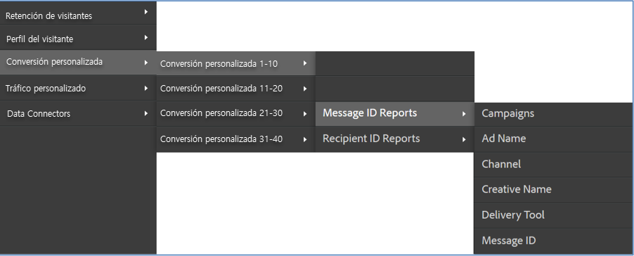
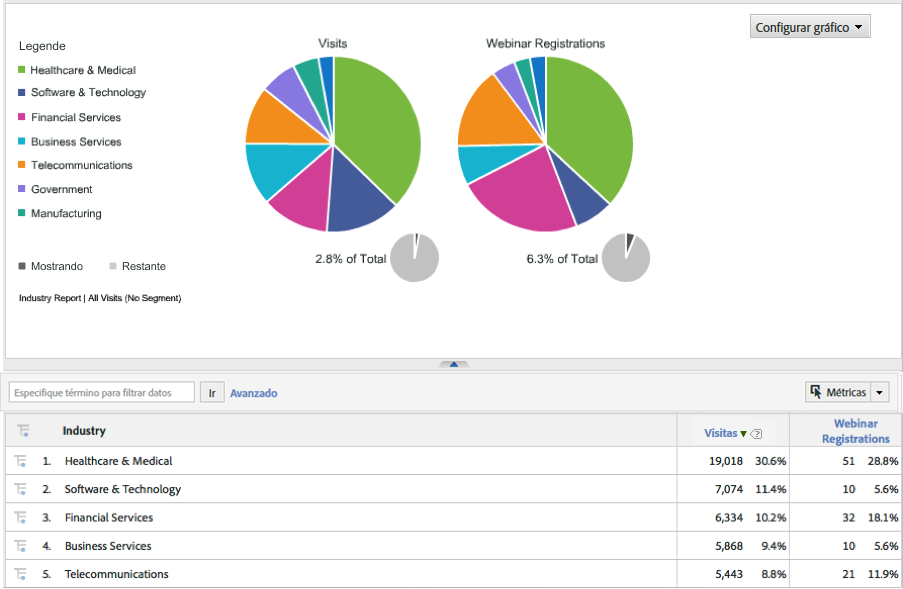

# Implementación de la integración {#deploying-the-integration}

La implementación de esta integración consiste en completar el asistente de integración de Adobe y verificar la integración.

## Finalización del asistente de integración de Adobe {#completing-the-adobe-integration-wizard}

Pasos para completar el asistente de integración en la interfaz de Data Connectors.

1. Vaya al área de Data Connectors (anteriormente Genesis) dentro de Adobe Experience Cloud.
1. Inicie el asistente de integración de Dynamic Signal.
1. Elija el grupo de informes deseado y proporcione un nombre para la integración.
1. Configure las opciones siguientes:

   | Elemento | Descripción |
   |---|---|
   | Correo electrónico Dirección | La dirección de correo electrónico del contacto principal. |
   | Descripción | (Opcional) Descripción de esta configuración de integración. |
   | ID de comunidad | Puede obtener este ID de su representante de Dynamic Signal. |

1. Configure las siguientes opciones de **[!UICONTROL Asignaciones de variables]**:

   | Elemento | Descripción |
   |---|---|
   | Código de seguimiento | Elija una variable eVar disponible en el grupo de informes. |

1. Revise las clasificaciones que se crean para esta integración.
1. Marque la casilla para crear el tablero de integración de señal dinámica (opcional, pero muy recomendable).
1. Revise todas las opciones de configuración y haga clic en **[!UICONTROL Activar ahora]**.
1. **Importante**: Una vez que haya completado el asistente, debe notificar al representante de señales dinámicas para que pueda activar la integración en la plataforma de VoiceStorm.

## Verificación de la integración {#verifying-the-integration}

Pasos para ver la configuración de la integración de Dynamic Signal VoiceStorm en Adobe Experience Cloud

1. Vea la configuración de la integración de Dynamic Signal en el registro de actividades de integración.
   1. En Adobe Experience Cloud, vaya a **[!UICONTROL Asistencia]** > **[!UICONTROL Registro de actividades de integración]**.

      

   1. Busque entradas como **[!UICONTROL Datos de clasificación importados correctamente]**. Estas entradas deberían aparecer en un plazo de 24 horas desde que se realizó la implementación.
1. Revise los informes de Dynamic Signal en Adobe Analytics mediante el panel creado automáticamente con el asistente de integración de Adobe (paso 7). También puede navegar hasta los informes de Dynamic Signal dentro de la estructura de menú de Adobe Analytics; consulte las capturas de pantalla a continuación.

   **Nota**: Estos datos deberían aparecer entre 24 y 48 horas después de la implementación.

   

   
