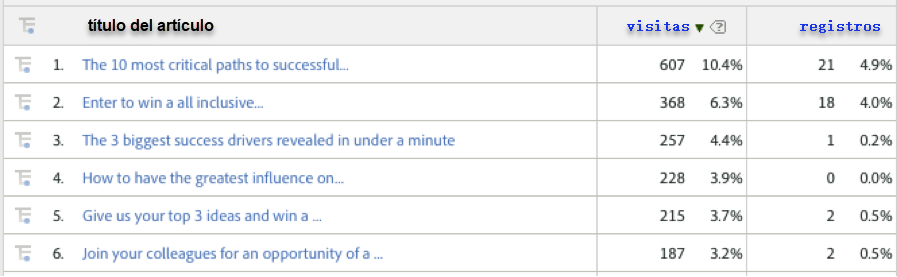
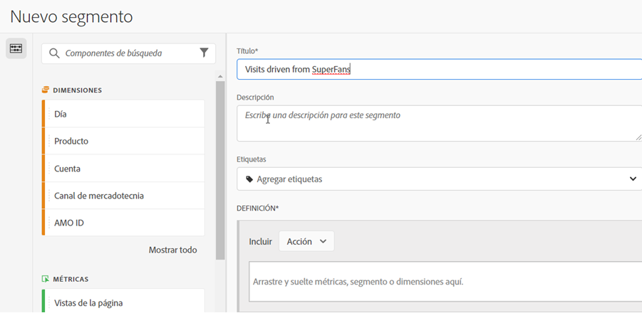
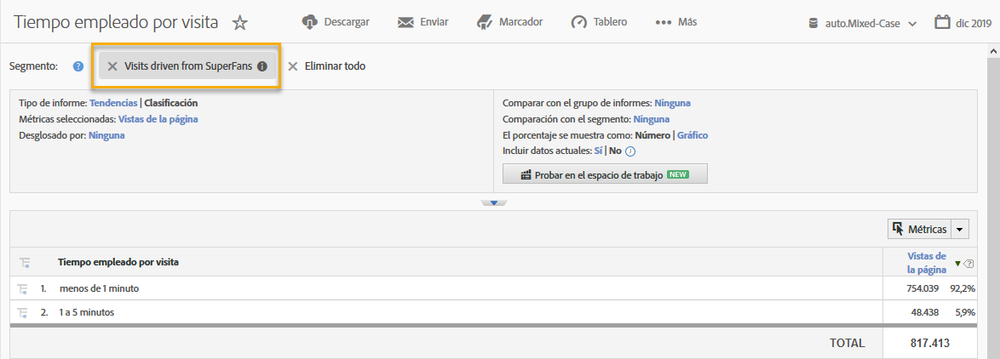

# Uso de la integración {#using-the-integration}

Una vez implementada, puede empezar a utilizar las funciones adicionales que ofrece esta integración.

**Nota**: Puede tardar entre 24 y 48 horas en empezar a ver algunos de los datos de Dynamic Signal en los informes de Adobe Analytics.

Las siguientes acciones aportan valor añadido a esta integración en Adobe Analytics.

## Visualización de métricas de tráfico y conversión por dimensiones de Dynamic Signal {#viewing-traffic-and-conversion-metrics-by-dynamic-signal-dimensions}

Ejemplo de un informe en Adobe Analytics.

Esta integración proporciona nuevas dimensiones que están disponibles como informes de Adobe Analytics. El informe siguiente es un ejemplo de análisis de visitas y una métrica de conversión (registros) que se desglosaron por título de artículo.

## Segmentación por dimensiones de Dynamic Signal {#segmenting-by-dynamic-signal-dimensions}

Ejemplos de segmentos basados en dimensiones de Dynamic Signal.

Una característica principal de esta integración es la capacidad de crear segmentos de Adobe Analytics basados en las dimensiones de informes integradas. Por ejemplo, puede crear un segmento que incluya solo las visitas que se originen de una comunidad de VoiceStorm específica. Puede llamar a esto “Visitas impulsadas por SuperFans”. Esta definición de segmento puede tener el aspecto siguiente.

## Dimensiones de informes integradas {#integrated-reporting-dimensions}

Enumera las dimensiones de informes de Dynamic Signal que se incluyen en esta integración.

| Dimensión | Descripción |
|---|---|
| Tipo de canal | La red social (o plataforma de blogs) donde el usuario compartió una publicación comunitaria. Los usuarios pueden compartir una publicación en varios canales. Los clics y otras actividades se segmentan por canal. Este campo muestra Facebook, Twitter, etc. para que pueda ver qué tipo de canal genera actividad. |
| ID de artículo | El ID de artículo identifica de forma exclusiva cada fragmento de contenido de la comunidad de Dynamic Signal. |
| Tipo de origen | Este campo indica si la publicación fue creada por un “Miembro” o por la “Marca”. Tenga en cuenta que, en cualquier caso, el contenido se puede crear manualmente en la aplicación o importar desde una fuente externa. |
| Nombre de usuario | El usuario que compartió una publicación en sus redes sociales, generando clics en el sitio. |
| ID de origen | El ID de origen identifica de forma exclusiva al creador (o autor) de la publicación compartida. Normalmente, se trata de un miembro en particular o de una fuente externa. |
| ID de usuario | El ID de usuario identifica de forma exclusiva a un usuario (es decir, un miembro) en la comunidad de Dynamic Signal. En este caso, el usuario es el que comparte la publicación en sus redes sociales. |
| Nombre de origen | La fuente es el creador (o autor) de la publicación compartida. En la mayoría de los casos, se trata de un miembro de la comunidad o de una fuente externa. |
| Título de artículo | Título de la publicación compartida que generó clics en el sitio. |
| Nombre de la comunidad | Nombre de su comunidad de Dynamic Signal. |

