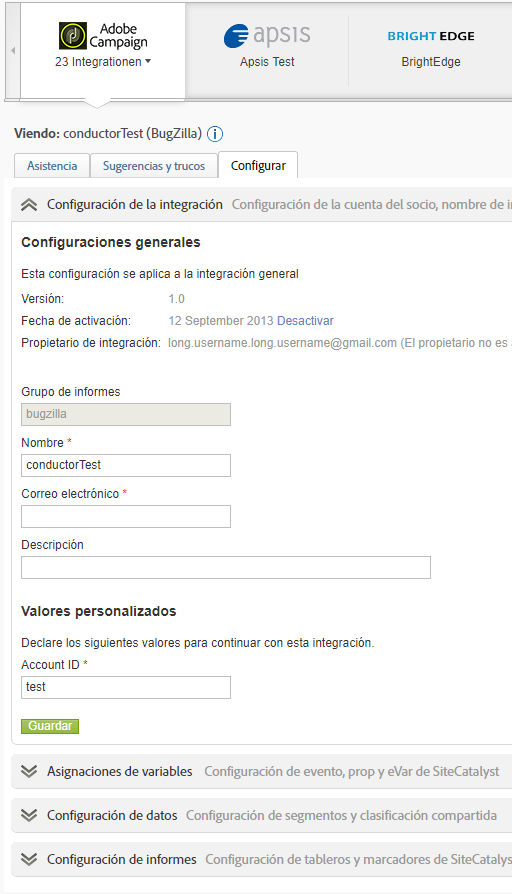

# Descripción general de Data Connectors

Adobe proporciona a las organizaciones información práctica en tiempo real con respecto a las estrategias digitales y a las iniciativas de marketing. Data Connectors permite importar datos de seguimiento de aplicaciones de terceros en Analytics, de modo que puede recopilar y usar datos desde una ubicación central. Si usa uno de los productos asociados, puede crear una integración que importa los datos de la aplicación a los informes de marketing. Una vez realizada la integración, puede generar informes que incluyan datos de su aplicación.

Por ejemplo, una integración de correo electrónico que desee utilizar un socio de correo electrónico para distribuir una campaña por correo electrónico. Cuando los visitantes llegan a su página web, usted quiere saber quiénes han llegado hasta ella en respuesta a su campaña por correo electrónico. Data Connectors integra los datos de su socio de correo electrónico en los informes de marketing para que pueda determinar esta información para medir la eficacia de su campaña por correo electrónico.

>[!IMPORTANT]
>
>La vida útil de la tecnología de Adobe Data Connector finalizará de mediados a finales de 2021. [Más información...](/help/import/data-connectors/data-connectors-eol.md)

**Requisitos del sistema**

Data Connectors debería integrarse apropiadamente con los exploradores más populares. Pese a ello, los informes aparecen y funcionan mejor en sistemas que cumplen las siguientes recomendaciones:

* Navegador: Microsoft Internet Explorer versión 6 y posterior
* Cookies: obligatorio
* JavaScript: habilitado
* Sistema operativo: Windows
* Macromedia Flash Player: versión 6 o posterior
* Resolución de pantalla: 1024x768 (800x600 también es válida)
* Profundidad de color: 16 bits o superior

Adicionalmente, la colección de datos mejora cuando los exploradores web de los usuarios tienen JavaScript habilitado.

**Requisitos previos**

Antes de configurar la integración de Data Connectors para su producto, haga lo siguiente:

* Tenga a mano las credenciales de acceso necesarias para la cuenta del producto del socio, con derechos para acceder a todos los datos que desee integrar con informes de marketing. Tal vez desee crear una cuenta de correo electrónico especial para distribuidores de informes y para notificaciones sobre operaciones integradas.
* Identifique las variables personalizadas que contienen la información de su campaña. Esto suele conocerse como el código de seguimiento de la campaña, pero puede que su organización utilice otra terminología.
* Determine los eventos que desea que reciban impresiones y datos sobre los clics. Puede que desee cambiar el nombre de los eventos.
* Coloque el código adecuado en su página de destino para que Analytics pueda realizar el modelado adecuado con los datos que proceden del producto del socio. En las Reseñas de Data Connectors en la pestaña Recursos, encontrará instrucciones específicas para cada producto asociado.

## Añadir una integración

Debe tener una cuenta actual para acceder a la página de aterrizaje de [!UICONTROL Data Connectors] (consola). También es aconsejable que esté familiarizado con Adobe Analytics.

1. Inicie sesión en Adobe Experience Cloud.
1. Haga clic en **[!UICONTROL Analytics]** > **[!UICONTROL Administrador]** > **[!UICONTROL Data Connectors]**.
1. Haga clic en **[!UICONTROL Agregar nuevo]**.
1. Siga los pasos de la interfaz **[!UICONTROL Añadir integración]**.

   En función de la integración de producto individual, puede que deba proporcionar información concreta sobre la configuración como parte del proceso de integración.

   Cuando la integración termina, el icono del producto del socio aparece en la página Red de Data Connectors y está disponible en los menús.

## Consola de Data Connectors

Después de activar una integración, esta se muestra en la página [!UICONTROL Data Connectors]. Puede ver los detalles y realizar cambios de configuración en la consola. Puede ver las integraciones activas y las integraciones de todos los conjuntos de informes de su empresa. También puede ver un registro de actividad, configurar una integración como un panel, configurar una integración y encontrar ayuda.



## Segmentos de remarketing en Data Connectors

Los segmentos de remarketing son archivos de datos que se crean en función de las variables usadas en una integración de Data Connectors.

Adobe Analytics los envía en archivos distintos diarios por medio de Data Warehouse a una FTP creada por Adobe para el tercero. A continuación, el tercero distribuye los archivos al cliente. Normalmente, las empresas los utilizan para enfocar el remarketing a quienes posiblemente hayan visitado el sitio web y echado un vistazo al producto sin comprarlo. (Por ejemplo, uno se dirige a un cliente ofreciéndole un descuento en un producto que vio y que no terminó comprando).

**Segmentos**

* [!UICONTROL Abandonos del carro de compras]: el porcentaje de visitantes que han añadido un producto al carro, pero no lo han comprado. Técnicamente, se trata de una métrica calculada al dividir los encargos por las veces que se ha añadido un producto al carro de compras.
* [!UICONTROL Compras]: los ID de destinatario (o los ID de visitante) que han realizado compras en base al ID de mensaje de un producto específico.
* [!UICONTROL Vistas del producto]: parecida a los [!UICONTROL Abandonos del carro de compras], se trata de otra métrica calculada. Informa de las [!UICONTROL Vistas del producto] divididas por encargos, porque el hecho de que los clientes vean el producto demuestra un cierto interés.

**Ejemplos de implementación**

Para implementar correctamente los segmentos de remarketing se deben cumplir las siguientes condiciones:

* Se ha establecido un contrato de Data Connectors y su empresa ha completado la fase de implementación con un consultor de Adobe.
* El evento correspondiente se activa al mismo tiempo que la variable del producto:
   * Abandono del carro de compras: evento `scAdd`
   * Compras: evento `purchase`
   * Vistas del producto: evento `prodView`

>[!NOTE]
>
>Si el producto se define sin un evento asociado, el evento prodView se activa automáticamente. Si no se cumplen los requisitos anteriores, no se informa correctamente de los segmentos de remarketing correspondientes.

[!UICONTROL Abandonos del carro de compras]: se activa después de que el usuario añada un producto al carro de compras:

```
s.products=";cat";
s.events="scAdd";
```

[!UICONTROL Compras]: se activa en la página de confirmación de la compra:

```
s.products=";
cat;1;50";
s.events="purchase";
//Note: Though optional, adding the purchaseID variable increases accuracy by preventing duplicate purchases
```

**Problemas habituales**

| Problema | Descripción |
| -----------| ---------- |  
| No se muestra ninguna información del ID de producto en el archivo del segmento de remarketing. | Esto ocurre cuando se activa el evento correcto, pero no hay ninguna variable de producto en la misma solicitud de imagen. Para corregir este problema, asegúrese de que la variable de producto y los eventos correspondientes se activen en la misma página, tal como se indica en los ejemplos de implementación anteriores. |
| No se reciben los archivos del segmento de remarketing. | Si no recibe sus archivos, haga que uno de los usuarios con asistencia de su empresa se ponga en contacto con ClientCare para investigar la causa de los informes que no se reciben correctamente. |


>[!IMPORTANT]
>
>Es habitual que los consultores también configuren una solicitud de Data Warehouse como un informe diario programado, además de su integración de Data Connectors estándar con el archivo del segmento de remarketing. Esta solicitud de Data Warehouse incluye variables de Data Connectors, así como variables que no sean de este tipo, y se puede programar solo en base a la solicitud específica de su empresa. Para evitar confusiones durante la resolución de problemas, especifique si el archivo en cuestión es el archivo del segmento de remarketing real o bien una solicitud de Data Warehouse que contiene variables que no sean de Genesis.
