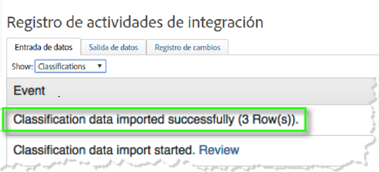
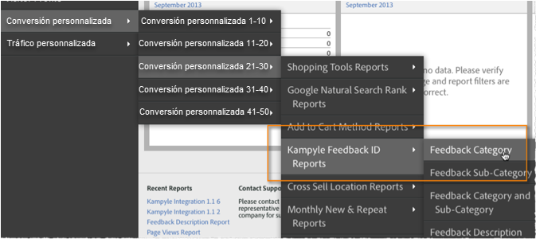

# Implementación de la integración {#deploying-the-integration}

La implementación de esta integración consiste en completar el asistente de integración de Adobe, implementar el código de complemento (JavaScript) y verificar la integración.

## Completar el asistente de integración de Adobe {#complete-the-adobe-integration-wizard}

Para activar la integración, complete el asistente de configuración en la interfaz de Data Connectors.

1. Iniciar sesión en [!DNL Adobe Experience Cloud].
1. Haga clic en **[!UICONTROL Analytics]** > **[!UICONTROL Administración]** > **[!UICONTROL Todos los administradores]** > **[!UICONTROL Conectores de datos]**.
1. Inicie el asistente de integración de Kampyle.
1. Seleccione el grupo de informes deseado y proporcione un nombre para la integración.
1. Configure las opciones siguientes:
   1. **[!UICONTROL Dirección]** de correo electrónico: La dirección de correo electrónico del contacto principal.
   1. **[!UICONTROL Descripción]**  (opcional): Descripción de esta configuración de integración.
   1. **[!UICONTROL Clave de Kampyle]**: Busque esta clave en la aplicación Kampyle en  **[!UICONTROL Formulario]**  de comentarios > Personalización  **[!UICONTROL del formulario de comentarios]**.
   1. **[!UICONTROL Servidor]** de seguimiento: El valor del servidor de seguimiento que utiliza para rastrear datos de Adobe Analytics.
   1. **[!UICONTROL Servidor de seguimiento seguro]**: Si su servidor de seguimiento es diferente para el tráfico seguro/https, proporcione esta configuración aquí.
1. Configure las siguientes opciones de **[!UICONTROL Asignaciones de variables]**:
   1. **[!UICONTROL ID de comentarios de Kampyle]**: Seleccione una variable de eVar disponible en el grupo de informes
   1. **[!UICONTROL Grado]** de comentarios: Seleccione un evento de éxito disponible (escriba &quot;contador&quot;) en el grupo de informes.
   1. **[!UICONTROL Elementos]** de comentarios: Seleccione un evento de éxito disponible (escriba &quot;contador&quot;) en el grupo de informes.
   1. **[!UICONTROL Comentarios con categoría]**: Seleccione un evento de éxito disponible (escriba &quot;contador&quot;) en el grupo de informes.
1. Marque la casilla para que el Panel de integración de Kampyle se cree automáticamente (recomendado).
1. Revise todas las opciones de configuración y haga clic en **[!UICONTROL Activar ahora]**.

## Implementar el objeto de configuración de integración {#deploy-the-integration-configuration-object}

Después de completar el asistente de integración, implemente el objeto de configuración de integración en la propiedad web. En muchos casos, la forma más sencilla de implementar el objeto de configuración de integración es incluirlo en el código de implementación de Adobe Analytics.

>[!NOTE]
>
>Si utiliza Adobe Experience Platform Launch, puede añadir fácilmente el objeto de configuración de integración a través de esa herramienta.

1. Vaya a la pestaña **[!UICONTROL Recursos]** > **[!UICONTROL Asistencia]** de la integración.
1. Descargue y guarde el recurso **[!UICONTROL Código de integración de Kampyle (JS)]**. El código tiene un aspecto similar al siguiente:

   ```
   /* Kampyle:  Integration configuration settings */
     window.k_sc_param = { "version":1.1 }
   ```

1. Implemente el código mediante uno de los siguientes métodos:

   * Utilice Adobe Experience Platform Launch.
   * Envíe el código al recurso de organización que mantiene la implementación de Adobe Analytics.

## Verificar la integración {#verify-the-integration}

Valide que la integración transfiera datos correctamente completando un par de comprobaciones.

### Registro de actividades de integración {#section-0472df9180db4f218db5f6040cab07af}

Para ver la configuración de la integración de Kampyle en Adobe Experience Cloud, vaya a **[!UICONTROL Asistencia]** > **[!UICONTROL Registro de actividades de integración]**. En la pestaña **[!UICONTROL Datos importados]**, debe ver las entradas que indican que los datos de clasificación se importaron correctamente.

>[!NOTE]
>
>Las entradas de registro suelen aparecer en las 24 horas siguientes a la implementación.



### Datos de informes de Adobe {#section-1ae9f0a5e6bc40988478ff55aefd56ac}

Vea sus informes de comentarios de Kampyle con Adobe Analytics navegando hasta los informes de Kampyle dentro de la estructura de menú adecuada.

>[!NOTE]
>
>Los datos de los informes deberían aparecer en un plazo de 24 a 48 horas después de la implementación, suponiendo que los formularios de comentarios integrados reciban los envíos de manera activa.


