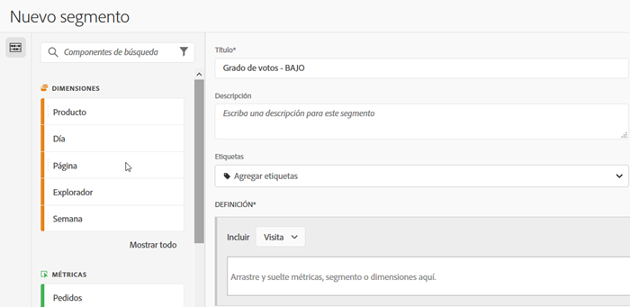
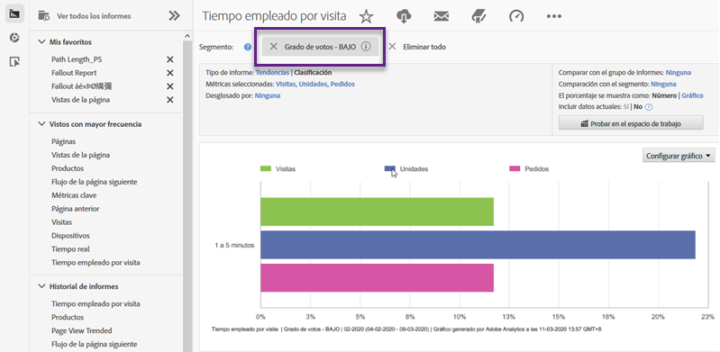

# Uso de la integración {#using-the-integration}

Una vez implementada, puede empezar a utilizar las funciones adicionales que ofrece esta integración. Las siguientes son acciones que se deben realizar para aprovechar esta integración desde Adobe Analytics.

>[!NOTE]
>
>Puede tardar entre 24 y 48 horas en empezar a ver los datos de respuesta de Kampyle en los informes de Adobe Analytics.

## Combinar comentarios y datos de comportamiento en el sitio {#mix-feedback-and-onsite-behavior-data}

Puede desglosar los informes de Reports &amp; Analytics por dimensiones de comentarios.

Con Adobe Reports &amp; Analytics, puede explorar varias dimensiones de comentarios disponibles en los informes. El informe siguiente es un ejemplo de cómo explorar una categoría específica de comentarios y luego desglosarla según la descripción de estos. Las métricas de Reports &amp; Analytics (Visitas e consultas de servicio al cliente) y Kampyle (promedio de puntuación de comentarios) se presentan en paralelo para facilitar el análisis.

## Segmentación por dimensión de comentario {#segment-by-feedback-dimension}

Puede crear segmentos basados en dimensiones de comentarios.

Una característica principal de esta integración es la capacidad de crear segmentos de Adobe Analytics basados en las dimensiones de comentarios de Kampyle. Por ejemplo, puede generar un segmento que incluya solo visitas en las que se haya dado una puntuación de 1 o 2. Puede llamar a esto “Puntuación de comentario: BAJA”. Esta definición de segmento sería la siguiente:

Este segmento se puede aplicar a prácticamente cualquier informe; un ejemplo es el informe de tiempo empleado por visita que se ve aquí.

