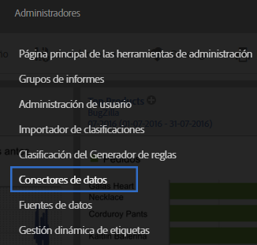
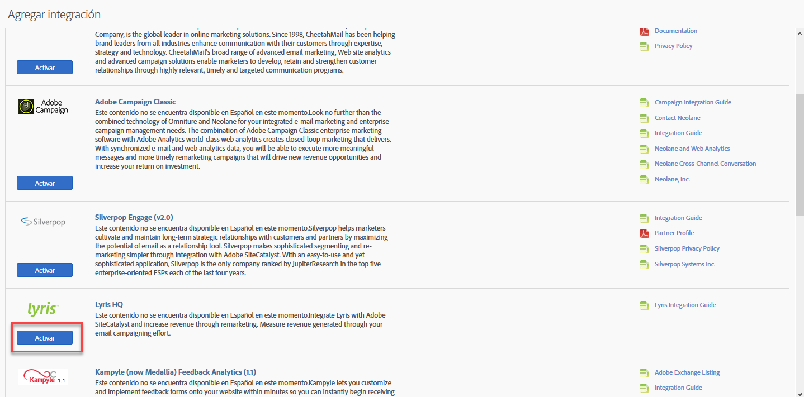
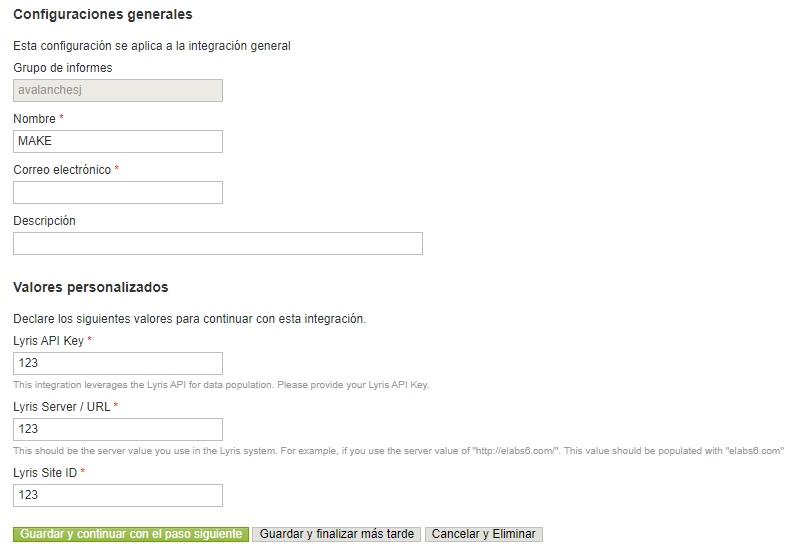
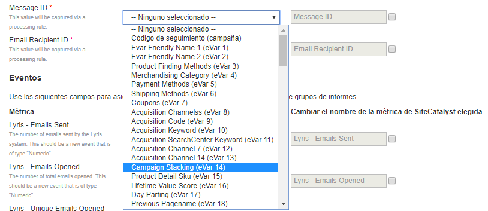
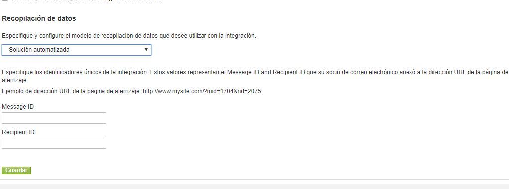
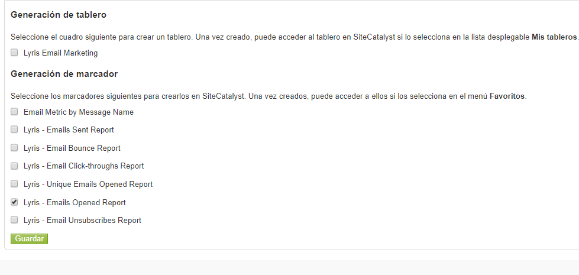
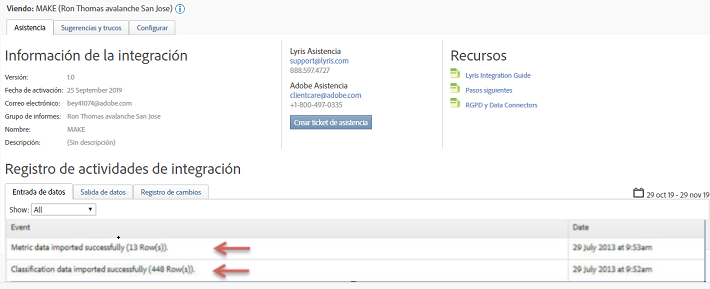

# Implementación de la integración{#deploying-the-integration}

Describe el proceso de implementación de tres pasos.

La implementación de esta integración es un proceso sencillo que requiere las siguientes acciones:

## Finalización del Asistente para integración{#completing-the-integration-wizard}

Pasos para utilizar el asistente de integración.

Para activar la integración, debe completar el asistente de integración de Lyris en la interfaz de Data Connectors.

1. Vaya al área Conectores de datos (anteriormente Genesis) dentro de Adobe Experience Cloud.

   

1. En **[!UICONTROL Agregar integración]**, en Lyris HQ, haga clic en**[!UICONTROL  Activar]**.

   

1. En Configuración ****general, elija el grupo de informes deseado y proporcione un nombre para la integración.
1. Rellene toda la información relacionada con la cuenta de Lyris en Valores **[!UICONTROL personalizados]**.

   

1. Elija las eVars y los eventos reservados correspondientes en los menús desplegables.

   

1. Puede elegir sus propios segmentos en **[!UICONTROL Sus segmentos]**, excepto los 3 segmentos de socios automatizados.
1. Esta integración puede requerir la descarga de algunos puntos de datos en su cuenta de Lyris. Puede optar por dar acceso a esto en Solicitud **[!UICONTROL de]**acceso.
1. En Recopilación **[!UICONTROL de]**datos, puede elegir tener una solución automática o manual (complemento de JavaScript) para recopilar parámetros de cadena de consulta de la dirección URL de la página de aterrizaje. Si decide tener una solución automatizada, introduzca el parámetro de cadena de consulta para ID de mensaje e ID de destinatario. Para obtener un complemento de JavaScript, póngase en contacto con su consultor de Adobe.

   

1. Puede elegir que el panel de Lyris y los marcadores se generen automáticamente.

   

1. Revise el resumen de la integración y haga clic en **[!UICONTROL Activar]**.

## Configuración dentro de Lyris EmailLabs{#configuration-within-the-lyris-emaillabs}

Instrucciones que describen lo que se debe configurar dentro de Lyris tras la finalización del asistente.

1. Después de completar el asistente de integración, debe trabajar con el equipo de Lyris Professional para completar la integración en su cuenta de Lyris HQ y facilitar las pruebas.
1. Agregar parámetros de cadena de consulta de URL: Compruebe que la cadena de adición de URL se introduce correctamente en las áreas de configuración de organización de la interfaz de usuario. Debe contener la ID de nivel de campaña (hq_m) y la ID de nivel de destinatario (hq_v).

   Un ejemplo de ID de cadena es:

   ```
   hq_lid=149&hq_m=96843&hq_l=23&hq_v=7703a51905
   ```

   >[!NOTE]
   >
   >Si está aplicando la herramienta de análisis nativa de Lyris, *haga clic en Rastrea* todas las variables requeridas que se agreguen.

## Verificación de la integración{#verifying-the-integration}

Pasos para comprobar que la integración de Lyris/Adobe Analytics se ha realizado correctamente.

Una vez completados todos los pasos de implementación, puede validar que la integración esté transfiriendo datos correctamente.

> [!NOTE] El intercambio de datos tarda unos días. Asegúrese de ponerse en contacto con Lyris después de activar la integración.

1. Navegue hasta la integración de Lyris en Conectores de datos. En la ficha **[!UICONTROL Asistencia]**> Registro**[!UICONTROL  de actividades de]**integración, debería ver eventos como datos de **[!UICONTROL métricas importados correctamente]**y/o datos**[!UICONTROL  de clasificación importados correctamente]**:

   

1. Ahora puede ver los informes de mensajes de Lyris con las métricas correspondientes. En Adobe Experience Cloud, seleccione **[!UICONTROL Informes y análisis]**.
1. Seleccione el grupo de informes correspondiente.
1. En Conversiones ****personalizadas, seleccione los informes**[!UICONTROL  de ID de]** mensaje y elija ID de **[!UICONTROL mensaje/Nombre]**del mensaje.

## Código de complemento del parámetro de cadena de consulta{#query-string-param-plug-in-code}

Muestra el código del complemento Lyris que se va a utilizar con Adobe Analytics.

> [!NOTE] Asegúrese de reservar las eVars necesarias en la herramienta de administración de Adobe Analytics antes de trabajar con el código siguiente. Una vez que sepa qué eVars ha reservado, reemplace eVarN por la eVar relevante. Por ejemplo: eVar10.

```
/* 
  * Plugin: getQueryParam 2.3 
  */ 
s.getQueryParam=new Function("p","d","u","" 
+"var s=this,v='',i,t;d=d?d:'';u=u?u:(s.pageURL?s.pageURL:s.wd.locati" 
+"on);if(u=='f')u=s.gtfs().location;while(p){i=p.indexOf(',');i=i<0?p" 
+".length:i;t=s.p_gpv(p.substring(0,i),u+'');if(t){t=t.indexOf('#')>-" 
+"1?t.substring(0,t.indexOf('#')):t;}if(t)v+=v?d+t:t;p=p.substring(i=" 
+"=p.length?i:i+1)}return v"); 
s.p_gpv=new Function("k","u","" 
+"var s=this,v='',i=u.indexOf('?'),q;if(k&&i>-1){q=u.substring(i+1);v" 
+"=s.pt(q,'&','p_gvf',k)}return v"); 
s.p_gvf=new Function("t","k","" 
+"if(t){var s=this,i=t.indexOf('='),p=i<0?t:t.substring(0,i),v=i<0?'T" 
+"rue':t.substring(i+1);if(p.toLowerCase()==k.toLowerCase())return s." 
+"epa(v)}return ''"); 
 
/*in the s_doPlugins function - Replace N with actual eVar number*/ 
s.eVarN=s.getQueryParam("<insert Lyris QS Param>");  
//places query param value from Message ID in eVarN variable s.eVarN=s.getQueryParam("<insert Lyris QS Param>");  
//places query param value from Recepient ID in eVarN variable 
```
