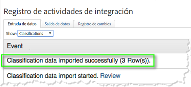
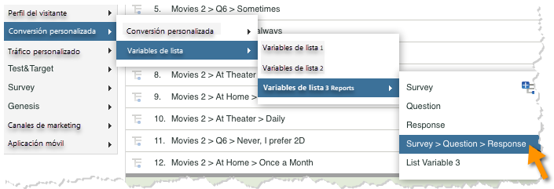
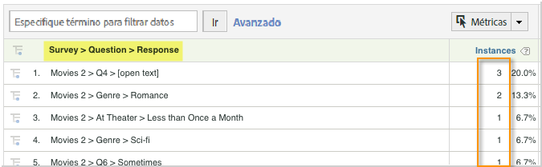

# Implementación de la integración {#deploying-the-integration}

Implementar esta integración es un proceso sencillo que requiere las siguientes acciones.

## Finalización del asistente de integración de Adobe {#completing-the-adobe-integration-wizard}

Para activar la integración, debe completar el asistente de integración de Qualtrics en la interfaz de Data Connectors.

1. Vaya a Data Connectors e inicie el asistente de integración de Qualtrics.
1. Seleccione el grupo de informes que desee utilizar para esta integración y asígnele un nombre.

   Complete el asistente de integración, proporcionando la información descrita en los pasos siguientes. 1. **Paso 1 del asistente**

   | Dirección de correo electrónico | La dirección de correo electrónico del contacto principal. |
   |---|---|
   | Descripción | (Opcional) Descripción de esta configuración de integración. |
   | ID de organización de Qualtrics | [Búsqueda del ID de organización de Qualtrics](../qualtrics-overview/qualtrics-org-id.md) |
   | Token de Adobe SiteCatalyst | [Generación del token de Qualtrics de Adobe Analytics](../qualtrics-overview/qualtrics-token.md) |

1. **Paso 2 del asistente: asignaciones de variables**
   |  Lista de respuestas de Qualtrics | Seleccione una variable de lista disponible en el grupo de informes. (Es posible que necesite habilitar una nueva listVar dentro del administrador de grupos de informes).  |
   |---|---|
   |  ID de respuesta de Qualtrics | Seleccione una eVar o prop disponible en el grupo de informes. (Es posible que necesite habilitar una nueva listVar dentro del administrador de grupos de informes).  |
   |  Servidor de seguimiento | Proporcione la configuración del servidor de seguimiento (dominio) que se utiliza para rastrear datos de Adobe Analytics. Use la variable `trackingServerSecure` servidor de seguimiento si difiere de la configuración estándar del servidor de seguimiento.  |
   |  Envíos de encuesta de Qualtrics | Seleccione un evento disponible en su grupo de informes (es posible que deba habilitar un nuevo evento desde el administrador de grupos de informes).  |

1. **Paso 3 del asistente**: no se necesita nada, solo información.

   Resultado (1). **Paso 4 del asistente: exportar configuración**

   | eVar | Seleccione hasta cinco de las eVars que desee exponer para exportarlas a Qualtrics. |
   |---|---|
   | Eventos | Seleccione hasta cinco de los eventos personalizados que desee exponer para exportarlos a Qualtrics. |
   | Props | Seleccione hasta cinco de las props que desee exponer para exportarlas a Qualtrics. |
   | Solicitudes de acceso | Marque la casilla de cualquiera de las métricas y dimensiones estándar que desee exportar a Qualtrics. Se requiere `visitor_id` para permitir que la exportación funcione correctamente. |

1. **Paso 5 del asistente**: revise la configuración y haga clic en **[!UICONTROL Activar ahora]**.

## Activación de la integración en Qualtrics Research Suite {#enabling-the-integration-in-qualtrics-research-suite}

Después de completar el asistente de integración, debe activar la integración para cada encuesta de Qualtrics que desee conectar.

1. Inicie sesión en Qualtrics Research Suite.
1. En la pestaña **[!UICONTROL Mis encuestas]**, haga clic en el botón **[!UICONTROL Editar]** de la encuesta que desee integrar.
1. Haga clic en el menú **[!UICONTROL Opciones avanzadas]** y seleccione **[!UICONTROL Adobe Analytics]**. (Si no ve esta opción, pregunte al administrador para obtener los permisos necesarios).

   

1. Seleccione la configuración de Adobe Analytics y, a continuación, haga clic en **[!UICONTROL Guardar]**. Si no hay configuraciones disponibles, es probable que aún no haya completado el asistente de integración de Adobe.
   1. La casilla de verificación **[!UICONTROL Incluir respuestas parciales]** se puede utilizar para indicar que desea capturar datos en Adobe Analytics después de completar cada pantalla parcial de la encuesta. Si no se selecciona, los datos se transfieren únicamente para las encuestas completadas.
   1. La casilla de verificación **[!UICONTROL Enviar marca de hora con señalización]** solo se debe utilizar cuando se integre con un grupo de informes configurado para recibir datos con marca de hora (algo poco común).

   

## Verificación de la integración {#verifying-the-integration}

Una vez completados todos los pasos de implementación, puede validar que la integración transfiera los datos correctamente.

1. **Registro de actividades de integración**: en la interfaz de usuario de Data Connectors, vea la pestaña **[!UICONTROL Asistencia]** en la integración de Qualtrics. Debajo del encabezado **[!UICONTROL Registro de actividades de integración]** debe ver las entradas que indican los datos de clasificación importados sin problemas.

   >[!NOTE]
   >
   >Estas entradas deben aparecer en el plazo de 1 hora después de la implementación.

   

1. **Datos de informes**: vea los informes de las encuestas de Qualtrics con la interfaz de usuario de Reports &amp; Analytics de marketing (en **[!UICONTROL Variables de lista]**).

   >[!NOTE]
   >
   >Estos datos deberían aparecer en un plazo de 24 a 48 horas tras la implementación, suponiendo que la encuesta integrada reciba respuestas de forma activa.

    
