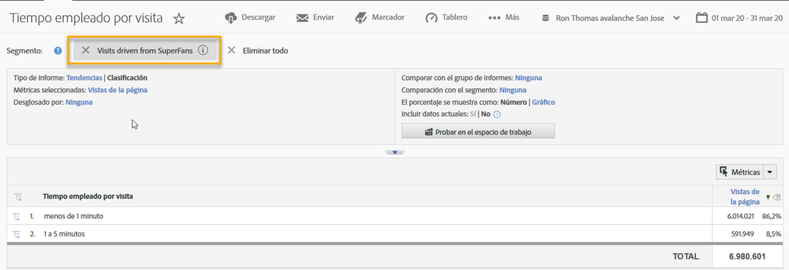
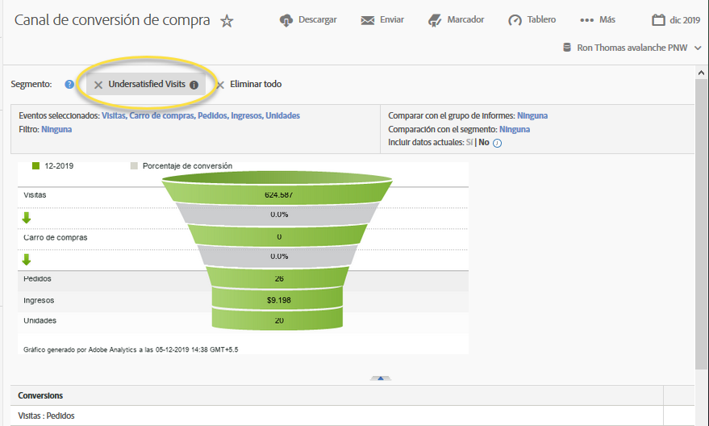

# Uso de la integración {#using-the-integration}

Una vez implementada, puede empezar a utilizar las funciones adicionales que ofrece esta integración.

>[!NOTE]
>
>Puede tardar entre 24 y 48 horas en empezar a ver los datos de respuesta de Qualtrics en los informes de Adobe Analytics.

Las siguientes son acciones que se deben realizar para aprovechar esta integración desde Adobe Analytics.

1. Cree un segmento mediante los datos de respuesta a la encuesta (consulte [Creación de un segmento](https://experienceleague.adobe.com/docs/analytics/components/segmentation/seg-home.html)).
1. Aplique el segmento a los informes clave.

## Ejemplo {#section-07051d0d60a44408a4e108034586c42f}

A continuación, se muestra cómo un analista puede definir un segmento de Adobe Analytics mediante los datos de respuesta a la encuesta. En este caso se utiliza una pregunta de la encuesta como “¿Cuán satisfactoria ha sido su visita de hoy?”. Con esta pregunta podemos crear un segmento para identificar a los visitantes “insatisfechos”. Este segmento podría utilizarse para explorar en profundidad cualquier informe de Adobe Analytics, como el canal de conversión de compras, como se muestra a continuación.

 
