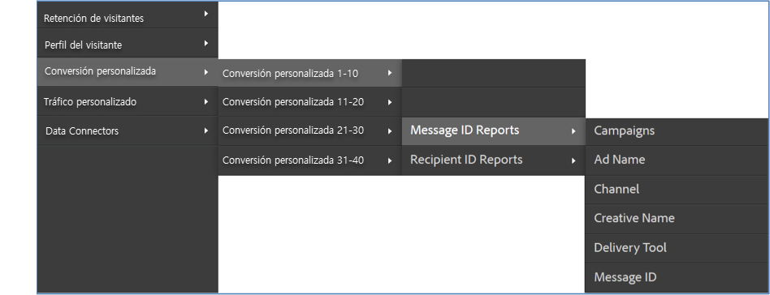

# Verificación de la integración{#verifying-the-integration}

Después de la implementación, debe validar que la integración transfiera correctamente los datos a través de las siguientes comprobaciones.

1. Vea el registro de actividad de integración.
   1. En Adobe Marketing Cloud, vaya a **[!UICONTROL Asistencia]** &gt; Registro de actividades **[!UICONTROL de integración]**.

      

   1. Busque entradas como Datos **[!UICONTROL de clasificación importados correctamente]**, Datos **[!UICONTROL de métricas importados correctamente]** y Datos **[!UICONTROL de métricas exportados correctamente]**. Estas entradas deben aparecer en un plazo de 1 día tras la correcta implementación.
1. Vea los datos de informes en Adobe Analytics.
   1. Vaya a Conversión **[!UICONTROL personalizada]** &gt; **[!UICONTROL Conversión personalizada 1-10]** &gt; **[!UICONTROL Informes ID de mensaje]**.

      

   1. Busque los informes de Responsys. Estos datos deben aparecer entre 24 y 48 horas después de la implementación correcta.
