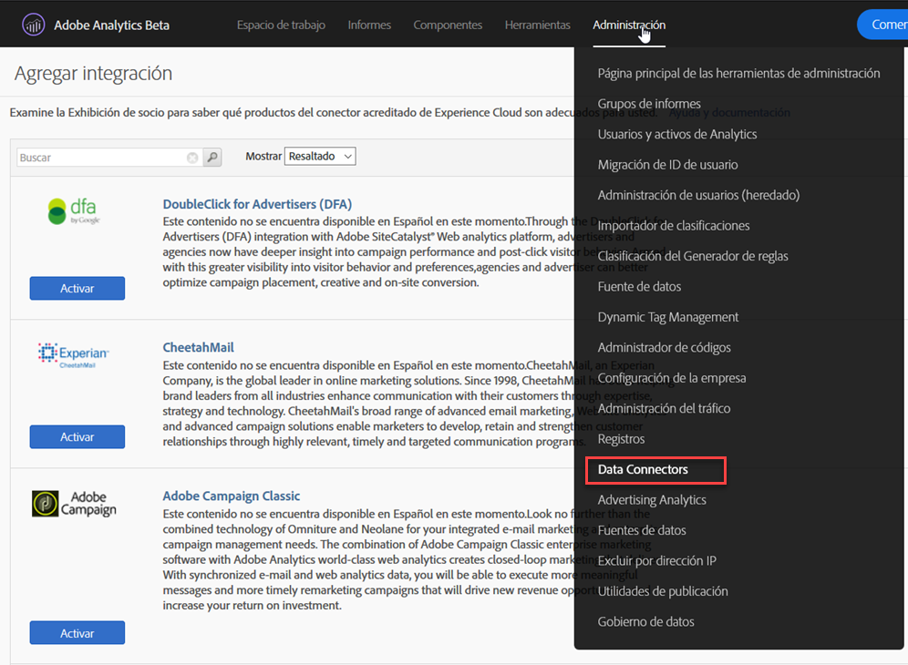
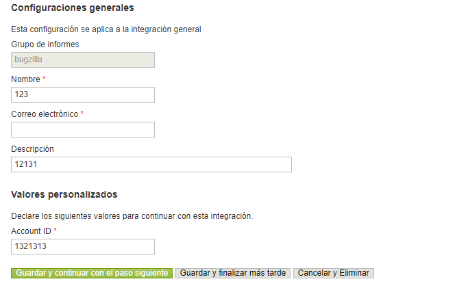
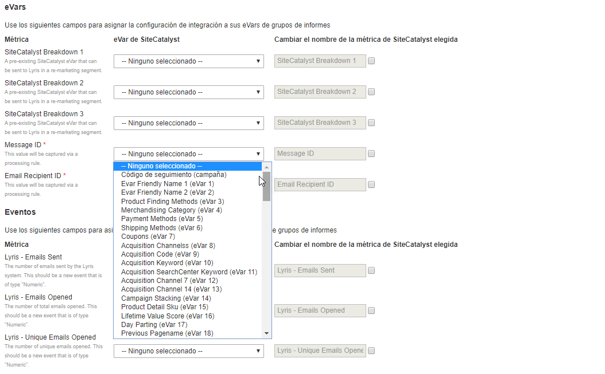
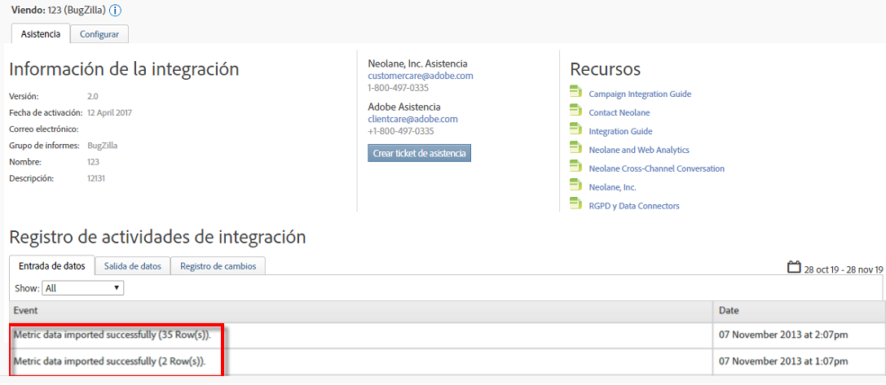

# Implementación de la integración{#deploying-the-integration}

La implementación de esta integración es un proceso sencillo de tres pasos.

## Finalización del Asistente para integración{#completing-the-integration-wizard}

Para activar la integración, debe completar el asistente para la integración selectiva en la interfaz de Data Connectors.

1. Vaya al área Conectores de datos de Adobe Experience Cloud.

   

1. En **[!UICONTROL Agregar integraciones]**, arrastre y suelte el complemento de selección en Adobe Experience Cloud.

   

   Esto abrirá la integración del conector de datos inteligente.

1. **Configuración** de integración: Elija el grupo de informes deseado y proporcione un nombre para la integración en Configuración **[!UICONTROL de]** integración.

1. En Valores **** personalizados, rellene toda la información relacionada con la cuenta de Seleccionar.

   

1. **Asignación** de variables: Elija las eVars y los eventos reservados correspondientes en los menús desplegables:

   

1. **Configuración** de datos: Puede elegir sus propios segmentos en **[!UICONTROL Sus segmentos]** , aparte de los 3 segmentos automatizados de **[!UICONTROL socio]** .

1. Esta integración puede requerir la descarga de algunos puntos de datos en su cuenta de Selplice. Puede elegir otorgar acceso para lo mismo en Solicitud **[!UICONTROL de]** acceso.
1. En Recopilación **[!UICONTROL de]** datos, elija una solución automática o manual (complemento de JavaScript) para recopilar parámetros de cadena de consulta de la dirección URL de la página de aterrizaje. Si elige una solución automatizada, introduzca el parámetro de cadena de consulta para ID de mensaje e ID de destinatario, que es MID y RID respectivamente. Para el complemento JavaScript, póngase en contacto con su consultor de Adobe.
1. **Configuración** de informes: En Generación **[!UICONTROL de]** tableros, marque la casilla para que el tablero selectivo se genere automáticamente.

   

1. Revise el resumen de la integración y haga clic en **[!UICONTROL Activar]**.

## Configuración dentro de la lista de usuarios{#configuration-within-selligent}

Tan pronto como la integración está habilitada dentro de Adobe Analytics, se activa una configuración automática en el lado de Selplice.

Se ha creado un rastreador que rastreará cada correo electrónico. Si desea limitarlo a un dominio determinado, actualice la configuración del rastreador.

Se recomienda encarecidamente mover el parámetro de seguimiento de Adobe Analytics en la dirección URL al principio. Esto garantizará que las reglas de procesamiento de Adobe recogen los parámetros de la dirección URL de la página de aterrizaje. Habilite el seguimiento marcando la casilla de verificación como se muestra a continuación.

## Verificación de la integración{#verifying-the-integration}

Una vez completados todos los pasos de implementación, puede validar que la integración esté transfiriendo datos correctamente.

El intercambio de datos tardará unos días en comenzar. Asegúrese de ponerse en contacto con Seleccionar después de activar la integración.

### Registro de actividades de integración {#section-927e270495db479fba9578915d9ae9c9}

Navegue hasta la integración selectiva dentro de Conectores de datos. En la ficha **[!UICONTROL Asistencia]** , debería ver eventos como Datos de métricas importados o Datos de clasificación importados correctamente:

### Datos de informes {#section-ebd481a162324e66bd6dc8cb4b8d2424}

Vea los informes de mensajes inteligentes con las métricas apropiadas.

1. Vaya a Informes y análisis en Adobe Experience Cloud.
1. Seleccione el grupo de informes correspondiente.
1. En Conversión **** personalizada, seleccione los informes **[!UICONTROL de ID de]** mensaje y elija ID de **[!UICONTROL mensaje/Nombre]** del mensaje.
