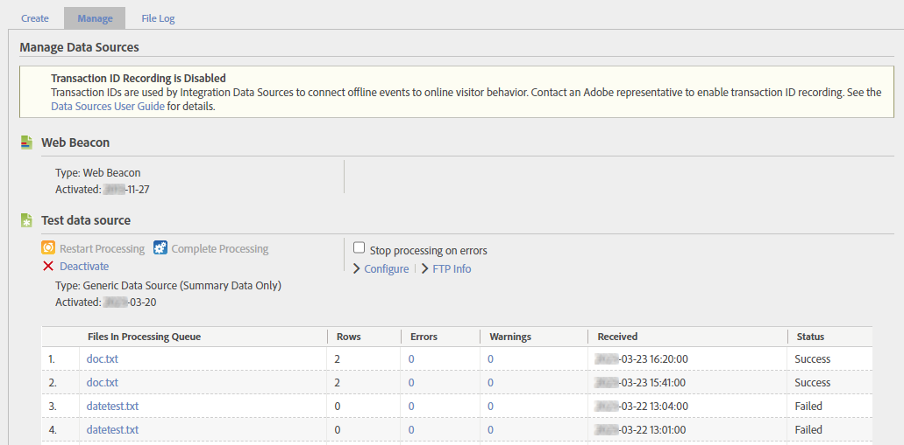

# Administración de fuentes de datos

Utilice el administrador de fuentes de datos para crear, editar o desactivar fuentes de datos. También puede utilizar esta interfaz para realizar un seguimiento del estado de los archivos cargados en las ubicaciones FTP de las fuentes de datos.

**[!UICONTROL Administrador]** > **[!UICONTROL Todos los administradores]** > **[!UICONTROL Fuentes de datos]**

Utilice el selector de grupos de informes de la parte superior derecha para cambiar entre grupos de informes de su organización.

Esta interfaz tiene tres fichas principales: **[!UICONTROL Administrar]**, **[!UICONTROL Crear]** y **[!UICONTROL Registro de archivos]**.

## Administrar

La variable **[!UICONTROL Administrar]** gestiona todos los orígenes de datos que ha creado su organización. Puede ver la información del FTP, realizar modificaciones en las variables que se usan en los archivos de plantilla o desactivar por completo las fuentes de datos.

La fuente de datos superior siempre es [!UICONTROL Señalización web]. Esta fuente de datos es lo que se usa para la recopilación de datos típica mediante AppMeasurement. No se puede editar ni desactivar.

Cada fuente de datos tiene las siguientes opciones:

* **[!UICONTROL Reiniciar procesamiento]**: Reinicia el procesamiento de la fuente de datos que se detuvo anteriormente debido a errores. El procesamiento continúa hasta que se encuentre el siguiente error. El procesamiento de los archivos de fuente de datos solamente se detiene si se selecciona **[!UICONTROL Detener procesamiento si hay errores]**.
* **[!UICONTROL Completar procesamiento]**: Ya no se usa: este botón solo se utilizó para [Fuentes de datos de procesamiento completo](full-processing-eol.md).
* **[!UICONTROL Detener procesamiento si hay errores]**: Casilla de verificación que indica al servidor de procesamiento que se detenga cuando encuentre un error. El procesamiento de la fuente de datos no se reanudará hasta que se seleccione **[!UICONTROL Reiniciar procesamiento]**. Cuando una fuente de datos encuentra un error de archivo, se lo notifica. El Adobe mueve el archivo con el error a una carpeta llamada `files_with_errors` en el servidor FTP. Cuando haya resuelto el problema, vuelva a enviar el archivo para que se procese.
* **[!UICONTROL Configurar]**: Un vínculo que le lleva a través del asistente de creación de fuentes de datos para esta fuente de datos. Este asistente le permite cambiar el nombre de la fuente de datos o reconfigurar las variables incluidas automáticamente al descargar un archivo de plantilla.
* **[!UICONTROL Información de FTP]**: Un vínculo que le lleva al último paso del asistente de creación de fuentes de datos en el que se muestran las credenciales de FTP.

Una vez que la fuente de datos recibe los datos, se muestra una tabla que contiene varias columnas para los archivos cargados.

* **[!UICONTROL Archivos en cola de procesamiento]**: Nombre del archivo.
* **[!UICONTROL Filas]**: Número total de filas del archivo.
* **[!UICONTROL Errores]**: Número de filas que contenían errores y no se podían ingerir.
* **[!UICONTROL Advertencias]**: Número de filas que contenían advertencias.
* **[!UICONTROL Recibido]**: Marca de fecha y hora a la que se recibió el archivo en el huso horario del grupo de informes.
* **[!UICONTROL Estado]**: El estado del archivo (`Success` o `Failed`).

## Crear

La variable **[!UICONTROL Crear]** le proporciona un punto de partida para el asistente de creación de fuentes de datos.

La categoría y el tipo de fuente de datos eran más valiosos en versiones anteriores de Adobe Analytics. Sin embargo, aún tienen un uso limitado:

* El tipo de fuente de datos se muestra en la variable [Administrar](#manage) para la propia fuente de datos y la pestaña [Registro de archivos](#file-log) para cada archivo individual.
* Algunos tipos de fuentes de datos incluyen automáticamente variables al descargar el archivo de plantilla. Sin embargo, puede incluir cualquier dimensión o métrica disponible siempre y cuando se adhiera al [Formato del archivo](file-format.md).

Más allá de estos motivos, todas las categorías y tipos de fuentes de datos que puede elegir son idénticos en la práctica. Elija la categoría y el tipo que mejor represente su propósito para utilizar fuentes de datos.

Con la retirada de [Fuentes de datos de procesamiento completo](full-processing-eol.md), no se pueden seleccionar varias categorías y tipos. Si selecciona un tipo de fuente de datos de procesamiento completo, la variable **[!UICONTROL Activar]** aparece atenuado.

## Registro de archivos

La variable **[!UICONTROL Registro de archivos]** le proporciona una vista agregada de todos los archivos de fuente de datos cargados para el grupo de informes determinado.

Hay disponible una barra de búsqueda que le ayuda a localizar una fuente de datos específica. La tabla muestra las columnas siguientes:

* **[!UICONTROL Nombre de la fuente de datos]**: Nombre del origen de datos.
* **[!UICONTROL Tipo]**: Tipo de fuente de datos.
* **[!UICONTROL Nombre de archivo]**: Nombre del archivo que se cargó.
* **[!UICONTROL Filas]**: Número total de filas del archivo.
* **[!UICONTROL Errores]**: Número de filas que contenían errores.
* **[!UICONTROL Advertencias]**: Ya no se utiliza. Número de filas que contenían advertencias.
* **[!UICONTROL Recibido]**: La fecha y hora en que el Adobe comenzó a procesar el archivo.
* **[!UICONTROL Estado]**: El estado del archivo (`Success` o `Failed`).
