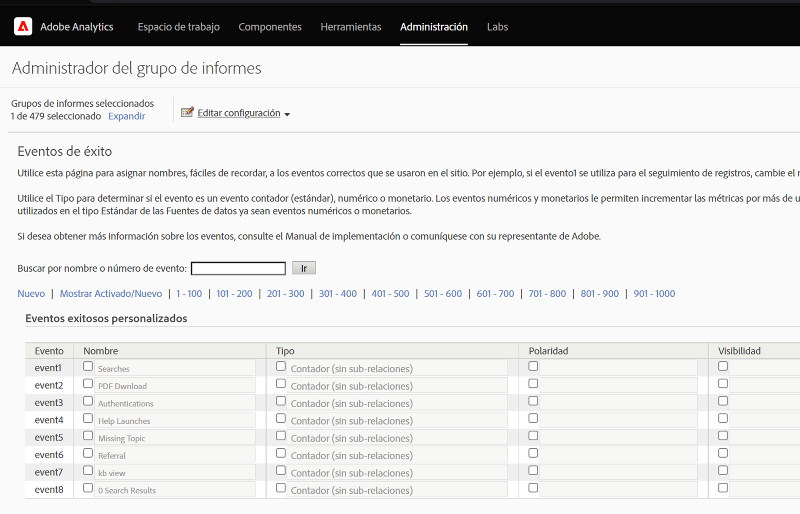

# Importar métricas de búsqueda  paga mediante fuentes [!UICONTROL de datos]

Para muchas organizaciones de mercadotecnia, la búsqueda paga es una de las formas más valiosas y confiables de llegar &#x200B; nuevos clientes y de retener los existentes. La función Fuentes [!UICONTROL de] datos de Adobe Analytics facilita la importación de datos de búsqueda paga avanzados desde plataformas de publicidad digital como Google AdWords. Puede integrarlo con el resto de los datos de mercadotecnia, junto con los datos de atributos del cliente y comportamiento en el sitio, para permitirle obtener una mejor perspectiva de los esfuerzos de búsqueda paga de su organización.

Estos pasos muestran cómo configurar una integración con AdWords para importar datos de palabras clave, así como métricas tales como impresiones, clics, costo por clic y más.

Los pasos explican cómo configurar una importación única de datos de pago por clic. Sin embargo, [!UICONTROL las fuentes] de datos permiten la importación continua de datos utilizando el formato de archivo descrito aquí. Según la plataforma de búsqueda paga, puede programar exportaciones periódicas (diarias, mensuales, etc.), configurar procesos automatizados para transformar esas exportaciones en el formato de archivo que Adobe Analytics requiere y cargar estos archivos en Adobe Analytics para el sistema de informes de integración de búsqueda paga.

## Requisitos previos

* Ha implementado la detección de búsqueda paga.
* Está capturando datos del código de seguimiento.
* Tiene códigos de seguimiento únicos para cada grupo de publicidad.

## Configure [!UICONTROL Success Events]

Nuestro primer paso es preparar a Adobe Analytics para recibir las métricas. Para ello, debe configurar algunos eventos de éxito.

[!UICONTROL Los eventos de éxito son acciones de las que se puede llevar un seguimiento. ] You determine what a [!UICONTROL success event] is. Con el fin de rastrear las métricas de búsqueda  paga, queremos configurar eventos [!UICONTROL de] éxito en torno a [!UICONTROL clics], [!UICONTROL impresiones], costo total y habilitar los códigos de seguimiento .

1. Go to **[!UICONTROL Adobe Analytics > Admin > Report Suites]**.
1. Selección de un grupo de informes.
1. Haga clic en **[!UICONTROL Editar configuración > Conversión > Eventos de éxito]**.

   

1. En Eventos de éxito personalizados, utilice **[!UICONTROL Añadir nuevo]** para crear 3 eventos de éxito personalizados: [!UICONTROL Clics] (contador), [!UICONTROL Impresiones] (contador) y Costo  total (moneda).

   

1. Haga clic en Guardar.
Debe recibir un mensaje que indique que se aprobaron los guardado.
1. Vaya a **[!UICONTROL Administración > Grupos de informes > Editar configuración > Conversión > Variables]** de conversión.
1. Habilite los códigos de seguimiento seleccionando la casilla de verificación junto a Código **[!UICONTROL de]** seguimiento en **[!UICONTROL Campaña > Variable]** de Campaña.

   

## Configurar fuentes de datos

[!UICONTROL Las fuentes] de datos permiten compartir datos de flujo de navegación con Adobe Analytics. En este caso, utilizamos Adobe Analytics para rastrear las métricas de búsqueda paga. Utilizamos el código de seguimiento como nuestra clave para unir los dos datos (métricas de búsqueda paga y métricas de Adobe Analytics).

1. Vaya a **[!UICONTROL Adobe Analytics > Administración > Fuentes]** de datos.
1. Seleccione la ficha **[!UICONTROL Crear]** para activar en inicio nuevas fuentes de datos.
1. En **[!UICONTROL Seleccionar Categoría]**, seleccione Campaña **[!UICONTROL de publicidad]**.

   

1. En **[!UICONTROL Seleccionar tipo]**, seleccione Servicio **[!UICONTROL pago por clic]** genérico.
1. Haga clic en **[!UICONTROL Activar]**.
The [!UICONTROL Data Source Activation Wizard] displays:

   

1. Haga clic en **[!UICONTROL Siguiente]** y asigne un nombre al origen de datos. Este nombre aparece en el Administrador de fuentes de datos.
1. Acepte el contrato de servicio y haga clic en **[!UICONTROL Siguiente]**.
1. Seleccione las tres métricas estándar: [!UICONTROL Impresiones], [!UICONTROL Clics] y Costo  total y haga clic en **[!UICONTROL Siguiente]**.
1. Ahora &quot;asigne&quot; esta nueva fuente de datos a los eventos personalizados que hemos creado en [Configurar Eventos](/help/admin/admin/c-success-events/t-success-events.md)de éxito.

   

1. Elija dimensiones de datosMarque la casilla junto a Códigos de seguimiento y haga clic en **[!UICONTROL Siguiente]**.
1. Asigne Dimension de datos.
Asigne la dimensión de datos importada (atributo) al atributo de Adobe Analytics en el que desea almacenarla. Puede ser una dimensión estándar o un eVar. Después de hacer clic en **[!UICONTROL Siguiente]**, las asignaciones resultantes se muestran en el resumen:

   

1. Haga clic en **[!UICONTROL Guardar]**.
1. Haga clic en **[!UICONTROL Descargar]** para descargar el archivo de plantilla de esta fuente de datos.
El nombre del archivo corresponde al tipo de fuente de datos que especificó inicialmente; en este caso, &quot;Generic Pay-Per-Click Service template.txt&quot;.
1. Abra la plantilla en su editor de texto favorito.
El archivo ya se ha rellenado con las métricas y dimensiones y sus asignaciones.

## Exportar datos de PPC y cargarlos en Analytics

Pasos similares a estos funcionan para Google Adwords, MSN, Yahoo y otras cuentas PPC.

### Exportar datos

1. Inicie sesión en su cuenta de PPC y cree un nuevo informe o exporte.
Asegúrese de que la exportación incluye los campos siguientes: fecha, dirección URL de destino (página de aterrizaje), impresiones, clics y costo. La exportación puede incluir otros campos, pero se eliminarán los pasos a continuación.
1. Si es posible, guarde el informe como un archivo delimitado por tabuladores `.csv` o tabuladores. Esto facilitará el trabajo en los siguientes pasos.
1. Abra el archivo en Microsoft Excel.

### Editar el archivo en Microsoft Excel

1. En Microsoft Excel, elimine todas las columnas que no sean las mencionadas anteriormente.
1. Elimine las filas adicionales de la parte superior.
1. Para aislar los códigos de seguimiento de las direcciones URL de destino:
a. Copie y pegue datos de todas las columnas.
b. Haga clic en **[!UICONTROL Datos > Texto a columnas]**.
c. En el paso 1 del asistente, asegúrese de que **[!UICONTROL Delimitado]** está seleccionado y haga clic en **[!UICONTROL Siguiente]**.
d. En el paso 2 del asistente, especifique el delimitador en función de cómo haya creado las direcciones URL (ya sea ? o &amp;) y haga clic en **[!UICONTROL Siguiente]**.
e. En el paso 3 del asistente, previsualización los datos y asegúrese de que una de las columnas es &quot;trackingcodename=trackingcode&quot;. Si tiene variables adicionales, repita estos pasos (utilizando &amp; como delimitador).
f. Elimine todas las columnas excepto los códigos de seguimiento, las impresiones, los clics y el costo. Añada una nueva columna llamada Fecha y organice las columnas en el siguiente orden: Fecha: Código de seguimiento: Impresiones :: Clics :: Costo.
1. Añada estos datos a la plantilla que descargó en la sección &quot;Configurar fuentes de datos&quot; de arriba.
Ahora está listo para cargar el archivo.

### Cargar el archivo a Adobe Analytics mediante FTP

Vuelva al Asistente para fuentes de datos para obtener instrucciones y cargue el archivo mediante FTP:

## Crear métricas calculadas

Añadir métricas calculadas será útil al tomar decisiones de pago por clic.

Por ejemplo: puede agregar estas métricas [calculadas](https://experienceleague.adobe.com/docs/analytics/components/calculated-metrics/calcmetric-workflow/cm-build-metrics.html?lang=en#calculated-metrics):

| Nombre | Fórmula | Tipo de métrica | Descripción |
| --- | --- | --- | --- |
| ‏‏Vistas de página por visita | Vistas de página/Visitas | Numéricos | Cuando se aplica a nivel de sitio: muestra la media de páginas por visita. Cuando se aplica en el informe de páginas más populares: muestra el número promedio de veces que una página específica se ha visto por visita. |
| Valor de pedido promedio | Ingresos/Pedidos | Moneda | Muestra el ingreso promedio por pedido. |
| Ingresos por visita | Ingresos/Visita | Moneda | Muestra los ingresos promedio por visita. |
| Tasa de pulsaciones (CTR) | Clics/Impresiones | Numéricos | Mida la proporción de clics con respecto a las impresiones de una publicidad en línea o de una campaña de marketing por correo electrónico. |
| Ganancia | Ingresos - Costo | Moneda | Muestra los ingresos de una campaña menos el costo. |
| Ganancia por impresión (IPP) | (Ingresos - Costo)/Impresión | Moneda | Muestra la cantidad de ingresos que se generaba cada vez que se mostraba una publicidad, equilibrada con el costo. |
| Retorno de inversión en publicidad (ROAS) | Cantidad de ventas/gasto en publicidad | Moneda | (ROI) Representa los dólares obtenidos por cada dólar gastado en la publicidad correspondiente. |

## Configurar y ejecutar informes

El paso final es agregar las métricas de fuentes de datos y cualquier métrica calculada al informe Código de seguimiento y explorar en profundidad una campaña para obtener una vista inmediata del rendimiento de cada grupo de publicidad.

1. En **[!UICONTROL Adobe Analytics > Informes]**, seleccione el grupo de informes en el que ha importado las fuentes de datos.
1. Vaya a **[!UICONTROL Informes > Campañas > Código de seguimiento > Código]** de seguimiento.
1. Seleccione el intervalo de fechas.
1. Haga clic en **[!UICONTROL Métricas > Añadir]** y agregue las métricas de fuentes de datos (Clics, Impresiones, Costo total) desde la lista de Métricas estándar.
1. Haga lo mismo con cualquier métrica calculada que haya agregado. El informe se actualizará a medida que agregue métricas.
