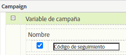

# Importar métricas de [!UICONTROL Búsqueda pagada] utilizando [!UICONTROL Fuentes de datos]

Para muchas organizaciones de marketing, la búsqueda de pago es una de las formas más valiosas y confiables de llegar &#x200B; nuevos clientes y de conservar los existentes. La capacidad [!UICONTROL Fuentes de datos] de Adobe Analytics facilita la importación de datos de búsqueda pagada avanzados desde plataformas de publicidad digital como Google AdWords. Puede integrarlo con el resto de los datos de marketing, junto con los datos de atributos del cliente y del comportamiento en el sitio, para permitirle obtener una mejor perspectiva de los esfuerzos de búsqueda pagada de su organización.

Estos pasos muestran cómo configurar una integración con AdWords para importar datos de palabras clave, así como métricas como impresiones, clics, costo por clic y más.

Los pasos explican cómo configurar una importación única de datos de pago por clic. Sin embargo, [!UICONTROL Fuentes de datos] permite la importación continua de datos utilizando el formato de archivo descrito aquí. En función de la plataforma de búsqueda de pago, es posible que pueda programar exportaciones periódicas (diarias, mensuales, etc.), configurar procesos automatizados para transformar esas exportaciones en el formato de archivo que Adobe Analytics requiere y cargar estos archivos en Adobe Analytics para los informes de integración de búsqueda pagada.

## Requisitos previos

* Ha implementado la detección de búsqueda de pago.
* Está capturando datos de código de seguimiento.
* Tiene códigos de seguimiento únicos para cada grupo de publicidad.

## Configurar [!UICONTROL eventos de éxito]

El primer paso es preparar Adobe Analytics para recibir las métricas. Para ello, debe configurar algunos eventos de éxito.

[!UICONTROL Los eventos de éxito son acciones de las que se puede llevar un seguimiento. ] Usted determina lo que es un [!UICONTROL evento de éxito]. Para nuestro propósito de rastrear las métricas de [!UICONTROL búsqueda de pago], queremos configurar [!UICONTROL eventos de éxito] alrededor de [!UICONTROL clics], [!UICONTROL impresiones], [!UICONTROL coste total] y habilitar[!UICONTROL códigos de seguimiento].

1. Vaya a **[!UICONTROL Adobe Analytics > Administración > Grupos de informes]**.
1. Selección de un grupo de informes.
1. Haga clic en **[!UICONTROL Editar configuración > Conversión > Eventos de éxito]**.

   

1. En Eventos de éxito personalizados, utilice **[!UICONTROL Agregar nuevo]** para crear 3 eventos de éxito personalizados: [!UICONTROL Clics] (contador), [!UICONTROL Impresiones] (contador) y [!UICONTROL Costo total] (moneda).

   

1. Haga clic en Guardar.
Debe recibir un mensaje que indique que sus ahorros se aprobaron.
1. Vaya a **[!UICONTROL Administración > Grupos de informes > Editar configuración > Conversión > Variables de conversión]**.
1. Habilite los códigos de seguimiento seleccionando la casilla junto a **[!UICONTROL Tracking Code]** en **[!UICONTROL Campaign > Campaign Variable]**.

   

## Configuración de fuentes de datos

[!UICONTROL Las fuentes de ] datos le permiten compartir datos de flujo de navegación sin clics con Adobe Analytics. En este caso, utilizamos Adobe Analytics para rastrear las métricas de búsqueda de pago. Utilizamos el código de seguimiento como nuestra clave para unir los dos fragmentos de datos: métricas de búsqueda de pago y métricas de Adobe Analytics.

1. Vaya a **[!UICONTROL Adobe Analytics > Administración > Todos los administradores > Fuentes de datos]**.
1. Seleccione la pestaña **[!UICONTROL Create]** para comenzar a activar nuevas fuentes de datos.
1. En **[!UICONTROL Seleccionar categoría]**, seleccione **[!UICONTROL Campaña de publicidad]**.

   

1. En **[!UICONTROL Seleccionar tipo]**, seleccione **[!UICONTROL Servicio de pago por clic genérico]**.
1. Haga clic en **[!UICONTROL Activar]**.
El [!UICONTROL Asistente para la activación de fuentes de datos] muestra:

   

1. Haga clic en **[!UICONTROL Next]** y asigne un nombre a la fuente de datos. Este nombre aparece en el Administrador de fuentes de datos.
1. Acepte el contrato de servicio y haga clic en **[!UICONTROL Next]**.
1. Seleccione las tres métricas estándar: [!UICONTROL Impresiones], [!UICONTROL Clics] y [!UICONTROL Coste total] y haga clic en **[!UICONTROL Siguiente]**.
1. Ahora, &quot;asigne&quot; esta nueva fuente de datos a los eventos personalizados que hemos creado en [Configurar eventos de éxito](/help/admin/admin/c-success-events/t-success-events.md).

   

1. Elegir dimensiones de datos
Marque la casilla junto a Códigos de seguimiento y haga clic en **[!UICONTROL Siguiente]**.
1. Asigne Dimension de datos.
Asigne la dimensión de datos importada (atributo) al atributo de Adobe Analytics en el que desea almacenarla. Puede tratarse de una dimensión estándar o de un eVar. Después de hacer clic en **[!UICONTROL Next]**, las asignaciones resultantes se muestran en el resumen:

   

1. Haga clic en **[!UICONTROL Guardar]**.
1. Haga clic en **[!UICONTROL Descargar]** para descargar el archivo de plantilla para esta fuente de datos.
El nombre del archivo corresponde al tipo de fuente de datos especificado inicialmente (en este caso, &quot;Generic Pay-Per-Click Service template.txt&quot;).
1. Abra la plantilla en su editor de texto favorito.
El archivo ya se ha rellenado con las métricas y dimensiones y sus asignaciones.

## Exportar datos de PPC y cargarlos en Analytics

Pasos similares a estos funcionan para Google AdWords, MSN, Yahoo y otras cuentas de PPC.

### Exportar datos

1. Inicie sesión en su cuenta de PPC y cree un nuevo informe o exportación.
Asegúrese de que la exportación incluye los campos siguientes: fecha, dirección URL de destino (página de aterrizaje), impresiones, clics y coste. La exportación puede incluir otros campos, pero se eliminarán los pasos siguientes.
1. Si es posible, guarde el informe como un archivo `.csv` o delimitado por tabuladores. Esto facilitará el trabajo con en los pasos siguientes.
1. Abra el archivo en Microsoft Excel.

### Editar el archivo en Microsoft Excel

1. En Microsoft Excel, elimine todas las columnas que no sean las mencionadas anteriormente.
1. Elimine las filas adicionales de la parte superior.
1. Para aislar los códigos de seguimiento de las direcciones URL de destino:
a. Copie y pegue datos de todas las columnas.
b. Haga clic en **[!UICONTROL Datos > Texto a columnas]**.
c. En el paso 1 del asistente, asegúrese de que **[!UICONTROL Delimited]** está seleccionado y haga clic en **[!UICONTROL Next]**.
d. En el paso 2 del asistente, especifique el delimitador en función de cómo haya creado las direcciones URL (ya sea ? o &amp;) y haga clic en **[!UICONTROL Siguiente]**.
e. En el paso 3 del asistente, previsualice los datos y asegúrese de que una de las columnas sea &quot;trackingcodename=trackingcode&quot;. Si tiene variables adicionales, repita estos pasos (usando &amp; como delimitador).
f. Elimine todas las columnas excepto los códigos de seguimiento, las impresiones, los clics y el coste. Añada una nueva columna denominada Date y organice las columnas en el siguiente orden: Fecha : Código de seguimiento : Impresiones : Clics : Costo.
1. Agregue estos datos a la plantilla que descargó en la sección &quot;Configurar fuentes de datos&quot; anterior.
Ahora está listo para cargar el archivo.

### Cargar el archivo a Adobe Analytics mediante FTP

Vuelva al asistente de fuentes de datos para obtener instrucciones y cargue el archivo a través de FTP:

## Crear métricas calculadas

Agregar métricas calculadas será útil cuando tome decisiones de pago por clic.

Por ejemplo, puede agregar estas [métricas calculadas](https://experienceleague.adobe.com/docs/analytics/components/calculated-metrics/calcmetric-workflow/cm-build-metrics.html?lang=en#calculated-metrics):

| Nombre | Fórmula | Tipo de métrica | Descripción |
| --- | --- | --- | --- |
| ‏‏Vistas de página por visita | Vistas de página/Visitas | Numéricos | Cuando se aplica a nivel de sitio: muestra la media de páginas por visita. Cuando se aplica en el informe de páginas más populares: muestra el número promedio de veces que una página específica se ha visto por visita. |
| Valor de pedido promedio | Ingresos/Pedidos | Moneda | Muestra el ingreso promedio por pedido. |
| Ingresos por visita | Ingresos/Visita | Moneda | Muestra los ingresos promedio por visita. |
| Tasa de pulsaciones (CTR) | Clics/Impresiones | Numéricos | Mida la proporción de clics respecto a impresiones de una publicidad en línea o una campaña de marketing por correo electrónico. |
| Beneficio | Ingresos - Coste | Moneda | Muestra los ingresos de una campaña menos el costo. |
| Beneficio por impresión (PPI) | (Ingresos - Coste)/Impresión | Moneda | Muestra cuántos ingresos se generaban cada vez que se mostraba una publicidad, equilibrados con el coste. |
| Rendimiento del gasto en publicidad (ROAS) | Importe de ventas/gasto de publicidad | Moneda | (ROI) Representa los dólares obtenidos por cada dólar invertido en la publicidad correspondiente. |

## Configurar y ejecutar informes

El paso final es agregar las métricas de la fuente de datos y cualquier métrica calculada al informe Código de seguimiento y explorar en profundidad una campaña para obtener una vista inmediata del rendimiento de cada grupo de publicidad.

1. En **[!UICONTROL Adobe Analytics > Informes]**, seleccione el grupo de informes en el que ha importado las fuentes de datos.
1. Vaya a **[!UICONTROL Informes > Campañas > Código de seguimiento > Código de seguimiento]**.
1. Seleccione el intervalo de fechas.
1. Haga clic en **[!UICONTROL Métricas > Agregar]** y agregue las métricas de fuente de datos (Clics, Impresiones, Costo total) en la lista de Métricas estándar.
1. Haga lo mismo con cualquier métrica calculada que haya agregado. El informe se actualizará a medida que agregue métricas.
