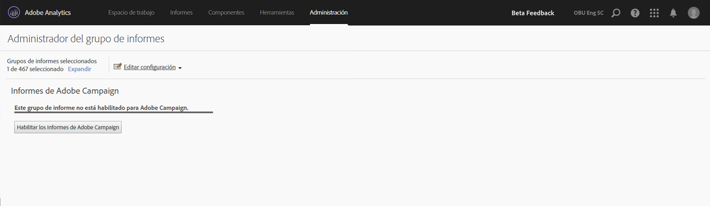

# Informes de Adobe Campaign

Para obtener más información acerca de cómo configurar esta integración, vaya a la [documentación de Adobe Campaign](https://helpx.adobe.com/es/campaign/standard/integrating/using/about-campaign-analytics-integration.html).

Esta integración entre Adobe Analytics y Adobe Campaign

* Le permite compartir sus datos de KPI (Indicador de rendimiento clave) de Adobe Campaign Standard con Adobe Analytics.
* Enriquece las fórmulas de seguimiento con parámetros de Adobe Analytics.
* Agrega un nuevo informe en **[!UICONTROL Analytics]** > **[!UICONTROL Informes]** > **[!UICONTROL Adobe Campaign.]**
* Agrega 5 nuevas clasificaciones de Adobe Campaign.
* Agrega 10 nuevas métricas de Adobe Campaign.
* Agrega 6 nuevas dimensiones de Adobe Campaign.
* Sincroniza datos con Analytics cada 15 minutos.

## Paso 1. Habilite la creación de informes de Adobe Campaign {#section_C685EF10505045708A6536BB13F6CD58}

Para ver datos de campaña en Analytics, primero debe habilitar la creación de informes de Campaign.

1. Vaya a  **[!UICONTROL Analytics]** > **[!UICONTROL Administración]** > **[!UICONTROL Grupos de informes]** > **`<select report suite>`** > **[!UICONTROL Editar configuración]** > **[!UICONTROL Adobe Campaign]** > **[!UICONTROL Informes de Adobe Campaign]** .
1. Haga clic en **[!UICONTROL Habilitar los informes de Adobe Campaign]**.

   

## Paso 2: Vea informes de Adobe Campaign {#section_9C18A29F3CC54BD4AC5EA96417F17B33}

La integración entre Adobe Campaign Standard y Adobe Analytics agrega el siguiente informe en **[!UICONTROL Analytics]** > **[!UICONTROL Informes]**

| Información general de la tienda de aplicaciones | Definición |
|--- |--- |
| ID de entrega ejecutada de Adobe Campaign | Muestra datos importados desde Adobe Campaign acerca de correos electrónicos enviados desde Adobe Campaign. |

## Paso 3. Use clasificaciones de Adobe Campaign {#section_74A28AF3F4CA4091943789DE4D8B2B63}

**[!UICONTROL Analytics]** > **[!UICONTROL Administración]** > **[!UICONTROL Grupos de informes]** > **`<select report suite>`** > **[!UICONTROL Editar configuración]** > **[!UICONTROL Adobe Campaign]** > **[!UICONTROL Clasificaciones de Adobe Campaign]**

Una vez que el grupo de informes esté habilitado para Adobe Campaign, quedan disponibles las siguientes clasificaciones:

* ID de entrega (nombre de entrega interno que ve en Campaign)
* Etiqueta de entrega (Entrega en Campaign - Entrega individual/Entrega recurrente/Entrega de transacción)
* ID de campaña (nombre de campaña interno que ve en Campaign)
* Etiqueta de campaña (campaña en Adobe Campaign)
* Etiqueta de entrega ejecutada (lista de entregas ejecutadas individuales)

## Dimensiones y métricas de Adobe Campaign disponibles en Adobe Analytics {#section_F33385C9660644AF84172EC39601469B}

Las siguientes **métricas** están disponibles desde Campaign en los grupos de informes de Adobe Analytics:

* Se envió Adobe Campaign
* Se abrió Adobe Campaign
* Se hizo clic en Adobe Campaign
* Se procesó Adobe Campaign
* Se entregó Adobe Campaign
* Apertura exclusiva de Adobe Campaign
* Clic exclusivo de Adobe Campaign
* Se canceló la suscripción a Adobe Campaign
* Total de salidas hacia otro sitio de Adobe Campaign
* Instancias de ID de entrega ejecutada de Adobe Campaign

Las siguientes **dimensiones** están disponibles desde Campaign en los grupos de informes de Adobe Analytics:

| Nombre de la dimensión | Definición |
|--- |--- |
| ID de campaña | ID de todas las campañas para las que se han enviado KPI a lo largo de la duración. |
| Etiqueta de campaña | Etiquetas de los ID de campaña |
| ID de entrega | ID de todas las entregas para las que se han enviado KPI a lo largo de la duración. También incluye el ID de entregas maestras de una entrega recurrente o de transacción. Ejemplo: Hay programada una entrega recurrente DM1 que cuenta con las entregas secundarias DM2, DM3, DM4 y DM5.  El ID de entrega muestra resultados para todas las entregas, de DM1 a DM5. |
| Etiqueta de entrega | Etiquetas de los ID de entrega |
| ID de entrega ejecutada de | ID únicamente de las entregas ejecutadas. No se incluye el ID de entregas maestras recurrentes/de transacción. Ejemplo: Hay programada una entrega recurrente DM1 que cuenta con las entregas secundarias DM2, DM3, DM4 y DM5. ID de entrega ejecutada muestra resultados para todas las entregas a partir de DM2 hasta DM5: las entregas que se han ejecutado. |
| Etiqueta de entrega ejecutada | Etiquetas de los ID de entrega ejecutada |
