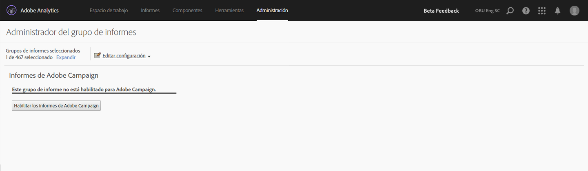

# Sistema de informes de Adobe Campaign Standard

Para obtener más información acerca de cómo configurar esta integración, vaya a la [documentación de Adobe Campaign](https://helpx.adobe.com/es/campaign/standard/integrating/using/about-campaign-analytics-integration.html).

>[!IMPORTANT]
>Este artículo se aplica solamente al sistema de informes de Adobe Campaign **Standard**. Consulte [aquí](/help/integrate/analytics-to-campaign-classic.md) para añadir el sistema de informes de Adobe Campaign **Classic**.

Esta integración entre Adobe Analytics y Adobe Campaign Standard:

* Permite compartir los datos de KPI (indicador de rendimiento clave) de Adobe Campaign Standard con Adobe Analytics.
* Enriquece las fórmulas de seguimiento con parámetros de Adobe Analytics.
* Agrega un nuevo informe en **[!UICONTROL Analytics]** > **[!UICONTROL Informes]** > **[!UICONTROL Adobe Campaign.]**
* Añade 5 nuevas clasificaciones de Adobe Campaign.
* Añade 9 nuevas métricas de Adobe Campaign.
* Añade 6 nuevas dimensiones de Adobe Campaign.
* Sincroniza datos con Analytics cada 15 minutos mediante una fuente de datos aprovisionada automáticamente.

## Paso 1. Habilitar el sistema de informes de Adobe Campaign Standard {#section_C685EF10505045708A6536BB13F6CD58}

Para ver datos de Campaign Standard en Analytics, primero debe habilitar el sistema de informes de Campaign en el Administrador del grupo de informes.

1. Vaya a  **[!UICONTROL Analytics]** > **[!UICONTROL Administración]** > **[!UICONTROL Grupos de informes]** > **`<select report suite>`** > **[!UICONTROL Editar configuración]** > **[!UICONTROL Adobe Campaign]** > **[!UICONTROL Informes de Adobe Campaign]** .
1. Haga clic en **[!UICONTROL Habilitar los informes de Adobe Campaign]**.

   

## Paso 2: Vea informes de Adobe Campaign {#section_9C18A29F3CC54BD4AC5EA96417F17B33}

La integración entre Adobe Campaign Standard y Adobe Analytics añade el siguiente informe en **[!UICONTROL Analytics]** > **[!UICONTROL Informes]**

* **[!UICONTROL ID de entrega ejecutada por Adobe Campaign]**: muestra datos importados de Adobe Campaign sobre correos electrónicos enviados desde Adobe Campaign. |

## Paso 3. Use clasificaciones de Adobe Campaign {#section_74A28AF3F4CA4091943789DE4D8B2B63}

**[!UICONTROL Analytics]** > **[!UICONTROL Administración]** > **[!UICONTROL Grupos de informes]** > **`<select report suite>`** > **[!UICONTROL Editar configuración]** > **[!UICONTROL Adobe Campaign]** > **[!UICONTROL Clasificaciones de Adobe Campaign]**

Una vez que el grupo de informes esté habilitado para Adobe Campaign, quedan disponibles las siguientes clasificaciones:

| Clasificación | Descripción |
| --- | --- |
| [!UICONTROL ID de entrega] | Nombre de entrega interno que ve en Campaign |
| [!UICONTROL Etiqueta de entrega] | Entrega en Campaign - Entrega individual/Entrega recurrente/Entrega de transacción |
| [!UICONTROL ID de campaña] | Nombre interno de Campaign que ve en Campaign |
| [!UICONTROL Etiqueta de Campaign] | Campaign en Adobe Campaign |
| [!UICONTROL Etiqueta de entrega ejecutada] | Lista de envíos ejecutados individuales |

## Dimensiones y métricas de Adobe Campaign Standard disponibles en Adobe Analytics {#section_F33385C9660644AF84172EC39601469B}

Las siguientes **métricas** están disponibles en Campaign en los grupos de informes de Adobe Analytics:

* Adobe Campaign enviado
* Adobe Campaign abierto
* Adobe Campaign ha hecho clic
* Entrega de Adobe Campaign
* Apertura única de Adobe Campaign
* Clic único en Adobe Campaign
* Suscripción cancelada de Adobe Campaign
* Total de salidas hacia otro sitio de Adobe Campaign
* Instancias de ID de envío ejecutadas por Adobe Campaign

Las **dimensiones** siguientes están disponibles en Campaign en los grupos de informes de Adobe Analytics:

| Nombre de Dimension | Definición |
| --- | --- |
| ID de campaña | ID de todas las campañas para las que se han enviado KPI durante la duración |
| Etiqueta de campaña | Etiquetas de los ID de campaña |
| ID de envío | ID de todos los envíos para los que se han enviado KPI durante la duración. También incluye los ID de los envíos maestros de envíos recurrentes y envíos de transacciones. Ejemplo: Hay programada una entrega recurrente DM1 que cuenta con las entregas secundarias DM2, DM3, DM4 y DM5.  El ID de entrega muestra los resultados de todas las entregas, de DM1 a DM5. |
| Etiqueta de envío | Etiquetas de ID de entrega |
| ID de entrega ejecutada de | ID solo de envíos ejecutados. Sin ID de envío maestro recurrente/ transaccional. Ejemplo: Hay programada una entrega recurrente DM1 que cuenta con las entregas secundarias DM2, DM3, DM4 y DM5. El ID de entrega ejecutado muestra los resultados de todas las entregas a partir de DM2 a DM5: los envíos que se han ejecutado. |
| Etiqueta de envío ejecutada | Etiquetas de los ID de envío ejecutados |
