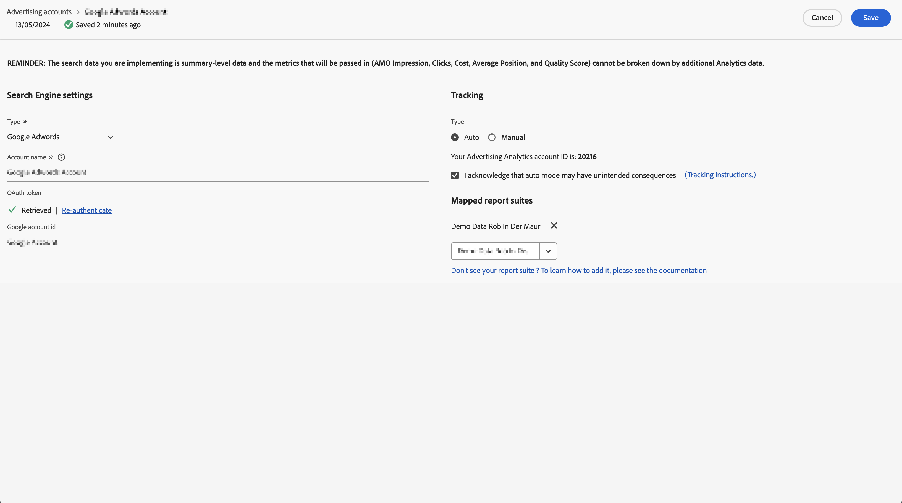

# Configurar una cuenta publicitaria

Los administradores de Adobe Analytics pueden crear nuevas cuentas publicitarias y asignar varias cuentas a varios grupos de informes (1 : 1, 1 : Muchos, Muchos : Muchos).

Los administradores también pueden [conceder acceso a los usuarios que no son administradores](/help/integrate/c-advertising-analytics/overview.md#section_FCC58EB635954A32990D4E67B52B4369) para que configuren cuentas publicitarias.

<!--

-->

1. En Adobe Analytics, vaya a **[!UICONTROL Administración]** > **[!UICONTROL Cuentas publicitarias]**.
1. (Solo la primera vez que se utilice) Acepte los términos del Contrato de licencia de usuario final.
1. Seleccionar **[!UICONTROL + Agregar]**.
1. Se muestra el cuadro de diálogo [!UICONTROL Nueva configuración del motor de búsqueda].

   

1. Complete **[!UICONTROL Configuración del motor de búsqueda]** siguiendo estas directrices:

   | Configuración | Descripción |
   | --- | --- |
   | **[!UICONTROL Tipo]** | Tiene dos opciones: **[!UICONTROL Google Adwords]** y **[!UICONTROL Bing Ads]**.  Nota: El 31 de marzo de 2019, Microsoft Bing absorbió Yahoo Gemini. Como resultado, la opción de cuenta publicitaria de Yahoo Gemini ya no está disponible. |
   | Nombre de la cuenta | Puede elegir establecer este nombre de cuenta en el nombre que mejor le parezca.  Nombre de cuenta es el nombre descriptivo de la cuenta que aparece en la interfaz de usuario. |
   | Autenticador de OAuth | **Nota**: OAuth es un estándar abierto para la delegación de acceso, usado por lo general como una forma de conceder a los sitios web o a las aplicaciones acceso a la información en los sitios web, pero sin proporcionar contraseñas. Observará que se le dirige a una dirección URL de terceros (efrontier.com). Adobe utiliza Adobe Media Optimizer para impulsar el proceso de autenticación de OAuth en los tres motores de búsqueda. Si utiliza Internet Explorer 11 (o una versión anterior), no podrá recuperar el token de OAuth para ninguno de los tres motores de búsqueda. En su lugar, utilice otros exploradores web.
Seleccione **[!UICONTROL Recuperar token]** para iniciar el proceso de autenticación OAuth2. Se le pedirá que utilice sus credenciales para iniciar sesión en la cuenta de búsqueda de Google/Bing. Según el proceso que haya elegido, el proceso es ligeramente diferente: <ul><li>Google AdWords: proporcione el identificador de la cuenta de Google</li><li>Microsoft Bing: proporcione el identificador de la cuenta de Bing y el identificador de cliente de Bing.</li></ul>Consulte [Localizar el identificador de cuenta](/help/integrate/c-advertising-analytics/c-adanalytics-workflow/aa-locate-account-id.md) para obtener información sobre estos identificadores. Cuando haya iniciado sesión correctamente, en el campo **[!UICONTROL Token de OAuth]** se mostrará la palabra **[!UICONTROL Recuperado]**. |

1. En la sección **[!UICONTROL Seguimiento]** proporciona información sobre cómo rastrear los datos mediante su implementación de Adobe Analytics. El seguimiento es un paso necesario para aumentar correctamente los datos de Adobe Analytics con los datos del motor de búsqueda.
Siga estas directrices para rellenar **[!UICONTROL Configuración del seguimiento]**:

   | Configuración | Descripción |
   | --- | --- |
   | Tipo | <ul><li>**Automático**: Permite que el motor de Advertising Cloud decida cómo se adjuntan los parámetros de seguimiento a las plantillas de seguimiento o a las direcciones URL de destino de. [!UICONTROL El seguimiento automático de tipos] es el método más sencillo, pero es posible que no genere el conjunto de datos mejor integrado. **Importante:** Para configurar una cuenta de motor de búsqueda con [!UICONTROL Seguimiento automático de tipos], usted es responsable de realizar las siguientes acciones:<ul><li>El parámetro y valor `s_kwcid` se agrega a las plantillas de seguimiento de la cuenta o a las direcciones URL de las páginas de aterrizaje en la cuenta que se agrega. El parámetro y el valor se insertan al final de la dirección URL. Es posible que se requieran acciones adicionales si el servidor web requiere un determinado par `key=value` al final de la dirección URL. O se requiere una actualización para admitir cualquier nuevo par `key=value` en la dirección URL. **Nota**: Más información sobre si debes agregar este parámetro a tu [Política de seguridad de contenido](https://experienceleague.adobe.com/es/docs/id-service/using/reference/csp).</li><li>Además, es posible insertar palabras clave en la URL de destino como parte del valor `s_kwcid` Si las palabras clave contienen caracteres especiales o símbolos, confirme que su servidor web los admite. Un ejemplo de caracteres especiales comunes es `+`, que se usa en las palabras clave &quot;Broad Match Modified&quot;.</li></ul></li><li>**Manual**: Le permite administrar cómo se agregan los parámetros de seguimiento a las plantillas de seguimiento o a las direcciones URL de destino del motor de búsqueda. [Consulte estos ejemplos de seguimiento manual para cada motor de búsqueda](/help/integrate/c-advertising-analytics/c-adanalytics-workflow/aa-manual-vs-automatic-tracking.md).</li></ul> |

1. Seleccione **[!UICONTROL Guardar]**.
1. Un aviso legal muestra una lista de advertencias. Confirme que ha leído y entiende este acuerdo. Seleccione la casilla de verificación y, a continuación, seleccione **[!UICONTROL Aceptar]**.

   Ahora se le dirigirá a la [IU de administración](/help/integrate/c-advertising-analytics/c-adanalytics-workflow/aa-manage-ad-accounts.md) de cuentas publicitarias, en que se incluirá su cuenta recién creada.

>[!NOTE]
>
>Los datos del motor de búsqueda suelen tardar un mínimo de 24 horas en propagarse a los informes de Analytics.
