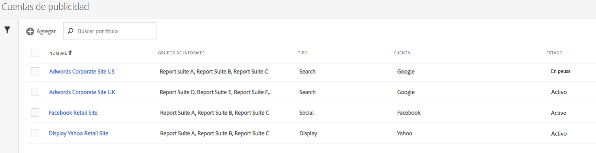
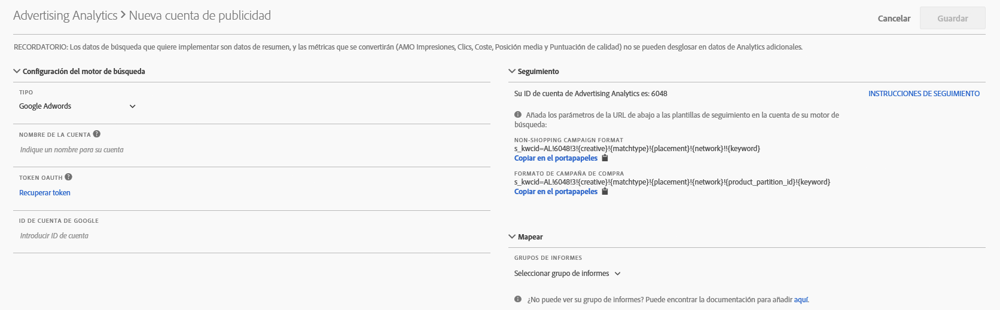

# Configurar una cuenta publicitaria

Los administradores de Adobe Analytics pueden crear nuevas cuentas publicitarias y asignar diversas cuentas a varios grupos de informes (1:1, 1:Muchos, Muchos:Muchos).

Los administradores también pueden [conceder acceso a los usuarios que no son administradores](/help/integrate/c-advertising-analytics/overview.md#section_FCC58EB635954A32990D4E67B52B4369) para que configuren cuentas publicitarias.

1. En Adobe Analytics, vaya a **[!UICONTROL Administración]** > **[!UICONTROL Cuentas publicitarias]**.
1. (Solo la primera vez que se utilice) Acepte los términos del Contrato de licencia de usuario final.
1. Haga clic en **[!UICONTROL + Añadir]**.
1. Se mostrará el cuadro de diálogo [!UICONTROL Nueva cuenta de motor de búsqueda]:

   

1. Siga estas directrices para rellenar **[!UICONTROL Configuración del motor de búsqueda]**:

   <table id="table_B3BE66B7D4C54766B8FFD2C6DCD657AF"> 
    <thead> 
      <tr> 
      <th colname="col1" class="entry"> Configuración </th> 
      <th colname="col2" class="entry"> Descripción </th> 
      </tr>
    </thead>
    <tbody> 
      <tr> 
      <td colname="col1"> 
Tipo 
 </td> 
      <td colname="col2"> 
Dispone de 2 opciones: Google AdWords y Microsoft Bing Ads. 
 
Nota: El 31 de marzo de 2019, Microsoft Bing absorbió Yahoo Gemini. Como resultado, la opción de cuenta publicitaria de Yahoo Gemini ya no está disponible.  
 </td> 
      </tr> 
      <tr> 
      <td colname="col1"> 
Nombre de la cuenta 
 </td> 
      <td colname="col2"> 
Como nombre de esta cuenta, puede elegir el nombre que mejor le parezca. Este es el nombre sencillo de la cuenta que aparecerá en la IU. 
 </td> 
      </tr> 
      <tr> 
      <td colname="col1"> 
Autenticador de OAuth 
 </td> 
      <td colname="col2"> 
Nota: OAuth es un estándar abierto para la delegación de acceso, usado por lo general como una manera de conceder a los sitios web o a las aplicaciones acceso a su información en otros sitios web, pero sin proporcionarles las contraseñas. 
 
Nota: Observará que se le dirige a una dirección URL de terceros (efrontier.com). Adobe utiliza efrontier como base del proceso de autenticación de OAuth para los tres motores de búsqueda. 
 
Nota: Si utiliza Internet Explorer 11 (o una versión anterior), no podrá recuperar correctamente el autenticador de OAuth para ninguno de los tres motores de búsqueda. En su lugar, utilice otros navegadores web. 
 
Al hacer clic en Recuperar autenticador, se inicia el proceso de autenticación de OAuth2. Esto significa que se le pedirá que utilice sus credenciales para iniciar sesión en la cuenta de búsqueda de Google/Bing. En función del motor de búsqueda que haya elegido, el proceso es ligeramente diferente: 

      <ul id="ul_FC9B5612F6554495B04C357CB0AB72EB"> 
       <li id="li_CD54231BFF134F83B3B5B14B34A0E1D2">Google AdWords: proporcione el identificador de la cuenta de Google. </li> 
       <li id="li_89B9D54BAA914E5DB2959B193489582E">Microsoft Bing: proporcione el identificador de la cuenta de Bing y el identificador de cliente de Bing. </li> 
       </ul> 
Consulte <a href="/help/integrate/c-advertising-analytics/c-adanalytics-workflow/aa-locate-account-id.md"  > Localizar el identificador de cuenta</a> para obtener información sobre estos identificadores. 
 
Cuando haya iniciado sesión correctamente, en el campo Autenticador de OAuth se mostrará la palabra <code>Retrieved</code>. 
 </td> 
      </tr> 
    </tbody> 
    </table>

1. En la sección **[!UICONTROL Seguimiento]**, debe proporcionar información sobre cómo la implementación de Adobe Analytics realiza un seguimiento de los datos del motor de búsqueda. Este paso es necesario para incrementar adecuadamente los datos de Adobe Analytics con los datos del motor de búsqueda.
Siga estas directrices para rellenar **[!UICONTROL Configuración del seguimiento]**:

   | Configuración | Descripción |
   |--- |--- |
   | Tipo | <ul><li>**Automático:** Permite que el motor de Advertising Cloud decida cómo se adjuntan los parámetros de seguimiento a las plantillas de seguimiento/URL de destino del motor de búsqueda. Este es el enfoque más sencillo, pero es posible que no genere el conjunto de datos mejor integrado. **Importante:** Para configurar una cuenta de motor de búsqueda en “Modo automático”, usted es responsable de realizar las siguientes acciones:  El parámetro y valor “s_kwcid” se agregará a las plantillas de seguimiento de cuentas o a las direcciones URL de página de aterrizaje en la cuenta que se agrega. Se insertará al final de la URL. Como resultado, es posible que deba llevar a cabo acciones adicionales si su servidor web requiere un determinado par clave-valor al final de la URL o bien una actualización que permita cualquier nuevo par clave-valor en la URL. **Nota:** Obtenga más información sobre si debe agregar este parámetro a la [política de seguridad de contenido](https://docs.adobe.com/content/help/es-ES/id-service/using/reference/csp.html). Además, en la URL de destino pueden insertarse palabras clave como parte del valor “s_kwcid”, de modo que, si contienen caracteres especiales o símbolos, confirme que su servidor web los admite (un ejemplo de carácter especial común es “+”, que se utiliza en las palabras clave “Broad Match Modified”).</li><li>**Manual:** Le permite administrar cómo se añaden los parámetros de seguimiento a las plantillas de seguimiento o a las direcciones URL de destino del motor de búsqueda. [Consulte estos ejemplos de seguimiento manual para cada motor de búsqueda](/help/integrate/c-advertising-analytics/c-adanalytics-workflow/aa-manual-vs-automatic-tracking.md).</li></ul> |

1. En la sección **[!UICONTROL Asignación]**, elija qué grupo(s) de informes va a enlazar a la cuenta de este motor de búsqueda. Debe proporcionar un grupo de informes como mínimo para guardar la cuenta publicitaria. Puede asignar diversas cuentas a varios grupos de informes (1:1, 1:Muchos, Muchos:Muchos). Recuerde que los datos que AMO obtiene del motor de búsqueda simplemente se copian a cualquier grupo de informes asignado, de modo que los datos no se dividen.

   >[!IMPORTANT]
   >
   >Solo los grupos de informes que se hayan [asignado a una organización de Experience Cloud](https://docs.adobe.com/content/help/es-ES/core-services/interface/about-core-services/report-suite-mapping.html) estarán disponibles para su selección. Si su grupo de informes no se incluye en la lista, consulte [Solucionar problemas de Advertising Analytics](/help/integrate/c-advertising-analytics/c-adanalytics-workflow/aa-troubleshooting.md).

   Para la **[!UICONTROL configuración de la asignación]**, siga estas directrices:

   <table id="table_AF876DC40F97403882C0AA528BD204FF"> 
    <thead> 
      <tr> 
      <th colname="col1" class="entry"> Configuración </th> 
      <th colname="col2" class="entry"> Descripción </th> 
      </tr>
    </thead>
    <tbody> 
      <tr> 
      <td colname="col1"> 
Report Suite  Asignación 
 </td> 
      <td colname="col2"> 
La asignación de grupos de informes determina el grupo de informes que se enlaza a la cuenta de este motor de búsqueda. En otras palabras, determina a qué grupo(s) de informes se envían los datos del motor de búsqueda. 
 
Si su grupo de informes no se incluye en la lista, puede <a href="https://docs.adobe.com/content/help/es-ES/core-services/interface/about-core-services/report-suite-mapping.html"  >asignar el grupo de informes a una organización de Experience Cloud</a> mediante esta herramienta. 
 </td> 
      </tr> 
    </tbody> 
    </table>

1. Haga clic en **[!UICONTROL Guardar]**.
1. Después de guardar, se muestra una lista de advertencias en un mensaje de exención de responsabilidad. Se le pedirá que confirme haber leído y entendido este contrato. Haga clic en la casilla de selección y, después, en **[!UICONTROL Aceptar]**.

   Ahora se le dirigirá a la [IU de administración](/help/integrate/c-advertising-analytics/c-adanalytics-workflow/aa-manage-ad-accounts.md) de cuentas publicitarias, en que se incluirá su cuenta recién creada.

>[!NOTE]
>
>Los datos del motor de búsqueda suelen tardar un mínimo de 24 horas en propagarse a los informes de Analytics.

