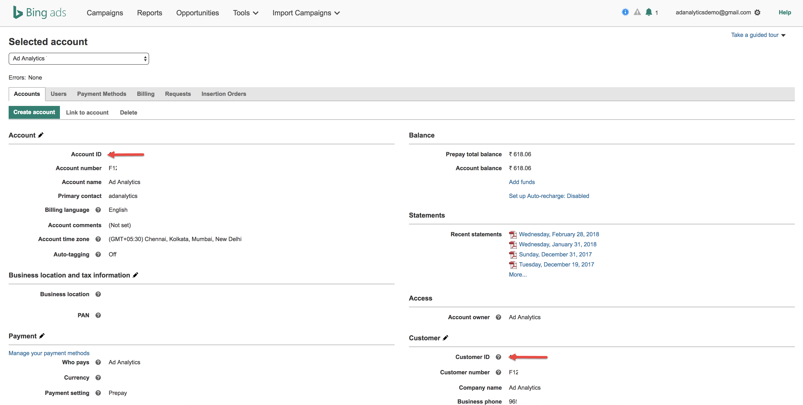

# Localización de los ID de su cuenta

Estas son instrucciones para ayudarle a localizar sus ID de cuenta para Google y Bing.

## Google AdWords {#section_2A62AD448BD949889DB77C2AF3E04C33}

>[!IMPORTANT]
>
>Google AdWords utiliza dos tipos de cuentas: a) Cuenta MCC (Mi centro de clientes) y b) Cuenta estándar. Para esta integración con Adobe Analytics, **debe iniciar sesión con una cuenta Estándar y no con una MCC**. La razón es que una cuenta MCC actúa como una cuenta "paraguas" que puede acceder a varias cuentas de AdWords con un solo inicio de sesión, mientras que el inicio de sesión de la cuenta Standard solo puede acceder a una cuenta de AdWords por inicio de sesión.

En la parte superior, haga clic en el icono Cuenta para ver el número de cuenta de AdWords (identificador de cliente).

## Bing {#section_F1B9C7E997444746936599732CD62665}

El identificador de cuenta y el identificador de cliente son necesarios. Se indican en la pestaña Cuentas.

> [!NOTE] El número de cuenta no es el mismo que el ID de cuenta.

