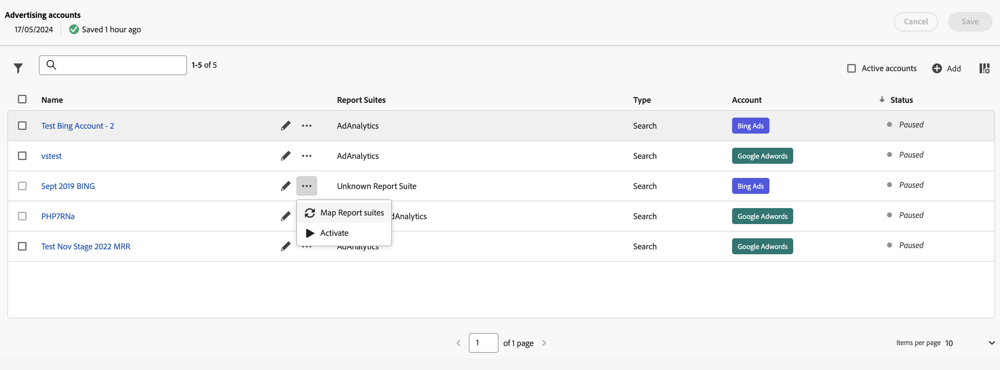

# Administrar las cuentas publicitarias

Puede acceder a la interfaz de cuentas de Advertising si navega hasta **[!UICONTROL Administración]** > **[!UICONTROL Cuentas de Advertising]**.

Verá una tabla con las cuentas publicitarias. Si no hay cuentas publicitarias disponibles, seleccione **[!UICONTROL Crear nueva cuenta publicitaria]**.

La tabla consta de las siguientes columnas:

| Nombre o elemento | Descripción |
|---|---|
| **[!UICONTROL Nombre]** | *Nombre de la cuenta*. Puede seleccionar el nombre para editar la configuración del motor de búsqueda. |
|  | Seleccione para cambiar el nombre de la cuenta publicitaria o editar la configuración del motor de búsqueda. |
|  | Seleccione esta opción para abrir un menú contextual que le permita [asignar grupos de informes](#map-reporting-suites), [activar o pausar cuentas publicitarias](#activate-or-pause-advertising-accounts). |
| **[!UICONTROL Grupos de informes]** | Enumera los grupos de informes a los que está asignada la cuenta publicitaria. |
| **[!UICONTROL Tipo]** | Muestra el tipo de cuenta publicitaria. De manera predeterminada, el tipo es [!UICONTROL Buscar] |
| **[!UICONTROL Cuenta]** | Muestre el tipo de cuenta: [!UICONTROL Bing Ads] o [!UICONTROL Google AdWords]. |
| **[!UICONTROL Estado]** | El estado de la cuenta publicitaria: *En pausa* o Activa. |

- Para filtrar la lista por grupo de informes, tipo y estado, seleccione 
- Para buscar tu cuenta publicitaria usando el campo de búsqueda .
- Para seleccionar cuentas activas en la tabla, marque **[!UICONTROL Cuentas activas]**.
- Para definir qué columnas mostrar en la tabla, seleccione .  En el diálogo **[!UICONTROL Personalizar tabla]**:
   - Seleccione las columnas que desea mostrar.
   - Seleccione **[!UICONTROL Aplicar]**.

Cuando selecciona una o más cuentas publicitarias, una barra de acciones azul, basada en el estado de las cuentas seleccionadas, le permite  **[!UICONTROL Cambiar nombre]**,  **[!UICONTROL Asignar grupos de informes]**,  **[!UICONTROL Activar]** o  **[!UICONTROL Pausar]** sus cuentas publicitarias.

## Crear una cuenta publicitaria

Para crear una nueva cuenta publicitaria:

1. Seleccione  **[!UICONTROL Agregar]**.
1. Verá el cuadro de diálogo [!UICONTROL Cuentas de Advertising] > **[!UICONTROL Nueva cuenta]** para que pueda definir una nueva cuenta publicitaria. Consulte [Configurar una cuenta de Advertising](aa-create-ad-account.md) para obtener más información.

## Editar una cuenta publicitaria

Para editar la configuración del motor de búsqueda de una cuenta publicitaria:

- Seleccione el nombre de la cuenta publicitaria.
- Seleccione  junto al nombre de la cuenta publicitaria.

## Asignar grupos de informes

Para asignar una o varias cuentas publicitarias a grupos de informes:

1. (opcional) Seleccione más de una cuenta publicitaria.
1. Seleccione  para una cuenta publicitaria específica.
1. Seleccione  **[!UICONTROL Asignar grupos de informes]** del menú contextual.
1. En el cuadro de diálogo Asignar grupos de informes, seleccione uno o varios grupos de informes en la lista desplegable. Puede eliminar grupos de informes de la asignación mediante .
1. Seleccione **[!UICONTROL Guardar]** para guardar la asignación.

## Activar o pausar cuentas publicitarias

Para activar una o varias cuentas publicitarias:

1. (opcional) Seleccione más de una cuenta publicitaria.
1. Seleccione  para una cuenta publicitaria específica.
1. Seleccione  **[!UICONTROL Activar]** en el menú contextual.

Para pausar una o varias cuentas publicitarias:

1. (opcional) Seleccione más de una cuenta publicitaria.
1. Seleccione  para una cuenta publicitaria específica.
1. Seleccione  **[!UICONTROL Pausar]** en el menú contextual.

