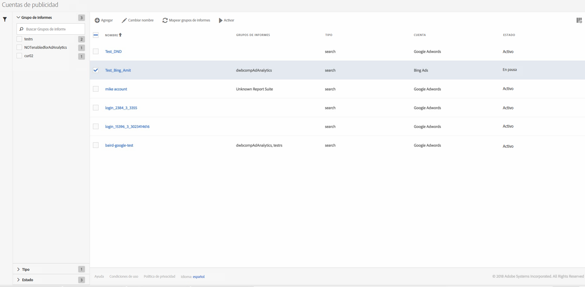

# Administrar las cuentas publicitarias

Para acceder a la IU de administración, vaya a **[!UICONTROL Administración]** > **[!UICONTROL Cuentas publicitarias]**.

<table id="table_BE318026CF024E94A885EED86AA7077F"> 
 <thead> 
  <tr> 
   <th colname="col1" class="entry"> Elemento </th> 
   <th colname="col2" class="entry"> Definición </th> 
  </tr>
 </thead>
 <tbody> 
  <tr> 
   <td colname="col1"> 
<b>Acciones</b> 
 </td> 
   <td colname="col2"> 
<b>Nota: Las acciones se muestran únicamente si ha seleccionado al menos una cuenta publicitaria. </b> 
 </td> 
  </tr> 
  <tr> 
   <td colname="col1"> 
+ Agregue 
 </td> 
   <td colname="col2"> 
Lo lleva a la IU <a href="/help/integrate/c-advertising-analytics/c-adanalytics-workflow/aa-create-ad-account.md"  >Configurar cuenta publicitaria</a>. 
 </td> 
  </tr> 
  <tr> 
   <td colname="col1"> 
Cambiar nombre 
 </td> 
   <td colname="col2"> 
Cambia el nombre de esta cuenta en todos los grupos de informes a los que está asignada. 
 </td> 
  </tr> 
  <tr> 
   <td colname="col1"> 
Asignar grupos de informes 
 </td> 
   <td colname="col2"> 
Le permite modificar las asignaciones de grupos de informes. 
 </td> 
  </tr> 
  <tr> 
   <td colname="col1"> 
Pausa 
 </td> 
   <td colname="col2"> 
Desactiva la cuenta. Para volver a activarla, haga clic en Activar. 
 </td> 
  </tr> 
  <tr> 
   <td colname="col1"> 
<b>Encabezamientos de columna</b> 
 </td> 
   <td colname="col2"> </td> 
  </tr> 
  <tr> 
   <td colname="col1"> 
Nombre 
 </td> 
   <td colname="col2"> 
El nombre que ha asignado a esta cuenta publicitaria. 
 </td> 
  </tr> 
  <tr> 
   <td colname="col1"> 
Grupos de informes 
 </td> 
   <td colname="col2"> 
Los grupos de informes asignados a esta cuenta publicitaria. 
 </td> 
  </tr> 
  <tr> 
   <td colname="col1"> 
Tipo 
 </td> 
   <td colname="col2"> 
En estos momentos, solo se admite un tipo: Búsqueda. 
 </td> 
  </tr> 
  <tr> 
   <td colname="col1"> 
Cuenta 
 </td> 
   <td colname="col2"> 
Muestra uno de los dos tipos de cuentas compatibles: Google AdWords o Bing Ads. 
 </td> 
  </tr> 
  <tr> 
   <td colname="col1"> 
Estado 
 </td> 
   <td colname="col2"> 
Existen dos indicadores de estado: 
 
    <ul id="ul_376263DEF6EE44B48564D272D3CBFCBC"> 
     <li id="li_75E329B68B4D4E929E227E717C993082"><b>Activa</b>: la cuenta se utiliza activamente para obtener datos de búsqueda. </li> 
     <li id="li_5E2DF98B22D34437A2A2C93F996C1EA2"><b>En pausa</b>: la cuenta está actualmente desactivada y no se utiliza para obtener datos de búsqueda. </li> 
    </ul> </td> 
  </tr> 
  <tr> 
   <td colname="col1"> 
<b>Filtros</b> 
 </td> 
   <td colname="col2"> 
(Margen izquierdo) Puede filtrar las cuentas publicitarias por Grupo de informes, Tipo y Estado. 
 </td> 
  </tr> 
 </tbody> 
</table>

