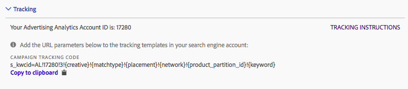

# Seguimiento: modo manual y modo automático

Con el seguimiento se determina cómo la implementación de Adobe Analytics realiza un seguimiento de los datos del motor de búsqueda. Este paso es necesario para incrementar adecuadamente los datos de Adobe Analytics con los datos del motor de búsqueda.

Se admiten dos modos de seguimiento: modo automático y modo manual.

## Modo de seguimiento automático {#concept_C4C6107838C947CFBB7F4E0CB94264F0}

En el modo automático, el motor de Advertising Cloud decide cómo se gestionan los datos del motor de búsqueda. Este es el enfoque más sencillo, pero es posible que no genere el conjunto de datos mejor integrado.

Como consecuencia, cuando seleccione el modo automático, antes de poder guardar la configuración de la cuenta deberá marcar una casilla de verificación para confirmar este hecho.


Tenga en cuenta que para configurar una cuenta de motor de búsqueda en'Modo automático ', usted es el responsable de realizar las siguientes acciones:

* En la cuenta agregada se añadirá el parámetro y valor “s_kwcid” a las plantillas de seguimiento de la cuenta o a las URL de las páginas de destino. Se insertará al final de la URL. Es posible que deba llevar a cabo acciones adicionales si su servidor web requiere un determinado par clave-valor al final de la URL o bien una actualización que permita cualquier nuevo par clave-valor en la URL. **Usted es responsable de garantizar que los parámetros de URL añadidos se conserven correctamente en la página de destino final.**
* Además, es posible insertar palabras clave en la URL de destino como parte del valor “s_kwcid”. Si contienen caracteres especiales o símbolos, confirme que su servidor web los admite. Ejemplo: un carácter especial común es “+”, que se utiliza en las palabras clave “Broad Match Modified”.

## Modo de seguimiento manual {#concept_87B28BA9E7F84BA5972F69E6F3482A33}

En el modo manual, debe especificar cómo el proceso de integración de datos de Advertising Analytics debe tratar los datos del motor de búsqueda.

### Añadir el seguimiento manual a la cuenta de Google {#section_41C1EB1AEB034544A5BC291F53C05C67}

A continuación, se muestra la cadena que debe añadirse a la cuenta de Google. Debe añadir la cadena a todas las plantillas de seguimiento utilizadas en la cuenta.

>[!IMPORTANT]
>
>`<Advertising Analytics ID>` El valor (en **negrita** abajo) es genérico y **debe reemplazarse con su cadena de ID de cuenta específica**. Puede obtener la cadena del identificador de la cuenta específica en la sección “Seguimiento” de la pantalla de configuración de la cuenta.

**Cadena de seguimiento para campañas:**

```
s_kwcid=AL! 
<b><Advertising Analytics ID></b>!3!{creative}!{matchtype}!{placement}!{network}!{product_partition_id}!{keyword}
```



Ejemplos de códigos de seguimiento en varios formatos de plantilla de seguimiento:

**`{lpurl}`**

```
{lpurl}?s_kwcid=AL!9999!3!{creative}!{matchtype}!{placement}!network}!{product_partition_id}!{keyword}
```

**`{lpurl}`con parámetro de URL adicional**

```
{lpurl}?campaign=PPC&s_kwcid=AL!9999!3!{creative}!{matchtype}!{placement}!network}!{product_partition_id}!{keyword}
```

**Terceros (doubleclick)`{unescapedlpurl}`**

```
https://clickserve.dartsearch.net/link/click?{_dssagcrid}&{_dssftfiid}&ds_e_adid={creative}&ds_e_matchtype={ifsearch:search}{ifcontent:content}&ds_e_device={device}&ds_e_network={network}&{ifpla:ds_e_product_group_id={product_partition_id}&ds_e_product_id={product_id}&ds_e_product_merchant_id={merchant_id}&ds_e_product_country={product_country}&ds_e_product_language={product_language}&ds_e_product_channel={product_channel}&ds_e_product_store_id={product_store_id}}&ds_url_v=2&ds_dest_url={unescapedlpurl}?s_kwcid=AL!9999!3!{creative}!{matchtype}!{placement}!{network}!{product_partition_id}!{keyword}
```

**Terceros (doubleclick)`{lpurl}`**

Si la dirección URL se redirecciona sin utilizar un valor “unescapedlpurl”, debe codificar la cadena suficientes veces para que se conserve a través del redireccionamiento hasta la dirección URL de la página de aterrizaje final.

```
https://clickserve.dartsearch.net/link/click?{_dssagcrid}&{_dssftfiid}&ds_e_adid={creative}&ds_e_matchtype={ifsearch:search}{ifcontent:content}&ds_e_device={device}&ds_e_network={network}&{ifpla:ds_e_product_group_id={product_partition_id}&ds_e_product_id={product_id}&ds_e_product_merchant_id={merchant_id}&ds_e_product_country={product_country}&ds_e_product_language={product_language}&ds_e_product_channel={product_channel}&ds_e_product_store_id={product_store_id}}&ds_url_v=2&ds_dest_url={lpurl}?s_kwcid%3DAL!9999!3!{creative}!{matchtype}!{placement}!{network}!{product_partition_id}!{keyword}
```

### Añadir el seguimiento manual a la cuenta de Bing {#section_094F8ACA493C4D65B1F54A695558EBF2}

A continuación, se muestra la cadena que debe añadirse a la cuenta de Bing. Debe añadir la cadena a todas las plantillas de seguimiento utilizadas en la cuenta.

>[!IMPORTANT]
>
>`<Advertising Analytics ID>` El valor (en **negrita** abajo) es genérico y **debe reemplazarse con su cadena de ID de cuenta específica**. Puede obtener la cadena del identificador de la cuenta específica en la sección “Seguimiento” de la pantalla de configuración de la cuenta.

**Cadena de seguimiento para campañas:**

```
s_kwcid=AL!<Advertising Analytics ID>!10!{AdId}!{OrderItemId} 
```


Ejemplos de códigos de seguimiento en varios formatos de plantilla de seguimiento:

**{lpurl}**

```
{lpurl}?s_kwcid=AL!9999!10!{AdId}!{OrderItemId}`
```

**`{lpurl}`con parámetro de URL adicional**

```
{lpurl}?campaign=PPC&
s_kwcid=AL!9999!10!{AdId}!{OrderItemId}
```

**Terceros (doubleclick)' {unescapedlpurl}**

```https://clickserve.dartsearch.net/link/click?{_dssagcrid}&{_dssftfiid}&ds_e_adid={creative}&ds_e_matchtype={ifsearch:search}{ifcontent:content}&ds_e_device={device}&ds_e_network={network}&{ifpla:ds_e_product_group_id={product_partition_id}&ds_e_product_id={product_id}&ds_e_product_merchant_id={merchant_id}&ds_e_product_country={product_country}&ds_e_product_language={product_language}&ds_e_product_channel={product_channel}&ds_e_product_store_id={product_store_id}}&ds_url_v=2&ds_dest_url={unescapedlpurl}?s_kwcid=AL!9999!10!{AdId}!{OrderItemId}

```

**Terceros (doubleclick)`{lpurl}`**

Si la dirección URL se redirecciona sin utilizar un valor “unescapedlpurl”, debe codificar la cadena suficientes veces para que se conserve a través del redireccionamiento hasta la dirección URL de la página de aterrizaje final.

```
https://clickserve.dartsearch.net/link/click?{_dssagcrid}&{_dssftfiid}&ds_e_adid={creative}&ds_e_matchtype={ifsearch:search}{ifcontent:content}&ds_e_device={device}&ds_e_network={network}&{ifpla:ds_e_product_group_id={product_partition_id}&ds_e_product_id={product_id}&ds_e_product_merchant_id={merchant_id}&ds_e_product_country={product_country}&ds_e_product_language={product_language}&ds_e_product_channel={product_channel}&ds_e_product_store_id={product_store_id}}&ds_url_v=2&ds_dest_url={lpurl}?s_kwcid%3DAL!9999!10!{AdId}!{OrderItemId}
```
