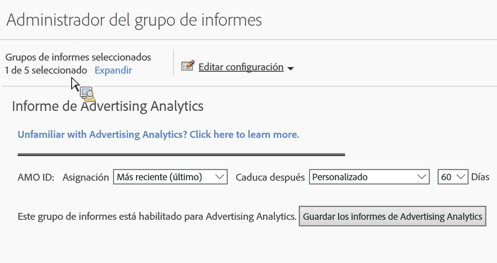

# Activación de un grupo de informes para Advertising Analytics

Para ver los datos de búsqueda de Análisis de publicidad en Analytics, debe configurar cada grupo de informes asignado a Experience Cloud para los informes de Análisis de publicidad.

1. [Asigne su grupo de informes a una organización](https://docs.adobe.com/content/help/en/core-services/interface/about-core-services/report-suite-mapping.html).
1. Vaya a **[!UICONTROL Admin]** > **[!UICONTROL Report Suites]**.

1. Seleccione el grupo de informes asignado a su organización de Experience Cloud.
1. Haga clic **[!UICONTROL Edit Settings]** > **[!UICONTROL Advertising Analytics Configuration]**.

   

   > [!IMPORTANT] El ID de AMO se refiere a la variable de Adobe Advertising Cloud en la que se van a insertar los datos de búsqueda.

1. Establezca las variables de asignación y caducidad que desea que utilice la variable de AMO ID. Las variables de conversión (eVars) permiten que Adobe Analytics atribuya eventos de éxito a valores específicos de variables. En ocasiones, las variables encuentran más de un valor antes de visitar un evento de éxito. Para estos casos, la asignación determina qué valor de variable recibe crédito por el evento.

   | Configuración | Definición |
   |--- |--- |
   | Valor original (primero) | El primer valor visto obtiene crédito de asignación completo, independientemente de los valores subsiguientes para esa variable. |
   | Más reciente (último) | El último valor visto obtiene crédito de asignación completo para el evento de éxito, independientemente de las variables que se hayan activado antes de él. |
   | Caduca después | Le permite especificar un período de tiempo o un evento tras el cual caduca el valor de la eVar (es decir, ya no recibe crédito por los eventos de éxito).  Si se da un evento de éxito después de que caduque la eVar, el valor Ninguno recibe crédito por el evento (no había ninguna eVar activa). |

1. Haga clic en **[!UICONTROL Enable Advertising Analytics Reporting]** (por primera vez) o **[!UICONTROL Update Advertising Analytics Reporting]** (horas subsiguientes). Ahora, su grupo de informes está listo para recibir datos de búsqueda de Advertising Analytics. No está listo para [crear cuentas publicitarias](/help/integrate/c-advertising-analytics/c-adanalytics-workflow/aa-create-ad-account.md).

