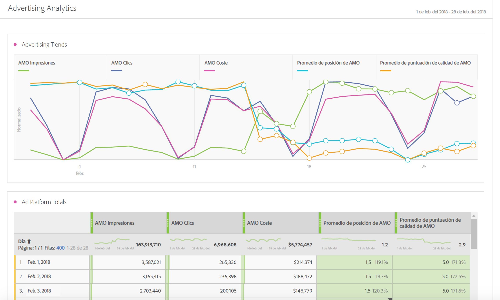
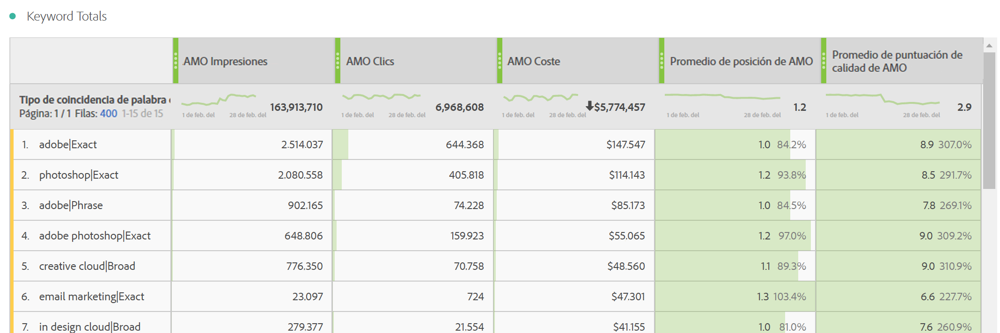
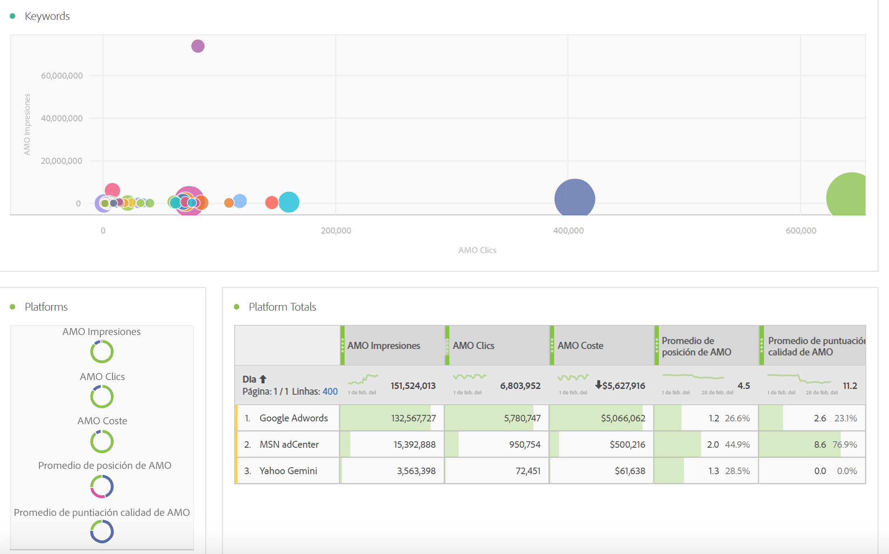
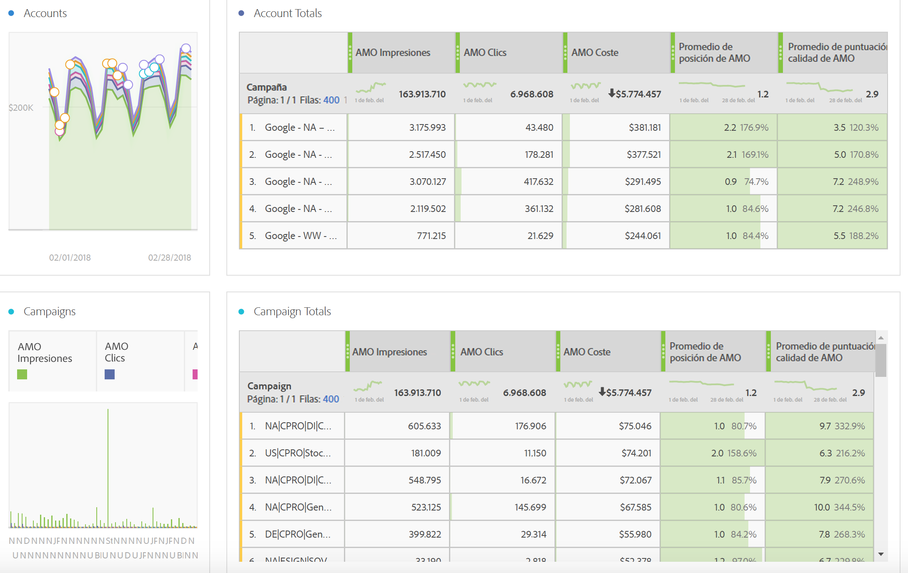
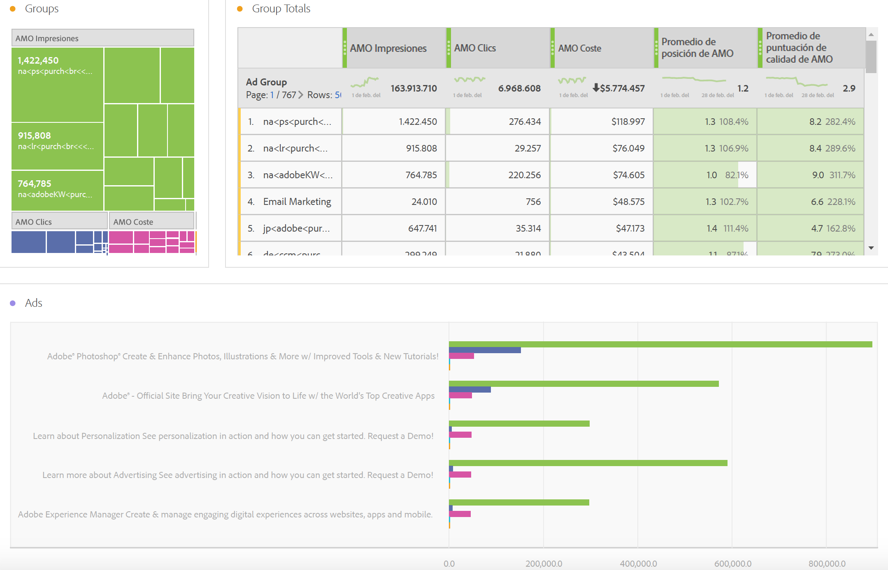
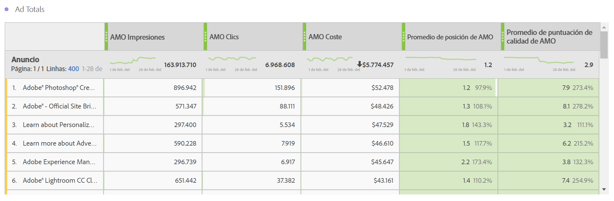
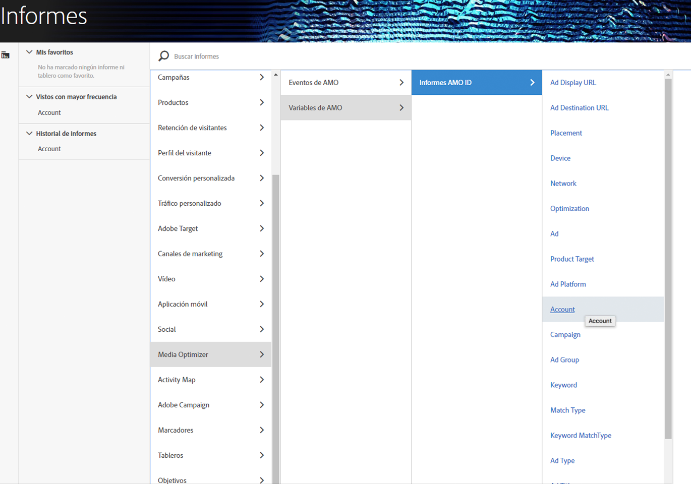

# Informar sobre datos publicitarios en Adobe Analytics

Detalles sobre la plantilla Analysis Workspace y los informes en Reports &amp; Analytics y Report Builder.

>[!NOTE]
>
>Los datos del motor de búsqueda suelen tardar un mínimo de 24 horas en propagarse a los informes de Analytics. Tenga en cuenta también que los informes de Analytics no devolverán datos de la granularidad por hora, ya que los datos de AMO no admiten esta característica.

## Analysis Workspace: Plantilla de motores de búsqueda {#section_8173F42B2C784F41B9FD82CBB66F9ADF}

Esta plantilla permite a cualquier usuario que implemente esta integración del motor de búsqueda acceder a numerosos datos del motor de búsqueda en Analytics. Puede acceder a ella desde **[!UICONTROL Workspace]** > **[!UICONTROL Plantillas]** > **[!UICONTROL Publicidad]** > **[!UICONTROL Motores de búsqueda.]**

>[!NOTE]
>
>La categoría de plantilla de publicidad es visible para todos los clientes, aunque no hayan implementado ninguna cuenta publicitaria. Sin embargo, si intenta abrir la plantilla Motores de búsqueda de pago para una empresa que no se ha proporcionado, aparecerá un mensaje de error en el que se explica que todavía no ha configurado ninguna cuenta de motor de búsqueda. En este caso, haga clic en **[!UICONTROL Configurar ahora]**, lo que lo llevará a la pantalla [Configuración de cuenta publicitaria](/help/integrate/c-advertising-analytics/c-adanalytics-workflow/aa-create-ad-account.md).

       

| Tabla/visualización | Descripción |
|--- |--- |
| Tendencias publicitarias | Información general de tendencias diarias para Impresiones de AMO, Clics de AMO y Coste de AMO. |
| Plataformas de publicidad | Gráfico de aros del coste de las dos plataformas principales (Google, Bing). |
| Totales de las plataformas de publicidad | Tabla de formato libre de las plataformas principales desglosada por Impresiones de AMO, Clics de AMO, Costes de AMO, Posición media de AMO y Posición media de AMO Puntuación de calidad |
| Cuentas | Área apilada de costes. |
| Totales de cuenta | Tabla de formato libre de las cuentas principales desglosada por las métricas asociadas. |
| Campañas | Gráfico de barras del coste de la campaña. |
| Totales de campaña | Tabla de formato libre de las campañas principales desglosada por las métricas asociadas. |
| Grupos | Mapa en árbol del coste. |
| Totales de grupo | Tabla de formato libre de los grupos publicitarios principales desglosada por las métricas asociadas. |
| Anuncios | Gráficos de barras horizontales de impresiones, clics y costes. |
| Totales de anuncios | Tabla de formato libre de los anuncios principales desglosada por las métricas asociadas. |
| Palabras clave | Gráfico de dispersión de impresiones, clics y costes para todas las combinaciones de tipo palabra clave / coincidencia. |
| Totales de palabras clave | Tabla de formato libre de las combinaciones de tipo palabra clave / coincidencia principales desglosada por las métricas asociadas. |

## Reports &amp; Analytics {#section_BB2E75DF909C49EA8D4E92D14D6DFD85}

Tan pronto como haya configurado una cuenta de Advertising Analytics, el informe de Advertising Analytics estará disponible.

## Report Builder {#section_8E0371CF81144C33990D909685D1726E}

Tan pronto como haya configurado una cuenta de Advertising Analytics, el informe de Advertising Analytics estará disponible.
