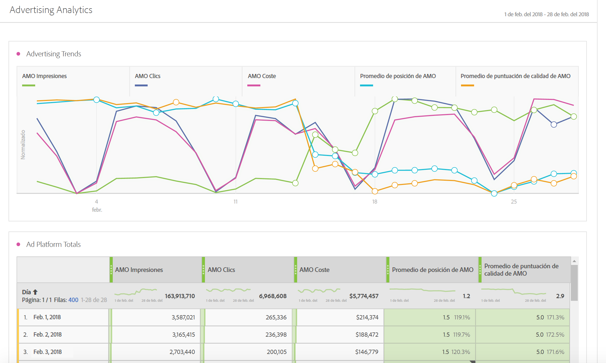
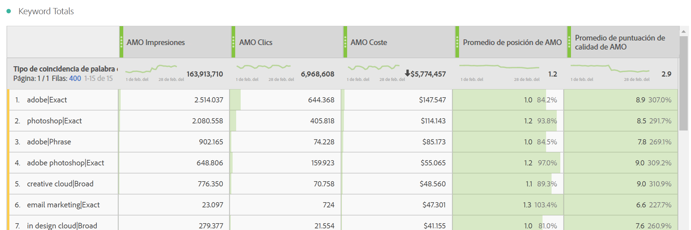
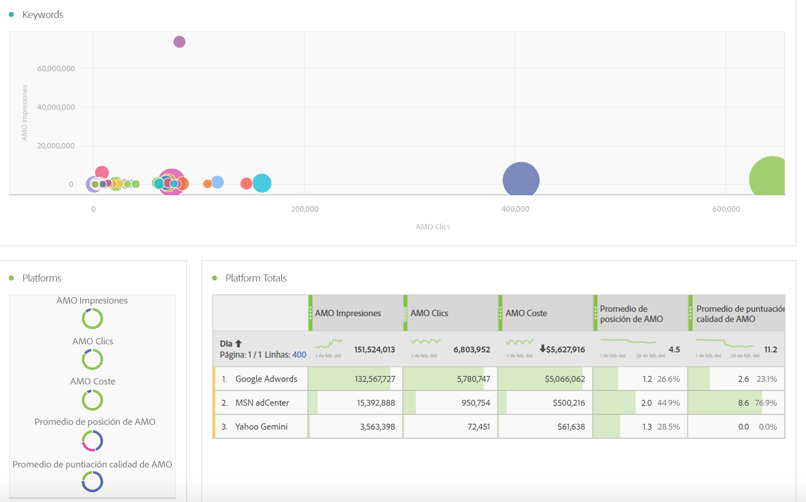
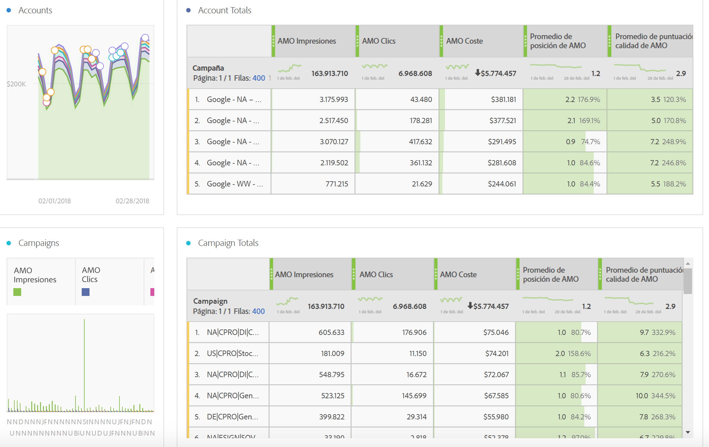
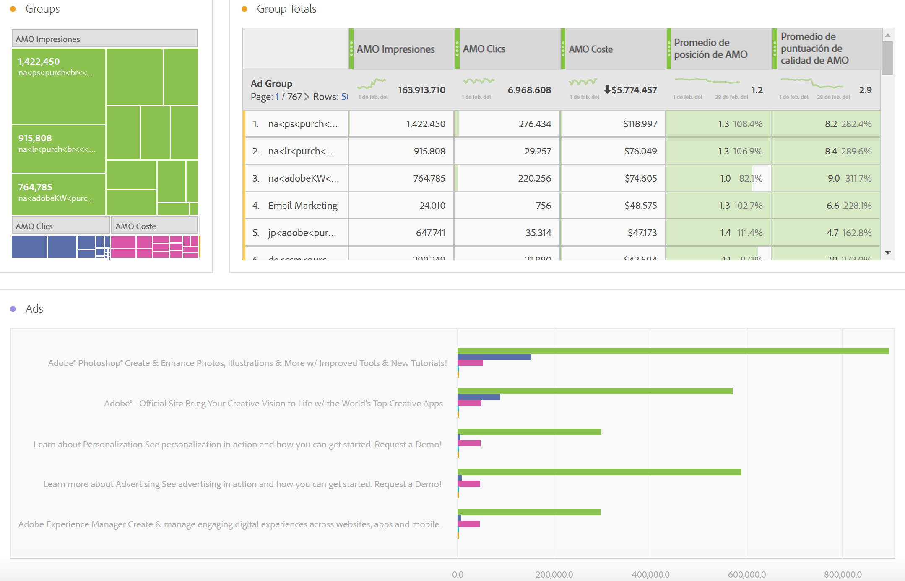
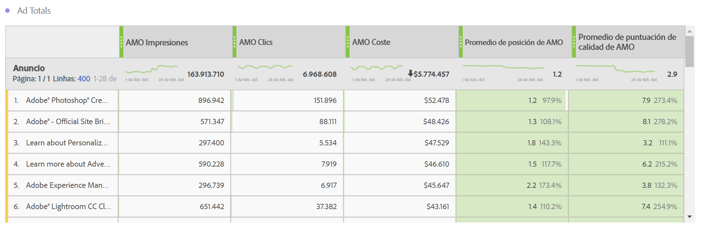

# Informar sobre datos publicitarios

Este artículo contiene detalles sobre el informe de Analysis Workspace y los informes de Report Builder.

>[!NOTE]
>
>Los datos del motor de búsqueda suelen tardar un mínimo de 24 horas en propagarse a los informes de Analytics. Los informes de Analytics no devuelven datos sobre la granularidad horaria, ya que los datos de Adobe Advertising no admiten esta característica.

## Informe de búsqueda de pago {#section_8173F42B2C784F41B9FD82CBB66F9ADF}

Este informe permite a cualquier usuario que implemente la integración del motor de búsqueda acceder a los datos del motor de búsqueda dentro de Analytics. Puede acceder a él a través de **[!UICONTROL Workspace]** > **[!UICONTROL Informes]** > **[!UICONTROL Adquisición]** > **[!UICONTROL Advertising Analytics: búsqueda de pago]**

>[!NOTE]
>
>El informe Búsqueda de pago es visible para todos los clientes, aunque no hayan implementado ninguna cuenta de Advertising. Si intenta abrir el informe Búsqueda de pago para una empresa que no está aprovisionada, aparecerá un mensaje de error en el que se explica que no ha configurado ninguna cuenta de motor de búsqueda. Seleccione **[!UICONTROL Configurar ahora]**, que lo lleva a la pantalla [Configuración de cuenta de Advertising](/help/integrate/c-advertising-analytics/c-adanalytics-workflow/aa-create-ad-account.md).

       

| Tabla/visualización | Descripción |
|--- |--- |
| Tendencias publicitarias | Información general de tendencias diarias para Impresiones de AMO, Clics de AMO y Coste de AMO. |
| Plataformas de publicidad | Gráfico de aros del coste de las dos plataformas principales (Google Ads, Microsoft Advertising). |
| Totales de las plataformas de publicidad | Tabla de forma libre de las plataformas principales desglosada por Impresiones de AMO, Clics de AMO, Costes de AMO, Posición media de AMO y Posición media de AMO Puntuación de calidad |
| Cuentas | Área apilada de costes. |
| Totales de cuenta | Tabla de forma libre de las cuentas principales desglosada por las métricas asociadas. |
| Campañas | Gráfico de barras del coste de la campaña. |
| Totales de campaña | Tabla de forma libre de las campañas principales desglosada por las métricas asociadas. |
| Grupos | Mapa en árbol del coste. |
| Totales de grupo | Tabla de forma libre de los grupos publicitarios principales desglosada por las métricas asociadas. |
| Anuncios | Gráficos de barras horizontales de impresiones, clics y costes. |
| Totales de anuncios | Tabla de forma libre de los anuncios principales desglosada por las métricas asociadas. |
| Palabras clave | Gráfico de dispersión de impresiones, clics y costes para todas las combinaciones de tipo palabra clave / coincidencia. |
| Totales de palabras clave | Tabla de forma libre de las combinaciones de tipo palabra clave / coincidencia principales desglosada por las métricas asociadas. |

## Report Builder {#section_8E0371CF81144C33990D909685D1726E}

Tan pronto como haya configurado una cuenta de Advertising Analytics, el informe de Advertising Analytics estará disponible.
