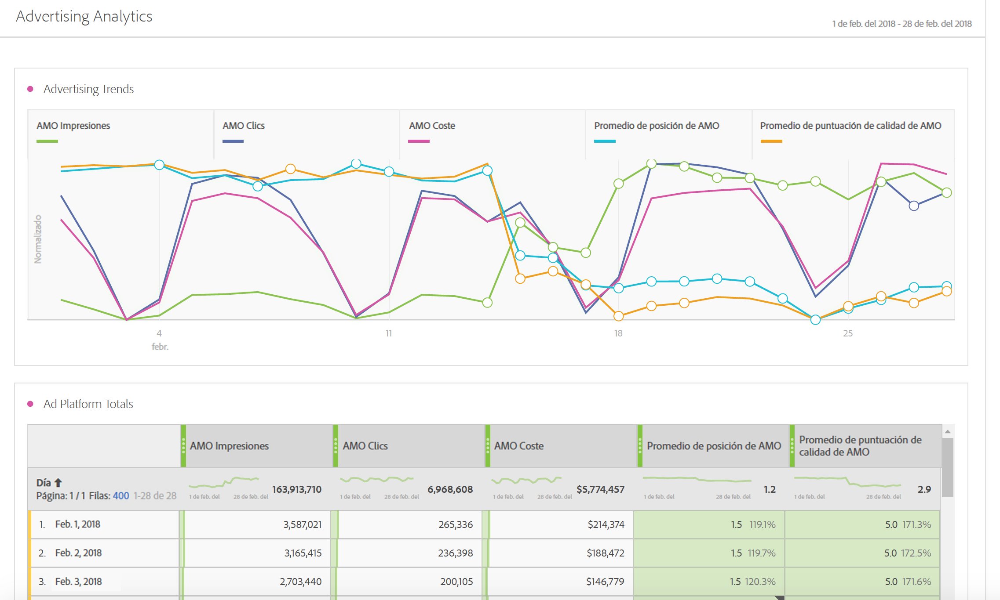

# Guía de Advertising Analytics

Advertising Analytics le permite consultar todos los datos de búsqueda de pago de Google y Bing alineados en Adobe Analytics. Anteriormente, cualquier dato de Google AdWords/DFA o Microsoft Bing Ads tenía que visualizarse en Adobe Advertising Cloud (AMO) o en Google/Bing. Ahora obtendrá los siguientes datos en Adobe Analytics: Impresiones, clics, costes directamente desde los motores de búsqueda, así como instancias de AMO ID (instancias de clic). La puntuación de calidad y las posiciones medias ya no se recopilarán, ya que Google ha eliminado la segmentación de estas métricas en septiembre de 2019.

>[!NOTE]
>
>El 31 de marzo de 2019, Microsoft Bing absorbió Yahoo Gemini. Como resultado, la opción de cuenta publicitaria de Yahoo Gemini ya no está disponible.

Al unir los datos de estos motores de búsqueda en Adobe Analytics, puede analizarlos mediante la potencia de Analysis Workspace. Una nueva plantilla denominada [Rendimiento de búsqueda de pago](/help/integrate/c-advertising-analytics/c-adanalytics-workflow/aa-report-ad-data-an.md) de Workspace facilita este análisis.

Esta integración va dirigida a los públicos siguientes:

* El **analista** que debe recopilar informes de rendimiento para el comercializador de búsqueda de pago.
* El **comercializador de búsqueda de pago** que busca respuestas a estas preguntas: ¿Cuánto tráfico estoy enviando a nuestro sitio web y qué proporción de ese tráfico están convirtiendo los clientes? ¿Cuáles son mis campañas publicitarias rentables?

## Requisitos previos {#section_C25E0CA3474C4EDEAEAA9A5B8AAC9299}

* Advertising Analytics está disponible únicamente para los SKU [Select](https://www.adobe.com/es/data-analytics-cloud/analytics/select.html), [Prime](https://www.adobe.com/es/data-analytics-cloud/analytics/prime.html) y [Ultimate](https://www.adobe.com/es/data-analytics-cloud/analytics/ultimate.html) de Adobe Analytics.

* Esta funcionalidad está disponible para clientes que no sean de Advertising Cloud ni de AMO.
* Para tener acceso a Advertising Analytics, debe ser administrador de Adobe Analytics. Posteriormente, puede [conceder permisos de acceso](/help/integrate/c-advertising-analytics/overview.md#section_FCC58EB635954A32990D4E67B52B4369) a los usuarios que no sean administradores.
* Los grupos de informes de Analytics de los que desee consultar los datos de búsqueda de Google/Bing, deben [estar asignados a su organización de Experience Cloud](https://docs.adobe.com/content/help/es-ES/core-services/interface/about-core-services/report-suite-mapping.html).
* Para los grupos de informes de los que desee consultar los datos de búsqueda de Google/Bing, [habilite dichos grupos de informes para Advertising Analytics](/help/integrate/c-advertising-analytics/c-adanalytics-workflow/aa-provision-rs.md). Puede hacerlo en **[!UICONTROL Administración]** > **[!UICONTROL Editar configuración]** > **[!UICONTROL Configuración de Advertising Analytics]**.

* Necesita credenciales de inicio de sesión para un usuario con permisos de edición en las cuentas de búsqueda que desee integrar en Adobe Analytics, como un identificador de cuenta de Google y una contraseña.
* En el caso de Bing Ads, también necesita el identificador de cliente de Bing.
* Si utiliza Internet Explorer 11 (o una versión anterior), no podrá [configurar correctamente una cuenta publicitaria](/help/integrate/c-advertising-analytics/c-adanalytics-workflow/aa-create-ad-account.md) para ninguno de los tres motores de búsqueda. En su lugar, utilice otros navegadores web.

## Permisos de Advertising Analytics {#section_FCC58EB635954A32990D4E67B52B4369}

Analytics cuenta con dos permisos que se conceden automáticamente a los administradores de Analytics. Los administradores tienen la opción de conceder estos permisos a los usuarios que no sean administradores.

<table id="table_86256AD8B4554F369439A8FDF2F545E1"> 
 <thead> 
  <tr> 
   <th colname="col1" class="entry"> Permiso </th> 
   <th colname="col2" class="entry"> Definición </th> 
   <th colname="col3" class="entry"> Conceder permiso en Adobe Analytics </th> 
   <th colname="col4" class="entry"> Conceder permiso si ha iniciado sesión en Adobe Experience Cloud </th> 
  </tr>
 </thead>
 <tbody> 
  <tr> 
   <td colname="col1"> 
Administración de Advertising Analytics 
 </td> 
   <td colname="col2"> 
Permite a los usuarios configurar/editar/visualizar las cuentas de búsqueda publicitarias. 
 </td> 
   <td colname="col3"> Administración  &gt;   Todos los administradores    &gt; Administración de   usuarios  &gt;   Grupos  &gt;   Editar acceso a todos los informes  &gt;   Personalizar herramientas de Analytics  &gt;   Administración de Advertising Analytics </td> 
   <td colname="col4"> Inicio de sesión en adminconsole.adobe.com &gt; Productos &gt; Perfil del producto &gt; Pestaña Permisos &gt; Herramientas de Analytics &gt; Administración de Advertising Analytics </td> 
  </tr> 
  <tr> 
   <td colname="col1"> 
Configuración de Advertising Analytics 
 </td> 
   <td colname="col2"> 
Permite a los usuarios configurar los grupos de informes que se van a aprovisionar para Advertising Analytics. 
 </td> 
   <td colname="col3"> Administración  &gt;   Todos los administradores    &gt; Administración de   usuarios  &gt;   Grupos  &gt;   Editar acceso a todos los informes  &gt;   Personalizar herramientas de grupos de informes  &gt;   Configuración de Advertising Analytics </td> 
   <td colname="col4"> Inicio de sesión en adminconsole.adobe.com &gt; Productos &gt; Perfil del producto &gt; Pestaña Permisos &gt; Herramientas de grupos de informes &gt; Configuración de Advertising Analytics </td> 
  </tr> 
 </tbody> 
</table>

## Dimensiones y métricas de Advertising Analytics {#section_C0DF4A08EA9E46ADABE9E465AFC11E32}

Advertising Analytics añade las siguientes dimensiones y métricas a Analysis Workspace, Reports &amp; Analytics, Report Builder y la API de informes de Analytics.

**Dimensiones**

>[!IMPORTANT]
>
>Esta integración crea un nuevo conjunto de dimensiones a través de las clasificaciones de la variable de ID de AMO. Estas dimensiones nuevas no afectan a los canales de marketing existentes ni a las dimensiones de la variable de seguimiento de campañas ni los modifican. El identificador de AMO está conectado al perfil de un visitante cuando dicho visitante aterriza en el sitio web desde un anuncio de búsqueda de pago. Como tal, las dimensiones de AMO se pueden utilizar para desglosar las métricas de AMO que proporciona esta integración, así como los datos que el visitante haya capturado del sitio web (visitas, visitantes, visualizaciones de páginas, tasa de rebotes, pedidos, ingresos, eventos personalizados, etc.). También se pueden desglosar por otras dimensiones al informar sobre otras métricas en el sitio.
>
>Las clasificaciones de estas métricas se actualizan a diario. Así pues, si realiza cambios en los metadatos en un motor de búsqueda, es posible que dichos cambios no se reflejen hasta el día siguiente cuando se actualicen las clasificaciones.

| Nombre de la clasificación (dimensión) | Definición |
|--- |--- |
| Tipo de coincidencia de palabra clave (ID de AMO) | El tipo de coincidencia de palabra clave. Por lo general, los valores serán amplia, frase, exacta o sin valor si el tipo de anuncio no tiene ningún tipo de coincidencia. |
| Plataforma de publicidad (ID de AMO) | El nombre del motor de búsqueda. Los valores pueden incluir Google AdWords o Microsoft Bing Ads. |
| Cuenta (ID de AMO) | El nombre de la cuenta de motor de búsqueda de la que se está realizando un seguimiento. |
| Campaña (ID de AMO) | El nombre de la campaña en la cuenta de motor de búsqueda. |
| Grupo de publicidad (ID de AMO) | El nombre del grupo de publicidad en las campañas de motor de búsqueda. |
| Anuncio (ID de AMO) | El Título de anuncio + Descripción de anuncio que se utilizan en su anuncio. |
| Palabra clave (ID de AMO) | El valor de palabra clave de su cuenta de motor de búsqueda. |
| Tipo de coincidencia (ID de AMO) | El tipo de coincidencia de palabra clave asignado a su palabra clave. Por lo general, los valores serán amplia, frase, exacta o sin valor si el tipo de anuncio no tiene ningún tipo de coincidencia. |
| Tipo de anuncio (ID de AMO) | Tipo de anuncio publicado, que suele ser “Anuncio de texto”. |
| Título de anuncio (ID de AMO) | El objeto Título que se utiliza en su anuncio. |
| Descripción de anuncio (ID de AMO) | El objeto Descripción de anuncio que se utiliza en su anuncio. |
| URL mostrada de anuncio (ID de AMO) | El objeto URL mostrada de anuncio que se utiliza en su anuncio. |
| URL de destino de anuncio (ID de AMO) | La URL de la página de destino o la URL final asignada a su anuncio. |
| Red (ID de AMO) | La red en la que se publica su anuncio. Para Advertising Analytics, este valor es siempre “Búsqueda”. |
| Ubicación (ID de AMO) | El sitio web de colocación gestionada (para las redes de contenido). Solo las colocaciones gestionadas utilizan esta dimensión. |
| Segmentación de productos (ID de AMO) | El nombre del segmento de producto utilizado en los anuncios PLA (no el producto comprado en sí). |
| Optimización (ID de AMO) | No se utiliza en Advertising Analytics. Solo lo utilizan los clientes de Advertising Cloud. |
| Dispositivo (ID de AMO) | No se utiliza hoy en día. Marcador de posición para posibles mejoras futuras en los tipos de dispositivo de destino indicados (p. ej., móvil, escritorio) del anuncio (no el dispositivo en sí del visitante). |

**Métricas**

>[!IMPORTANT]
>
>Las métricas que proporciona Advertising Analytics (enumeradas más abajo) son datos de resumen de los motores de búsqueda. No están conectadas a los perfiles de visitante de Analytics. Solo están conectadas a la variable de ID de AMO y a sus dimensiones de clasificación asociadas. Como tal, no se debe realizar ningún informe de ellas según ninguna dimensión ni ningún segmento que no sean los basados en las dimensiones de ID de AMO. En caso de hacerlo, Analytics mostrará los datos como ceros. Puede incluirlas en métricas calculadas con otras métricas, pero estas métricas calculadas también deben desglosarse únicamente por las dimensiones de ID de AMO.
>
>Estas métricas son datos que se obtienen a diario, de manera que no tendrán datos correspondientes al día en curso. Tampoco se deben hacer informes de ellas con una granularidad inferior a diario.
>
>Existe una métrica denominada Instancias de ID de AMO que se define cuando el ID de AMO se establece en una página de aterrizaje (es decir, un clic). Esta métrica se captura en tiempo real junto con el acceso a la página de aterrizaje y está disponible para el desglose con otras dimensiones establecidas también en la página de aterrizaje.

| Nombre de la métrica | Definición |
|--- |--- |
| Impresiones de AMO | El número de impresiones de un anuncio según la información del motor de búsqueda. |
| Clics de AMO | El número de clics en anuncios según la información del motor de búsqueda. |
| Coste de AMO | El coste pagado por cada palabra clave o anuncio según la información del motor de búsqueda. |
