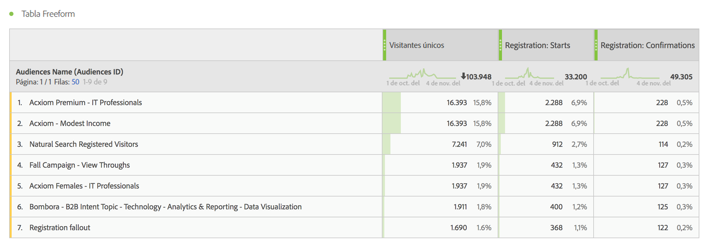
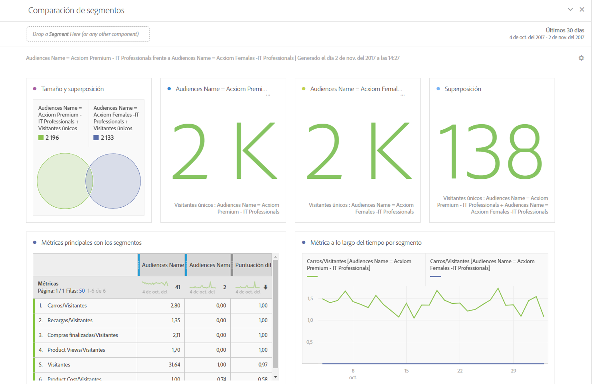
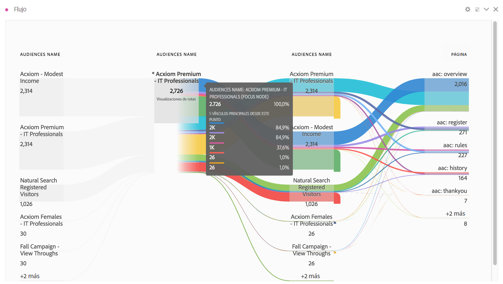
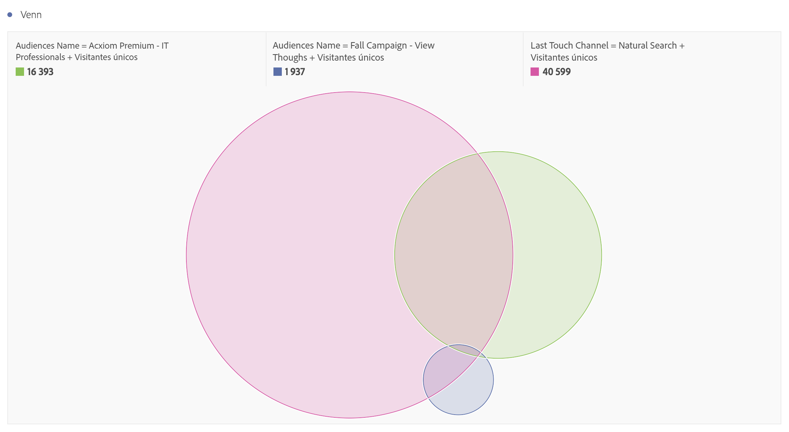
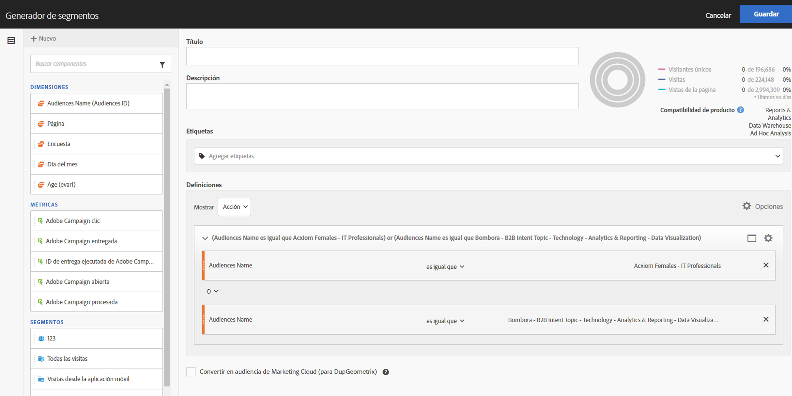

# Utilización de los datos de públicos en Analytics

Puede utilizar las dimensiones Audiencia de Adobe Audience Manager en todo Analytics. Los segmentos integrados son nuevas dimensiones de Analytics denominadas ID de audiencias y Nombre de audiencias, y se pueden usar como cualquier otra dimensión que recopile Analytics. En Fuentes de datos, los ID de público se almacenan en la columna “mc_audiences”. Estas dimensiones no están disponibles en este momento en Data Workbench o Livestream. Algunos ejemplos de cómo se pueden aprovechar las dimensiones Audiencias son los siguientes:

## Analysis Workspace {#workspace}

En Analysis Workspace, los segmentos de Adobe Audience Manager aparecen como dos dimensiones.

1. Vaya a **[!UICONTROL Workspace]**.
1. En la lista de **[!UICONTROL dimensiones]**, seleccione las dimensiones **[!UICONTROL ID de audiencia]** o **[!UICONTROL Nombre de audiencia]**. El nombre es una clasificación descriptiva del ID.

   

## Comparación de segmentos {#compare}

[Comparación de segmentos](/help/analyze/analysis-workspace/c-panels/c-segment-comparison/segment-comparison.md) detecta las diferencias estadísticamente más significativas entre dos segmentos. Los datos de públicos pueden usarse de dos maneras en Comparación de segmentos: 1) como los 2 segmentos que se comparan; y 2) como elementos de la tabla “Elementos de dimensiones principales”.

1. Vaya a **[!UICONTROL Workspace]** y seleccione el panel **[!UICONTROL Comparación de segmentos]** en el carril izquierdo.

1. Busque [!UICONTROL Nombre de audiencias] en el menú **[!UICONTROL Componente]**.

1. Abra [!UICONTROL Nombre de públicos] para que aparezcan los elementos de dimensiones relacionados.
1. Arrastre las audiencias que desee comparar al Generador de comparación de segmentos.
1. (Opcional): También puede incluir otros elementos de dimensión o segmentos, se pueden comparar hasta 2.
1. Haga clic en **[!UICONTROL Crear]**.

   Las dimensiones ID de públicos y Nombre de públicos aparecen automáticamente en la tabla “Elementos de dimensiones principales”, al igual que los datos de perfil adicionales para los dos segmentos que se comparan.

   

## Viaje del cliente (Flujo) en Analysis Workspace {#flow}

Los datos de segmentos de Adobe Audience Manager se pasan a Analytics para cada visita y representan el estado de pertenencia de un visitante a las distintas audiencias en un momento dado. Esto significa que un visitante podría encajar en un segmento (p. ej., “Conocimiento”) y más tarde tener la cualificación para un segmento superior (p. ej., “Consideración”). Puede usar [Flujo](/help/analyze/analysis-workspace/visualizations/fallout/fallout-flow.md) en Analysis Workspace para visualizar el recorrido que un visitante toma entre las audiencias.

1. Vaya a **[!UICONTROL Workspace]** y seleccione el panel **[!UICONTROL Flujo]** en el carril izquierdo.

1. Arrastre la dimensión [!UICONTROL Nombre de audiencia] al generador de flujo.
1. Haga clic en **[!UICONTROL Crear]**.
1. (Opcional): Arrastre cualquier otra dimensión a la visualización Flujo para crear un [Flujo entre dimensiones](/help/analyze/analysis-workspace/visualizations/c-flow/multi-dimensional-flow.md).

Los públicos también pueden utilizarse en las [visualizaciones de visitas en el orden previsto](/help/analyze/analysis-workspace/visualizations/fallout/fallout-flow.md).

## Visualización de Venn en Analysis Workspace {#venn}

[Visualizaciones Venn](/help/analyze/analysis-workspace/visualizations/venn.md) muestran la superposición entre hasta 3 segmentos.

1. Vaya a **[!UICONTROL Workspace]** y seleccione la visualización **[!UICONTROL Venn]** en el carril izquierdo.

1. Busque [!UICONTROL Nombre de audiencia] en el menú de componentes.
1. Abra [!UICONTROL Nombre de audiencia] para que aparezcan los elementos de dimensión relacionados.
1. Arrastre las audiencias que quiera comparar al Generador de Venn.
1. (Opcional): También puede incluir otros elementos de dimensión o segmentos; se pueden comparar hasta 3.
1. Haga clic en **[!UICONTROL Crear]**.

## Generador de segmentos {#builder}

Puede incorporar las dimensiones Públicos al [Generador de segmentos](/help/components/segmentation/segmentation-workflow/seg-build.md) de Analytics junto con la información de comportamiento que Analytics recopila.

1. Vaya a **[!UICONTROL Componentes]** > **[!UICONTROL Segmentos]**.
1. Haga clic en **[!UICONTROL Agregar]** para crear un segmento nuevo.
1. Después de nombrar el segmento, arrastre la dimensión [!UICONTROL Nombre de audiencia] al panel Definiciones.
1. (Opcional): Añada otros criterios al segmento.
1. Guarde el segmento.

   

