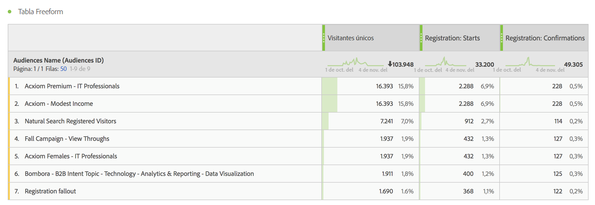
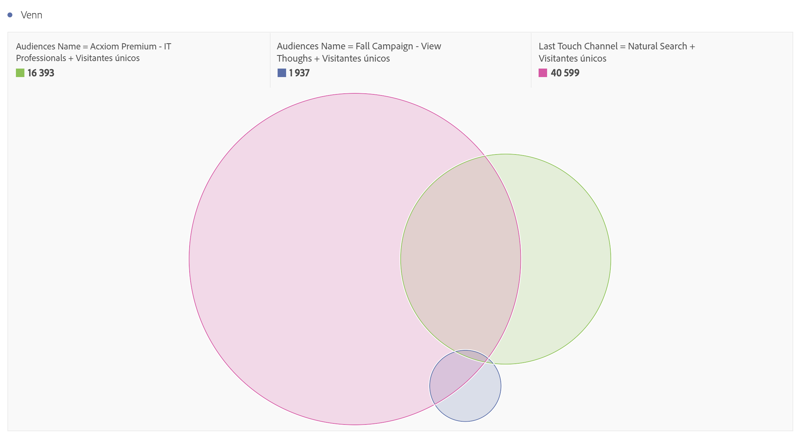

# Utilización de los datos de audiencias en Analytics

También puede utilizar las dimensiones Audiencias de AAM en Analytics. Los segmentos integrados son nuevas dimensiones de Analytics llamadas ID de audiencias y Nombre de audiencias, y pueden utilizarse como cualquier otra dimensión que Analytics recopile. En Fuentes de datos, los ID de audiencia se almacenan en la columna “mc_audiences”. Estas dimensiones no están disponibles en este momento en Data Workbench o Livestream. Estos son algunos ejemplos de cómo puede aprovechar las dimensiones Audiencias:

## Analysis Workspace {#section_C70837499BEA4DED885B3486C9E02C68}

En Analysis Workspace, los segmentos de AAM aparecen como dos dimensiones.

1. Vaya a **[!UICONTROL Workspace]**.
1. En la lista de **[!UICONTROL Dimensiones]**, seleccione **[!UICONTROL ID de audiencia]** o **[!UICONTROL Nombre de audiencia]**. Nombre es una clasificación descriptiva del ID.

   

## Comparación de segmentos {#section_E72B80B6470C42D4B9B19BE90E6070A2}

[Comparación de segmentos](https://docs.adobe.com/content/help/es-ES/analytics/analyze/analysis-workspace/panels/segment-comparison/segment-comparison.html) detecta las diferencias estadísticamente más significativas entre dos segmentos. Los datos de audiencias pueden usarse de dos maneras en Comparación de segmentos: 1) como los 2 segmentos que se comparan; y 2) como elementos de la tabla “Elementos de dimensiones principales”.

1. Vaya a **[!UICONTROL Workspace]** y seleccione el panel **[!UICONTROL Comparación de segmentos]** en el carril izquierdo.

1. Busque [!UICONTROL Nombre de audiencias] en el menú **[!UICONTROL Componente]**.

1. Abra [!UICONTROL Nombre de audiencias] para que aparezcan los elementos de dimensiones relacionados.
1. Arrastre las audiencias que desee comparar al generador de Comparación de segmentos.
1. (Opcional): puede incluir otros elementos de dimensiones o segmentos, hasta dos.
1. Haga clic en **[!UICONTROL Crear]**.

   Las dimensiones ID de audiencias y Nombre de audiencias aparecen automáticamente en la tabla “Elementos de dimensiones principales”, al igual que los datos de perfil adicionales para los dos segmentos que se comparan.

   

## Viaje del cliente (Flujo) en Analysis Workspace {#section_FC30E5795C9D4539838E30FE11FAEA6E}

Los datos de segmentos de AAM se pasan a Analytics para cada visita y representan el estado de pertenencia de un visitante a las distintas audiencias en un momento dado. Esto significa que un visitante podría encajar en un segmento (p. ej., “Conocimiento”) y más tarde tener la cualificación para un segmento superior (p. ej., “Consideración”). Puede utilizar [Flujo](https://docs.adobe.com/content/help/es-ES/analytics/analyze/analysis-workspace/visualizations/fallout/fallout-flow.html) en Analysis Workspace para visualizar el viaje que realiza un visitante entre audiencias.

1. Vaya a **[!UICONTROL Workspace]** y seleccione el panel **[!UICONTROL Flujo]** en el carril izquierdo.

1. Arrastre la dimensión [!UICONTROL Nombre de audiencia] al generador de Flujo.
1. Haga clic en **[!UICONTROL Crear]**.
1. (Opcional): Arrastre cualquier otra dimensión a la visualización Flujo para crear un [Flujo entre dimensiones](https://docs.adobe.com/content/help/es-ES/analytics/analyze/analysis-workspace/visualizations/flow/multi-dimensional-flow.html).

Las audiencias también pueden utilizarse en las [visualizaciones de visitas en el orden previsto](https://docs.adobe.com/content/help/es-ES/analytics/analyze/analysis-workspace/visualizations/fallout/fallout-flow.html).

## Visualización de Venn en Analysis Workspace {#section_E78AB764FB5047148B51DC1526B0DF89}

Las [visualizaciones de Venn](https://docs.adobe.com/content/help/es-ES/analytics/analyze/analysis-workspace/visualizations/venn.html) muestran el solapamiento entre un máximo de 3 segmentos.

1. Vaya a **[!UICONTROL Workspace]** y seleccione la visualización **[!UICONTROL Venn]** en el carril izquierdo.

1. Busque [!UICONTROL Nombre de audiencias] en el menú de componentes.
1. Abra [!UICONTROL Nombre de audiencia] para que aparezcan los elementos de dimensiones relacionados.
1. Arrastre las audiencias que desee comparar al generador de Venn.
1. (Opcional): puede incluir otros elementos de dimensiones o segmentos, hasta tres.
1. Haga clic en **[!UICONTROL Crear]**.

## Generador de segmentos {#section_2AA81852A1404AB894472CA8959461B6}

Puede incorporar las dimensiones Audiencias al [Generador de segmentos](/help/components/segmentation/segmentation-workflow/seg-build.md) de Analytics junto con la información de comportamiento que Analytics recopila.

1. Vaya a **[!UICONTROL Componentes]** > **[!UICONTROL Segmentos]**.
1. Haga clic en **[!UICONTROL Agregar]** para crear un segmento nuevo.
1. Después de ponerle nombre al segmento, arrastre la dimensión [!UICONTROL Nombre de audiencia] al panel Definiciones.
1. (Opcional): agregue otros criterios al segmento.
1. Guarde el segmento.

   

## Reports &amp; Analytics, y Report Builder {#section_04E8FD30F73344D7937AD3C6CD19E34A}

1. Para ver el informe de Analytics, vaya a **[!UICONTROL Informes]** > **[!UICONTROL Perfil del visitante]** > **[!UICONTROL Informes ID de audiencias]**.
1. Desde esta carpeta tiene acceso a las dimensiones ID de audiencias y Nombre de audiencia.

   
