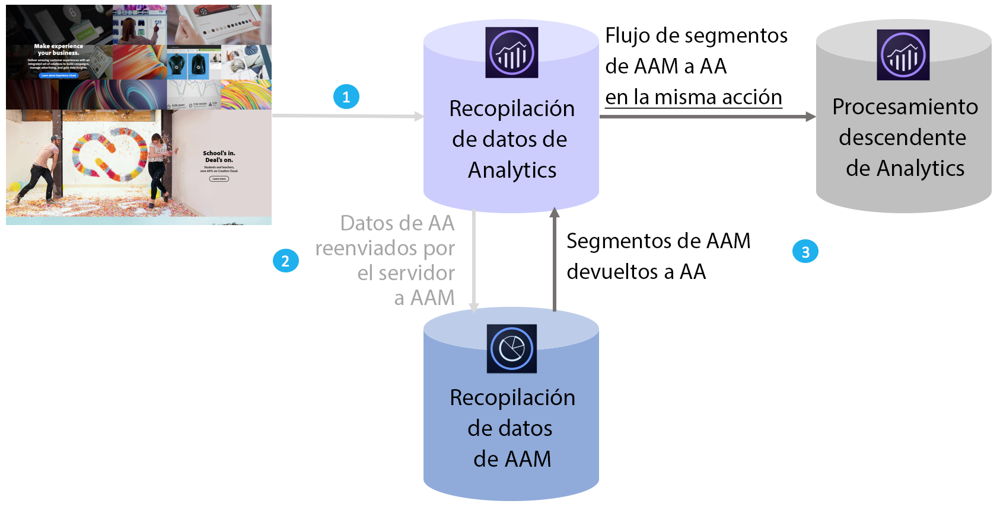

# Resumen de Audience Analytics

Adobe Audience Manager (AAM) es una potente plataforma de administración de datos que le ayuda a crear perfiles de audiencia únicos a partir de integraciones de datos de origen, secundarias o de socio, y de terceros. Para los anunciantes, estos perfiles de audiencia ayudan a definir los segmentos más valiosos que se pueden utilizar en cualquier canal digital.

Cuando se establece la integración de Audience Analytics, puede incorporar datos de audiencia de AAM, como información demográfica (p. ej., sexo o nivel de ingresos), información psicográfica (p. ej., intereses y aficiones), datos CRM y datos de impresiones de publicidad en cualquier flujo de trabajo de Analytics.

## Ventajas principales {#section_94816D17283349E0BA28521BE55BB868}

La integración de Audience Analytics ofrece las siguientes ventajas principales:

* Supone la primera integración de productos entre una plataforma de administración de datos (DMP) y un motor de análisis.
* AAM comparte segmentos en tiempo real con Analytics para permitir la detección de audiencias, la segmentación y la optimización.
* De forma predeterminada, AAM comparte todos sus segmentos, lo que enriquece en gran medida los perfiles de cliente de Analytics.
* Los administradores de soluciones pueden habilitar la integración desde la interfaz de usuario, solo se requieren cambios mínimos en el código.
* Solo se comparten los segmentos que satisfacen los controles de exportación de datos de Audience Manager.

## Cómo funciona {#section_CECDF5A0FEC64264B206EFEF54F19EF2}

1. Cada vez que un visitante llega a una de sus propiedades digitales, las visitas se recopilan y se envían a Analytics.
1. Con el [reenvío de lado del servidor](/help/admin/admin/c-server-side-forwarding/ssf.md), cada visita que Analytics recibe se envía automáticamente a AAM en tiempo real.
1. Con la integración de Audience Analytics, ante cada visita se busca en AAM si el visitante pertenece a alguna audiencia y se devuelve a Analytics una lista de ID de segmento para su procesamiento en tiempo real.

Como los segmentos de AAM se insertan por visita, puede estar seguro de que no le faltará ningún dato de AAM acerca de un visitante, y de que los datos de las visitas de dicho visitante estarán actualizados. Esta característica es mejor que un complemento de AppMeasurement, ya que los complementos solo pueden ofrecer los segmentos en la siguiente visita (y no en la visita actual).

Además, clasificamos automáticamente los ID de segmento de AAM con sus nombres descriptivos para que no aparezcan ID alfanuméricos en los informes de Analytics.

## Requisitos previos {#section_A345DC31F7D44EAE9DC1AB53E824C0CC}

Asegúrese de que se cumplen los siguientes requisitos previos:

* Es cliente tanto de Audience Manager como de Adobe Analytics.
* Es administrador de Audience Manager.
* Utiliza Identity Service 1.5 o posterior.
* Los grupos de informes de Adobe Analytics y AAM se [asignan a la misma organización de Experience Cloud](https://docs.adobe.com/content/help/es-ES/core-services/interface/about-core-services/report-suite-mapping.html).
* Utiliza el [reenvío de lado del servidor](/help/admin/admin/c-server-side-forwarding/ssf.md) y tiene implementado el [módulo Gestión de público](https://docs.adobe.com/content/help/es-ES/audience-manager/user-guide/implementation-integration-guides/integration-other-solutions/audience-management-module.html) (sin código DIL): AppMeasurement 1.5 o posterior.

Estos requisitos previos se describen en el [flujo de trabajo de Audience Analytics](/help/integrate/c-audience-analytics/c-workflow/audiences-workflow.md).
